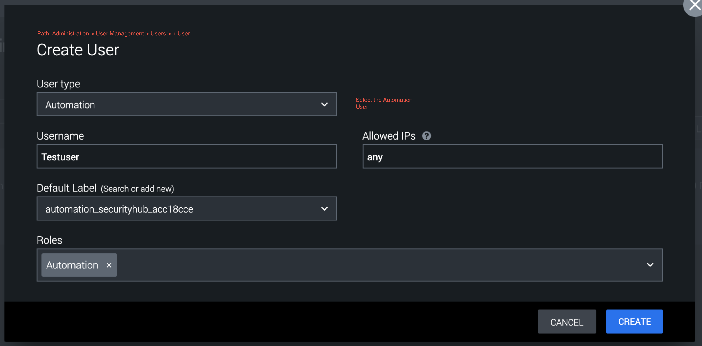

[comment]: # "Auto-generated SOAR connector documentation"
# ServiceNow

Publisher: Splunk  
Connector Version: 2\.1\.3  
Product Vendor: ServiceNow  
Product Name: ServiceNow  
Product Version Supported (regex): "\.\*"  
Minimum Product Version: 5\.0\.0  

This app integrates with ServiceNow to perform investigative and generic actions

[comment]: # " File: readme.md"
[comment]: # "  Copyright (c) 2016-2021 Splunk Inc."
[comment]: # ""
[comment]: # "Licensed under the Apache License, Version 2.0 (the 'License');"
[comment]: # "you may not use this file except in compliance with the License."
[comment]: # "You may obtain a copy of the License at"
[comment]: # ""
[comment]: # "    http://www.apache.org/licenses/LICENSE-2.0"
[comment]: # ""
[comment]: # "Unless required by applicable law or agreed to in writing, software distributed under"
[comment]: # "the License is distributed on an 'AS IS' BASIS, WITHOUT WARRANTIES OR CONDITIONS OF ANY KIND,"
[comment]: # "either express or implied. See the License for the specific language governing permissions"
[comment]: # "and limitations under the License."
[comment]: # ""
**Notes**

-   **Asset Configuration Parameter**

      

    -   on_poll_table: Table to ingest issues from.

    -   on_poll_filter: Filter to use with On Poll separated by '^' (e.g. description=This is a
        test^assigned_to=test.name).

    -   first_run_container: Maximum containers to ingest for the first run of scheduled polling.

    -   max_container: Maximum containers to ingest for subsequent runs of scheduled polling.

    -   severity: Custom severity of the ingested artifact.

          
          

        -   **Using Custom Severities on Ingested Data**
            -   If you decide to use custom severities to apply to Containers and Artifacts ingested
                via On Poll, then you must make sure that the automation user you use has the
                correct permissions.
            -   By default, the automation user is selected to run the ServiceNow ingestion action.
                (See **Asset Configuration** \> **Asset Settings** \> **Advanced** ) The automation
                user does **NOT** have access to view or edit **System Settings** , which includes
                the permission to view the custom severities on your instance. This will cause your
                On Poll action to fail since your user cannot pull the custom severities on your
                instance.
            -   In order to solve this problem, you must create a user of type **Automation** and
                assign this user a Role that has permissions to view or edit **System Settings** (
                **Administration** \> **User Management** \> **Users** **\> + User** button on the
                top right corner). Then, choose this user in your ServiceNow **Asset Settings**
                under **Advanced** and you will be able to successfully apply custom severities to
                your ingested data.  
                  
                **Administration** \> **User Management** \> **Users** **\> + User**
                  
                  
                **Administration** \> **User Management** \> **Roles & Permissions** **\> + Role**
                  
                  
                **Asset Settings** \> **Advanced**
                  
                  
            -   In order to use the custom severity it is necessary to create a severity over (
                **Administration** \> **Event Settings** \> **Severity** ). If custom severity has
                not been provided in the asset configuration, then the default severity from "
                **Administration** \> **Event Settings** \> **Severity** " will be considered.

      

-   **The functioning of On Poll**

      

    -   On Poll ingests the details of the tickets/records of a table provided by the user. An
        ingested container's name will be set to the 'short_description' of the ticket/record. If
        the ticket/record does not have any short_description then a default name will be given to
        the container.

          
          

    -   **Two ways of polling**

          

        -   Manual polling

              

            -   The application will fetch the number of tickets/records controlled by the
                container_count parameter set in the Poll Now window.
            -   Tickets/records can be restricted by providing a filter in the configuration
                parameter.

              

        -   Scheduled Polling

              

            -   The application will fetch the number of tickets/records, controlled by the
                'first_run_container' configuration parameter for the first run of Scheduled Polling
                and by the 'max_container' configuration parameter for the other runs of Scheduled
                Polling. Each poll will ingest tickets/records which have been created or updated
                since the previous run of Scheduled Polling.

      

-   **Specific functionality of ServiceNow On Poll**

      

    -   When the app is installed with Python version 2 and if the data is ingested using On Poll
        with query A and label B, it will list down the containers accordingly. If the ticket that
        is already ingested is updated, and then if the On Poll is executed again with the same
        label i.e. label B and with the same query A, it will add details of the updated ticket as
        an artifact in the already created container and update the container properties
        accordingly.
    -   When the app is installed with Python version 3 and if the data is ingested using On Poll
        with query A and label B, it will list down the containers accordingly. If the ticket that
        is already ingested is updated, and then if the On Poll is executed again with the same
        label i.e. label B and with the same query A, it will not update the container properties
        but will add the updated ticket as an artifact in the already created container.

      

-   **The functioning of Test Connectivity**

      
      

    -   **Case 1: If Client ID & Client Secret are provided:**

          

        -   Step1: While running the test connectivity, the system will check if the refresh token
            is present or not in the state file.
        -   Step2(a): If a refresh token is present then the system will make the API call to fetch
            a new token. Using new token the test connectivity will get passed.
        -   Step2(b): If the refresh token is not present then the system will check for the
            Username and Password. Using Username & Password system will make an API call to fetch a
            new token and test connectivity will get passed.
        -   Step3: If the refresh token is not present and Username and Password are not provided
            then the system will return an error and the action will fail.

          

    -   **Case 2: If Client ID & Client Secret are not provided:**

          

        -   Step1: While running the test connectivity, System will check if the Username and
            Password are provided or not.
        -   Step2: If Username & Password are provided then the system will get authenticated and
            test connectivity will get passed.
        -   Step3: If the Username & Password are not provided then the system will return an error
            and the action will fail.

      

-   In order to use the app actions, a user must have these roles itil, sn_request_write, and
    catalog. In some actions, the user can also provide the table name as input in that case the
    user must have the role/permission to access that table.

## Port Information

The app uses HTTP/ HTTPS protocol for communicating with the ServiceNow server. Below are the
default ports used by Splunk SOAR.

|         SERVICE NAME | TRANSPORT PROTOCOL | PORT |
|----------------------|--------------------|------|
|         http         | tcp                | 80   |
|         https        | tcp                | 443  |

### Configuration Variables
The below configuration variables are required for this Connector to operate.  These variables are specified when configuring a ServiceNow asset in SOAR.

VARIABLE | REQUIRED | TYPE | DESCRIPTION
-------- | -------- | ---- | -----------
**username** |  optional  | string | Username
**timezone** |  optional  | timezone | Timezone configured on ServiceNow
**url** |  required  | string | Device URL including the port, e\.g\. https\://myservicenow\.enterprise\.com\:8080
**on\_poll\_table** |  optional  | string | Table to ingest issues from
**on\_poll\_filter** |  optional  | string | Filter to use with On Poll separated by '^' \(e\.g\. description=This is a test^assigned\_to=test\.name\)
**client\_id** |  optional  | string | Client ID\. OAuth will be preferred if provided
**client\_secret** |  optional  | password | Client Secret\. Required with Client ID
**password** |  optional  | password | Password
**first\_run\_container** |  optional  | numeric | Max container \(For first run of schedule polling\)
**max\_container** |  optional  | numeric | Max container \(For other runs of schedule polling\)
**severity** |  optional  | string | Severity to apply to Containers and Artifacts ingested via On Poll \(Automation user must have System Settings permissions\)

### Supported Actions  
[test connectivity](#action-test-connectivity) - Run a query on the device to test connection and credentials  
[add work note](#action-add-work-note) - Add a work note to a record  
[add comment](#action-add-comment) - Add a comment to a record  
[describe service catalog](#action-describe-service-catalog) - Fetches the details of a catalog  
[request catalog item](#action-request-catalog-item) - Requests a catalog item  
[describe catalog item](#action-describe-catalog-item) - Fetches the details of a catalog item  
[list services](#action-list-services) - Get a list of items  
[list categories](#action-list-categories) - Get a list of categories  
[list service catalogs](#action-list-service-catalogs) - Get a list of catalogs  
[list tickets](#action-list-tickets) - Get a list of tickets/records  
[create ticket](#action-create-ticket) - Create a new ticket/record  
[get ticket](#action-get-ticket) - Get ticket/record information  
[update ticket](#action-update-ticket) - Update ticket/record information  
[get variables](#action-get-variables) - Get variables for a ticket/record  
[run query](#action-run-query) - Gets object data according to the specified query  
[on poll](#action-on-poll) - Ingest tickets from SNOW  

## action: 'test connectivity'
Run a query on the device to test connection and credentials

Type: **test**  
Read only: **True**

#### Action Parameters
No parameters are required for this action

#### Action Output
No Output  

## action: 'add work note'
Add a work note to a record

Type: **generic**  
Read only: **False**

Users can provide a valid ticket number in the 'sys\_id' parameter or check the 'is\_sys\_id' parameter and provide a valid <b>SYS ID</b> in the 'sys\_id' parameter\. Users can get the <b>SYS ID</b> value for any ticket from the results of the <b>List Tickets</b> action run\.

#### Action Parameters
PARAMETER | REQUIRED | DESCRIPTION | TYPE | CONTAINS
--------- | -------- | ----------- | ---- | --------
**table\_name** |  required  | Table to query | string |  `servicenow table` 
**id** |  required  | SYS ID or ticket number of a record | string |  `servicenow ticket sysid`  `servicenow ticket number` 
**work\_note** |  required  | Work note to add | string | 
**is\_sys\_id** |  optional  | Whether the value provided in the ID parameter is SYS ID or ticket number | boolean | 

#### Action Output
DATA PATH | TYPE | CONTAINS
--------- | ---- | --------
action\_result\.status | string | 
action\_result\.parameter\.id | string |  `servicenow ticket sysid`  `servicenow ticket number` 
action\_result\.parameter\.is\_sys\_id | boolean | 
action\_result\.parameter\.table\_name | string |  `servicenow table` 
action\_result\.parameter\.work\_note | string | 
action\_result\.data\.\*\.acquisition\_method | string | 
action\_result\.data\.\*\.active | string | 
action\_result\.data\.\*\.activity\_due | string | 
action\_result\.data\.\*\.additional\_assignee\_list | string | 
action\_result\.data\.\*\.approval | string | 
action\_result\.data\.\*\.approval\_history | string | 
action\_result\.data\.\*\.approval\_set | string | 
action\_result\.data\.\*\.asset\_tag | string | 
action\_result\.data\.\*\.assigned | string | 
action\_result\.data\.\*\.assigned\_condition | string | 
action\_result\.data\.\*\.assigned\_to | string | 
action\_result\.data\.\*\.assignment\_group | string | 
action\_result\.data\.\*\.beneficiary | string | 
action\_result\.data\.\*\.business\_duration | string | 
action\_result\.data\.\*\.business\_service | string | 
action\_result\.data\.\*\.business\_stc | string | 
action\_result\.data\.\*\.calendar\_duration | string | 
action\_result\.data\.\*\.calendar\_stc | string | 
action\_result\.data\.\*\.caller\_id | string | 
action\_result\.data\.\*\.caller\_id\.display\_value | string | 
action\_result\.data\.\*\.caller\_id\.link | string |  `url` 
action\_result\.data\.\*\.category | string | 
action\_result\.data\.\*\.caused\_by | string | 
action\_result\.data\.\*\.checked\_in | string | 
action\_result\.data\.\*\.checked\_out | string | 
action\_result\.data\.\*\.child\_incidents | string | 
action\_result\.data\.\*\.ci | string | 
action\_result\.data\.\*\.close\_code | string | 
action\_result\.data\.\*\.close\_notes | string | 
action\_result\.data\.\*\.closed\_at | string | 
action\_result\.data\.\*\.closed\_by | string | 
action\_result\.data\.\*\.closed\_by\.display\_value | string | 
action\_result\.data\.\*\.closed\_by\.link | string |  `url` 
action\_result\.data\.\*\.cmdb\_ci | string | 
action\_result\.data\.\*\.comments | string | 
action\_result\.data\.\*\.comments\_and\_work\_notes | string | 
action\_result\.data\.\*\.company | string | 
action\_result\.data\.\*\.company\.display\_value | string | 
action\_result\.data\.\*\.company\.link | string | 
action\_result\.data\.\*\.contact\_type | string | 
action\_result\.data\.\*\.contract | string | 
action\_result\.data\.\*\.correlation\_display | string | 
action\_result\.data\.\*\.correlation\_id | string | 
action\_result\.data\.\*\.cost | string | 
action\_result\.data\.\*\.cost\_center | string | 
action\_result\.data\.\*\.delivery\_date | string | 
action\_result\.data\.\*\.delivery\_plan | string | 
action\_result\.data\.\*\.delivery\_task | string | 
action\_result\.data\.\*\.department | string | 
action\_result\.data\.\*\.depreciated\_amount | string | 
action\_result\.data\.\*\.depreciation | string | 
action\_result\.data\.\*\.depreciation\_date | string | 
action\_result\.data\.\*\.description | string | 
action\_result\.data\.\*\.display\_name | string | 
action\_result\.data\.\*\.disposal\_reason | string | 
action\_result\.data\.\*\.due | string | 
action\_result\.data\.\*\.due\_date | string | 
action\_result\.data\.\*\.due\_in | string | 
action\_result\.data\.\*\.entitlement\_condition | string | 
action\_result\.data\.\*\.escalation | string | 
action\_result\.data\.\*\.expected\_start | string | 
action\_result\.data\.\*\.expenditure\_type | string | 
action\_result\.data\.\*\.follow\_up | string | 
action\_result\.data\.\*\.gl\_account | string | 
action\_result\.data\.\*\.group\_list | string | 
action\_result\.data\.\*\.hold\_reason | string | 
action\_result\.data\.\*\.impact | string | 
action\_result\.data\.\*\.incident\_state | string | 
action\_result\.data\.\*\.install\_date | string | 
action\_result\.data\.\*\.install\_status | string | 
action\_result\.data\.\*\.invoice\_number | string | 
action\_result\.data\.\*\.is\_merged\_license | string | 
action\_result\.data\.\*\.justification | string | 
action\_result\.data\.\*\.knowledge | string | 
action\_result\.data\.\*\.lease\_id | string | 
action\_result\.data\.\*\.license\_key | string | 
action\_result\.data\.\*\.location | string | 
action\_result\.data\.\*\.made\_sla | string | 
action\_result\.data\.\*\.managed\_by | string | 
action\_result\.data\.\*\.merged\_into | string | 
action\_result\.data\.\*\.model\.display\_value | string | 
action\_result\.data\.\*\.model\.link | string | 
action\_result\.data\.\*\.model\_category\.display\_value | string | 
action\_result\.data\.\*\.model\_category\.link | string | 
action\_result\.data\.\*\.notify | string | 
action\_result\.data\.\*\.number | string |  `servicenow ticket number` 
action\_result\.data\.\*\.old\_status | string | 
action\_result\.data\.\*\.old\_substatus | string | 
action\_result\.data\.\*\.opened\_at | string | 
action\_result\.data\.\*\.opened\_by\.display\_value | string | 
action\_result\.data\.\*\.opened\_by\.link | string |  `url` 
action\_result\.data\.\*\.order | string | 
action\_result\.data\.\*\.order\_date | string | 
action\_result\.data\.\*\.owned\_by | string | 
action\_result\.data\.\*\.parent | string | 
action\_result\.data\.\*\.parent\_incident | string | 
action\_result\.data\.\*\.po\_number | string | 
action\_result\.data\.\*\.pre\_allocated | string | 
action\_result\.data\.\*\.priority | string | 
action\_result\.data\.\*\.problem\_id | string | 
action\_result\.data\.\*\.purchase\_date | string | 
action\_result\.data\.\*\.quantity | string | 
action\_result\.data\.\*\.reassignment\_count | string | 
action\_result\.data\.\*\.reopen\_count | string | 
action\_result\.data\.\*\.reopened\_by | string | 
action\_result\.data\.\*\.reopened\_time | string | 
action\_result\.data\.\*\.request\_line | string | 
action\_result\.data\.\*\.resale\_price | string | 
action\_result\.data\.\*\.reserved\_for | string | 
action\_result\.data\.\*\.residual | string | 
action\_result\.data\.\*\.residual\_date | string | 
action\_result\.data\.\*\.resolved\_at | string | 
action\_result\.data\.\*\.resolved\_by | string | 
action\_result\.data\.\*\.resolved\_by\.display\_value | string | 
action\_result\.data\.\*\.resolved\_by\.link | string |  `url` 
action\_result\.data\.\*\.retired | string | 
action\_result\.data\.\*\.retirement\_date | string | 
action\_result\.data\.\*\.rfc | string | 
action\_result\.data\.\*\.rights | string | 
action\_result\.data\.\*\.route\_reason | string | 
action\_result\.data\.\*\.salvage\_value | string | 
action\_result\.data\.\*\.serial\_number | string | 
action\_result\.data\.\*\.service\_offering | string | 
action\_result\.data\.\*\.severity | string | 
action\_result\.data\.\*\.short\_description | string | 
action\_result\.data\.\*\.skip\_sync | string | 
action\_result\.data\.\*\.sla\_due | string | 
action\_result\.data\.\*\.state | string | 
action\_result\.data\.\*\.stockroom | string | 
action\_result\.data\.\*\.subcategory | string | 
action\_result\.data\.\*\.substatus | string | 
action\_result\.data\.\*\.support\_group | string | 
action\_result\.data\.\*\.supported\_by | string | 
action\_result\.data\.\*\.sys\_class\_name | string | 
action\_result\.data\.\*\.sys\_created\_by | string | 
action\_result\.data\.\*\.sys\_created\_on | string | 
action\_result\.data\.\*\.sys\_domain\.display\_value | string | 
action\_result\.data\.\*\.sys\_domain\.link | string |  `url` 
action\_result\.data\.\*\.sys\_domain\_path | string |  `domain` 
action\_result\.data\.\*\.sys\_id | string |  `servicenow ticket sysid`  `md5` 
action\_result\.data\.\*\.sys\_mod\_count | string | 
action\_result\.data\.\*\.sys\_tags | string | 
action\_result\.data\.\*\.sys\_updated\_by | string | 
action\_result\.data\.\*\.sys\_updated\_on | string | 
action\_result\.data\.\*\.task\_effective\_number | string | 
action\_result\.data\.\*\.time\_worked | string | 
action\_result\.data\.\*\.u\_short\_description | string | 
action\_result\.data\.\*\.universal\_request | string | 
action\_result\.data\.\*\.upon\_approval | string | 
action\_result\.data\.\*\.upon\_reject | string | 
action\_result\.data\.\*\.urgency | string | 
action\_result\.data\.\*\.user\_input | string | 
action\_result\.data\.\*\.vendor\.display\_value | string | 
action\_result\.data\.\*\.vendor\.link | string |  `url` 
action\_result\.data\.\*\.warranty\_expiration | string | 
action\_result\.data\.\*\.watch\_list | string | 
action\_result\.data\.\*\.work\_end | string | 
action\_result\.data\.\*\.work\_notes | string | 
action\_result\.data\.\*\.work\_notes\_list | string | 
action\_result\.data\.\*\.work\_start | string | 
action\_result\.summary | string | 
action\_result\.message | string | 
summary\.total\_objects | numeric | 
summary\.total\_objects\_successful | numeric |   

## action: 'add comment'
Add a comment to a record

Type: **generic**  
Read only: **False**

Users can provide a valid ticket number in the 'sys\_id' parameter or check the 'is\_sys\_id' parameter and provide a valid <b>SYS ID</b> in the 'sys\_id' parameter\. Users can get the <b>SYS ID</b> value for any ticket from the results of the <b>List Tickets</b> action run\.

#### Action Parameters
PARAMETER | REQUIRED | DESCRIPTION | TYPE | CONTAINS
--------- | -------- | ----------- | ---- | --------
**table\_name** |  required  | Table to query | string |  `servicenow table` 
**id** |  required  | SYS ID or ticket number of a record | string |  `servicenow ticket sysid`  `servicenow ticket number` 
**comment** |  required  | Comment to add | string | 
**is\_sys\_id** |  optional  | Whether the value provided in the ID parameter is SYS ID or ticket number | boolean | 

#### Action Output
DATA PATH | TYPE | CONTAINS
--------- | ---- | --------
action\_result\.status | string | 
action\_result\.parameter\.comment | string | 
action\_result\.parameter\.id | string |  `servicenow ticket sysid`  `servicenow ticket number` 
action\_result\.parameter\.is\_sys\_id | boolean | 
action\_result\.parameter\.table\_name | string |  `servicenow table` 
action\_result\.data\.\*\.acquisition\_method | string | 
action\_result\.data\.\*\.active | string | 
action\_result\.data\.\*\.activity\_due | string | 
action\_result\.data\.\*\.additional\_assignee\_list | string | 
action\_result\.data\.\*\.approval | string | 
action\_result\.data\.\*\.approval\_history | string | 
action\_result\.data\.\*\.approval\_set | string | 
action\_result\.data\.\*\.asset\_tag | string | 
action\_result\.data\.\*\.asset\_tracking\_strategy | string | 
action\_result\.data\.\*\.assigned | string | 
action\_result\.data\.\*\.assigned\_condition | string | 
action\_result\.data\.\*\.assigned\_to | string | 
action\_result\.data\.\*\.assigned\_to\.display\_value | string | 
action\_result\.data\.\*\.assigned\_to\.link | string | 
action\_result\.data\.\*\.assignment\_group | string | 
action\_result\.data\.\*\.barcode | string | 
action\_result\.data\.\*\.beneficiary | string | 
action\_result\.data\.\*\.bundle | string | 
action\_result\.data\.\*\.business\_duration | string | 
action\_result\.data\.\*\.business\_service | string | 
action\_result\.data\.\*\.business\_stc | string | 
action\_result\.data\.\*\.calendar\_duration | string | 
action\_result\.data\.\*\.calendar\_stc | string | 
action\_result\.data\.\*\.caller\_id | string | 
action\_result\.data\.\*\.caller\_id\.display\_value | string | 
action\_result\.data\.\*\.caller\_id\.link | string |  `url` 
action\_result\.data\.\*\.category | string | 
action\_result\.data\.\*\.caused\_by | string | 
action\_result\.data\.\*\.certified | string | 
action\_result\.data\.\*\.checked\_in | string | 
action\_result\.data\.\*\.checked\_out | string | 
action\_result\.data\.\*\.child\_incidents | string | 
action\_result\.data\.\*\.ci | string | 
action\_result\.data\.\*\.ci\.display\_value | string | 
action\_result\.data\.\*\.ci\.link | string | 
action\_result\.data\.\*\.close\_code | string | 
action\_result\.data\.\*\.close\_notes | string | 
action\_result\.data\.\*\.closed\_at | string | 
action\_result\.data\.\*\.closed\_by | string | 
action\_result\.data\.\*\.closed\_by\.display\_value | string | 
action\_result\.data\.\*\.closed\_by\.link | string |  `url` 
action\_result\.data\.\*\.cmdb\_ci | string | 
action\_result\.data\.\*\.cmdb\_ci\_class | string | 
action\_result\.data\.\*\.cmdb\_model\_category | string | 
action\_result\.data\.\*\.comments | string | 
action\_result\.data\.\*\.comments\_and\_work\_notes | string | 
action\_result\.data\.\*\.company | string | 
action\_result\.data\.\*\.company\.display\_value | string | 
action\_result\.data\.\*\.company\.link | string | 
action\_result\.data\.\*\.contact\_type | string | 
action\_result\.data\.\*\.correlation\_display | string | 
action\_result\.data\.\*\.correlation\_id | string | 
action\_result\.data\.\*\.cost | string | 
action\_result\.data\.\*\.cost\_center | string | 
action\_result\.data\.\*\.cost\_center\.display\_value | string | 
action\_result\.data\.\*\.cost\_center\.link | string | 
action\_result\.data\.\*\.delivery\_date | string | 
action\_result\.data\.\*\.delivery\_plan | string | 
action\_result\.data\.\*\.delivery\_task | string | 
action\_result\.data\.\*\.department | string | 
action\_result\.data\.\*\.department\.display\_value | string | 
action\_result\.data\.\*\.department\.link | string | 
action\_result\.data\.\*\.depreciated\_amount | string | 
action\_result\.data\.\*\.depreciation | string | 
action\_result\.data\.\*\.depreciation\.display\_value | string | 
action\_result\.data\.\*\.depreciation\.link | string | 
action\_result\.data\.\*\.depreciation\_date | string | 
action\_result\.data\.\*\.description | string | 
action\_result\.data\.\*\.display\_name | string | 
action\_result\.data\.\*\.disposal\_reason | string | 
action\_result\.data\.\*\.due | string | 
action\_result\.data\.\*\.due\_date | string | 
action\_result\.data\.\*\.due\_in | string | 
action\_result\.data\.\*\.entitlement\_condition | string | 
action\_result\.data\.\*\.escalation | string | 
action\_result\.data\.\*\.expected\_start | string | 
action\_result\.data\.\*\.expenditure\_type | string | 
action\_result\.data\.\*\.flow\_rate | string | 
action\_result\.data\.\*\.follow\_up | string | 
action\_result\.data\.\*\.full\_name | string | 
action\_result\.data\.\*\.gl\_account | string | 
action\_result\.data\.\*\.group\_list | string | 
action\_result\.data\.\*\.hold\_reason | string | 
action\_result\.data\.\*\.impact | string | 
action\_result\.data\.\*\.incident\_state | string | 
action\_result\.data\.\*\.install\_date | string | 
action\_result\.data\.\*\.install\_status | string | 
action\_result\.data\.\*\.invoice\_number | string | 
action\_result\.data\.\*\.is\_merged\_license | string | 
action\_result\.data\.\*\.justification | string | 
action\_result\.data\.\*\.knowledge | string | 
action\_result\.data\.\*\.lease\_id | string | 
action\_result\.data\.\*\.license\_key | string | 
action\_result\.data\.\*\.location | string | 
action\_result\.data\.\*\.location\.display\_value | string | 
action\_result\.data\.\*\.location\.link | string | 
action\_result\.data\.\*\.made\_sla | string | 
action\_result\.data\.\*\.main\_component | string | 
action\_result\.data\.\*\.managed\_by | string | 
action\_result\.data\.\*\.manufacturer\.display\_value | string | 
action\_result\.data\.\*\.manufacturer\.link | string | 
action\_result\.data\.\*\.merged\_into | string | 
action\_result\.data\.\*\.model\.display\_value | string | 
action\_result\.data\.\*\.model\.link | string | 
action\_result\.data\.\*\.model\_category\.display\_value | string | 
action\_result\.data\.\*\.model\_category\.link | string | 
action\_result\.data\.\*\.model\_number | string | 
action\_result\.data\.\*\.name | string | 
action\_result\.data\.\*\.notify | string | 
action\_result\.data\.\*\.number | string |  `servicenow ticket number` 
action\_result\.data\.\*\.old\_status | string | 
action\_result\.data\.\*\.old\_substatus | string | 
action\_result\.data\.\*\.opened\_at | string | 
action\_result\.data\.\*\.opened\_by\.display\_value | string | 
action\_result\.data\.\*\.opened\_by\.link | string |  `url` 
action\_result\.data\.\*\.order | string | 
action\_result\.data\.\*\.order\_date | string | 
action\_result\.data\.\*\.owned\_by | string | 
action\_result\.data\.\*\.owner | string | 
action\_result\.data\.\*\.parent | string | 
action\_result\.data\.\*\.parent\_incident | string | 
action\_result\.data\.\*\.picture | string | 
action\_result\.data\.\*\.po\_number | string | 
action\_result\.data\.\*\.power\_consumption | string | 
action\_result\.data\.\*\.pre\_allocated | string | 
action\_result\.data\.\*\.priority | string | 
action\_result\.data\.\*\.problem\_id | string | 
action\_result\.data\.\*\.product\_catalog\_item\.display\_value | string | 
action\_result\.data\.\*\.product\_catalog\_item\.link | string | 
action\_result\.data\.\*\.purchase\_date | string | 
action\_result\.data\.\*\.quantity | string | 
action\_result\.data\.\*\.rack\_units | string | 
action\_result\.data\.\*\.reassignment\_count | string | 
action\_result\.data\.\*\.reopen\_count | string | 
action\_result\.data\.\*\.reopened\_by | string | 
action\_result\.data\.\*\.reopened\_time | string | 
action\_result\.data\.\*\.request\_line | string | 
action\_result\.data\.\*\.resale\_price | string | 
action\_result\.data\.\*\.reserved\_for | string | 
action\_result\.data\.\*\.residual | string | 
action\_result\.data\.\*\.residual\_date | string | 
action\_result\.data\.\*\.resolved\_at | string | 
action\_result\.data\.\*\.resolved\_by | string | 
action\_result\.data\.\*\.resolved\_by\.display\_value | string | 
action\_result\.data\.\*\.resolved\_by\.link | string |  `url` 
action\_result\.data\.\*\.retired | string | 
action\_result\.data\.\*\.retirement\_date | string | 
action\_result\.data\.\*\.rfc | string | 
action\_result\.data\.\*\.rights | string | 
action\_result\.data\.\*\.salvage\_value | string | 
action\_result\.data\.\*\.serial\_number | string | 
action\_result\.data\.\*\.service\_offering | string | 
action\_result\.data\.\*\.severity | string | 
action\_result\.data\.\*\.short\_description | string | 
action\_result\.data\.\*\.skip\_sync | string | 
action\_result\.data\.\*\.sla | string | 
action\_result\.data\.\*\.sla\_due | string | 
action\_result\.data\.\*\.sound\_power | string | 
action\_result\.data\.\*\.state | string | 
action\_result\.data\.\*\.status | string | 
action\_result\.data\.\*\.stockroom | string | 
action\_result\.data\.\*\.stockroom\.display\_value | string | 
action\_result\.data\.\*\.stockroom\.link | string | 
action\_result\.data\.\*\.subcategory | string | 
action\_result\.data\.\*\.substatus | string | 
action\_result\.data\.\*\.support\_group | string | 
action\_result\.data\.\*\.supported\_by | string | 
action\_result\.data\.\*\.sys\_class\_name | string | 
action\_result\.data\.\*\.sys\_created\_by | string | 
action\_result\.data\.\*\.sys\_created\_on | string | 
action\_result\.data\.\*\.sys\_domain\.display\_value | string | 
action\_result\.data\.\*\.sys\_domain\.link | string |  `url` 
action\_result\.data\.\*\.sys\_domain\_path | string |  `domain` 
action\_result\.data\.\*\.sys\_id | string |  `servicenow ticket sysid`  `md5` 
action\_result\.data\.\*\.sys\_mod\_count | string | 
action\_result\.data\.\*\.sys\_tags | string | 
action\_result\.data\.\*\.sys\_updated\_by | string | 
action\_result\.data\.\*\.sys\_updated\_on | string | 
action\_result\.data\.\*\.time\_worked | string | 
action\_result\.data\.\*\.type | string | 
action\_result\.data\.\*\.u\_short\_description | string | 
action\_result\.data\.\*\.upon\_approval | string | 
action\_result\.data\.\*\.upon\_reject | string | 
action\_result\.data\.\*\.urgency | string | 
action\_result\.data\.\*\.user\_input | string | 
action\_result\.data\.\*\.vendor\.display\_value | string | 
action\_result\.data\.\*\.vendor\.link | string | 
action\_result\.data\.\*\.warranty\_expiration | string | 
action\_result\.data\.\*\.watch\_list | string | 
action\_result\.data\.\*\.weight | string | 
action\_result\.data\.\*\.work\_end | string | 
action\_result\.data\.\*\.work\_notes | string | 
action\_result\.data\.\*\.work\_notes\_list | string | 
action\_result\.data\.\*\.work\_start | string | 
action\_result\.summary | string | 
action\_result\.message | string | 
summary\.total\_objects | numeric | 
summary\.total\_objects\_successful | numeric |   

## action: 'describe service catalog'
Fetches the details of a catalog

Type: **investigate**  
Read only: **True**

#### Action Parameters
PARAMETER | REQUIRED | DESCRIPTION | TYPE | CONTAINS
--------- | -------- | ----------- | ---- | --------
**sys\_id** |  required  | SYS ID of a catalog | string |  `servicenow catalog sys id`  `md5` 
**max\_results** |  optional  | Max number of service catalog items to return | numeric | 

#### Action Output
DATA PATH | TYPE | CONTAINS
--------- | ---- | --------
action\_result\.status | string | 
action\_result\.parameter\.max\_results | numeric | 
action\_result\.parameter\.sys\_id | string |  `servicenow catalog sys id`  `md5` 
action\_result\.data\.\*\.active | string | 
action\_result\.data\.\*\.background\_color | string | 
action\_result\.data\.\*\.categories\.\*\.active | string | 
action\_result\.data\.\*\.categories\.\*\.description | string | 
action\_result\.data\.\*\.categories\.\*\.entitlement\_script | string | 
action\_result\.data\.\*\.categories\.\*\.header\_icon | string | 
action\_result\.data\.\*\.categories\.\*\.homepage\_image | string | 
action\_result\.data\.\*\.categories\.\*\.homepage\_renderer | string | 
action\_result\.data\.\*\.categories\.\*\.homepage\_renderer\.link | string |  `url` 
action\_result\.data\.\*\.categories\.\*\.homepage\_renderer\.value | string |  `md5` 
action\_result\.data\.\*\.categories\.\*\.icon | string | 
action\_result\.data\.\*\.categories\.\*\.image | string | 
action\_result\.data\.\*\.categories\.\*\.location | string | 
action\_result\.data\.\*\.categories\.\*\.mobile\_hide\_description | string | 
action\_result\.data\.\*\.categories\.\*\.mobile\_picture | string | 
action\_result\.data\.\*\.categories\.\*\.mobile\_subcategory\_render\_type | string | 
action\_result\.data\.\*\.categories\.\*\.module | string | 
action\_result\.data\.\*\.categories\.\*\.order | string | 
action\_result\.data\.\*\.categories\.\*\.parent | string | 
action\_result\.data\.\*\.categories\.\*\.parent\.link | string |  `url` 
action\_result\.data\.\*\.categories\.\*\.parent\.value | string |  `md5` 
action\_result\.data\.\*\.categories\.\*\.roles | string | 
action\_result\.data\.\*\.categories\.\*\.sc\_catalog\.link | string |  `url` 
action\_result\.data\.\*\.categories\.\*\.sc\_catalog\.value | string |  `md5` 
action\_result\.data\.\*\.categories\.\*\.show\_in\_cms | string | 
action\_result\.data\.\*\.categories\.\*\.sys\_class\_name | string | 
action\_result\.data\.\*\.categories\.\*\.sys\_created\_by | string | 
action\_result\.data\.\*\.categories\.\*\.sys\_created\_on | string | 
action\_result\.data\.\*\.categories\.\*\.sys\_id | string |  `servicenow category sys id`  `md5` 
action\_result\.data\.\*\.categories\.\*\.sys\_mod\_count | string | 
action\_result\.data\.\*\.categories\.\*\.sys\_name | string | 
action\_result\.data\.\*\.categories\.\*\.sys\_package\.link | string |  `url` 
action\_result\.data\.\*\.categories\.\*\.sys\_package\.value | string |  `md5` 
action\_result\.data\.\*\.categories\.\*\.sys\_policy | string | 
action\_result\.data\.\*\.categories\.\*\.sys\_scope\.link | string |  `url` 
action\_result\.data\.\*\.categories\.\*\.sys\_scope\.value | string |  `md5` 
action\_result\.data\.\*\.categories\.\*\.sys\_tags | string | 
action\_result\.data\.\*\.categories\.\*\.sys\_update\_name | string | 
action\_result\.data\.\*\.categories\.\*\.sys\_updated\_by | string | 
action\_result\.data\.\*\.categories\.\*\.sys\_updated\_on | string | 
action\_result\.data\.\*\.categories\.\*\.title | string | 
action\_result\.data\.\*\.description | string | 
action\_result\.data\.\*\.desktop\_continue\_shopping | string | 
action\_result\.data\.\*\.desktop\_home\_page | string | 
action\_result\.data\.\*\.desktop\_image | string | 
action\_result\.data\.\*\.editors | string | 
action\_result\.data\.\*\.enable\_wish\_list | string | 
action\_result\.data\.\*\.items\.\*\.active | string | 
action\_result\.data\.\*\.items\.\*\.availability | string | 
action\_result\.data\.\*\.items\.\*\.billable | string | 
action\_result\.data\.\*\.items\.\*\.catalogs\.\*\.active | boolean | 
action\_result\.data\.\*\.items\.\*\.catalogs\.\*\.sys\_id | string |  `servicenow catalog sys id`  `md5` 
action\_result\.data\.\*\.items\.\*\.catalogs\.\*\.title | string | 
action\_result\.data\.\*\.items\.\*\.category | string | 
action\_result\.data\.\*\.items\.\*\.category\.link | string | 
action\_result\.data\.\*\.items\.\*\.category\.sys\_id | string |  `servicenow category sys id`  `md5` 
action\_result\.data\.\*\.items\.\*\.category\.title | string | 
action\_result\.data\.\*\.items\.\*\.category\.value | string | 
action\_result\.data\.\*\.items\.\*\.content\_type | string | 
action\_result\.data\.\*\.items\.\*\.cost | string | 
action\_result\.data\.\*\.items\.\*\.custom\_cart | string | 
action\_result\.data\.\*\.items\.\*\.delivery\_plan | string | 
action\_result\.data\.\*\.items\.\*\.delivery\_plan\.link | string | 
action\_result\.data\.\*\.items\.\*\.delivery\_plan\.value | string | 
action\_result\.data\.\*\.items\.\*\.delivery\_plan\_script | string | 
action\_result\.data\.\*\.items\.\*\.delivery\_time | string | 
action\_result\.data\.\*\.items\.\*\.description | string | 
action\_result\.data\.\*\.items\.\*\.display\_price\_property | string | 
action\_result\.data\.\*\.items\.\*\.entitlement\_script | string | 
action\_result\.data\.\*\.items\.\*\.group | string | 
action\_result\.data\.\*\.items\.\*\.hide\_sp | string | 
action\_result\.data\.\*\.items\.\*\.icon | string | 
action\_result\.data\.\*\.items\.\*\.ignore\_price | string | 
action\_result\.data\.\*\.items\.\*\.image | string | 
action\_result\.data\.\*\.items\.\*\.kb\_article | string | 
action\_result\.data\.\*\.items\.\*\.list\_price | string | 
action\_result\.data\.\*\.items\.\*\.local\_currency | string | 
action\_result\.data\.\*\.items\.\*\.localized\_price | string | 
action\_result\.data\.\*\.items\.\*\.localized\_recurring\_price | string | 
action\_result\.data\.\*\.items\.\*\.location | string | 
action\_result\.data\.\*\.items\.\*\.mandatory\_attachment | string | 
action\_result\.data\.\*\.items\.\*\.meta | string | 
action\_result\.data\.\*\.items\.\*\.mobile\_hide\_price | string | 
action\_result\.data\.\*\.items\.\*\.mobile\_picture | string | 
action\_result\.data\.\*\.items\.\*\.mobile\_picture\_type | string | 
action\_result\.data\.\*\.items\.\*\.model | string | 
action\_result\.data\.\*\.items\.\*\.model\.link | string | 
action\_result\.data\.\*\.items\.\*\.model\.value | string | 
action\_result\.data\.\*\.items\.\*\.name | string | 
action\_result\.data\.\*\.items\.\*\.no\_attachment\_v2 | string | 
action\_result\.data\.\*\.items\.\*\.no\_cart | string | 
action\_result\.data\.\*\.items\.\*\.no\_cart\_v2 | string | 
action\_result\.data\.\*\.items\.\*\.no\_delivery\_time\_v2 | string | 
action\_result\.data\.\*\.items\.\*\.no\_order | string | 
action\_result\.data\.\*\.items\.\*\.no\_order\_now | string | 
action\_result\.data\.\*\.items\.\*\.no\_proceed\_checkout | string | 
action\_result\.data\.\*\.items\.\*\.no\_quantity | string | 
action\_result\.data\.\*\.items\.\*\.no\_quantity\_v2 | string | 
action\_result\.data\.\*\.items\.\*\.no\_search | string | 
action\_result\.data\.\*\.items\.\*\.no\_wishlist\_v2 | string | 
action\_result\.data\.\*\.items\.\*\.omit\_price | string | 
action\_result\.data\.\*\.items\.\*\.order | string | 
action\_result\.data\.\*\.items\.\*\.ordered\_item\_link | string | 
action\_result\.data\.\*\.items\.\*\.picture | string | 
action\_result\.data\.\*\.items\.\*\.preview | string | 
action\_result\.data\.\*\.items\.\*\.price | string | 
action\_result\.data\.\*\.items\.\*\.price\_currency | string | 
action\_result\.data\.\*\.items\.\*\.recurring\_frequency | string | 
action\_result\.data\.\*\.items\.\*\.recurring\_price | string | 
action\_result\.data\.\*\.items\.\*\.recurring\_price\_currency | string | 
action\_result\.data\.\*\.items\.\*\.request\_method | string | 
action\_result\.data\.\*\.items\.\*\.roles | string | 
action\_result\.data\.\*\.items\.\*\.sc\_catalogs | string | 
action\_result\.data\.\*\.items\.\*\.sc\_ic\_item\_staging | string | 
action\_result\.data\.\*\.items\.\*\.sc\_ic\_version | string | 
action\_result\.data\.\*\.items\.\*\.short\_description | string | 
action\_result\.data\.\*\.items\.\*\.show\_delivery\_time | boolean | 
action\_result\.data\.\*\.items\.\*\.show\_price | boolean | 
action\_result\.data\.\*\.items\.\*\.show\_quantity | boolean | 
action\_result\.data\.\*\.items\.\*\.show\_variable\_help\_on\_load | string | 
action\_result\.data\.\*\.items\.\*\.show\_wishlist | boolean | 
action\_result\.data\.\*\.items\.\*\.start\_closed | string | 
action\_result\.data\.\*\.items\.\*\.sys\_class\_name | string | 
action\_result\.data\.\*\.items\.\*\.sys\_created\_by | string | 
action\_result\.data\.\*\.items\.\*\.sys\_created\_on | string | 
action\_result\.data\.\*\.items\.\*\.sys\_id | string |  `servicenow item sys id`  `md5` 
action\_result\.data\.\*\.items\.\*\.sys\_mod\_count | string | 
action\_result\.data\.\*\.items\.\*\.sys\_name | string | 
action\_result\.data\.\*\.items\.\*\.sys\_package\.link | string | 
action\_result\.data\.\*\.items\.\*\.sys\_package\.value | string | 
action\_result\.data\.\*\.items\.\*\.sys\_policy | string | 
action\_result\.data\.\*\.items\.\*\.sys\_scope\.link | string | 
action\_result\.data\.\*\.items\.\*\.sys\_scope\.value | string | 
action\_result\.data\.\*\.items\.\*\.sys\_tags | string | 
action\_result\.data\.\*\.items\.\*\.sys\_update\_name | string | 
action\_result\.data\.\*\.items\.\*\.sys\_updated\_by | string | 
action\_result\.data\.\*\.items\.\*\.sys\_updated\_on | string | 
action\_result\.data\.\*\.items\.\*\.template | string | 
action\_result\.data\.\*\.items\.\*\.template\.link | string | 
action\_result\.data\.\*\.items\.\*\.template\.value | string | 
action\_result\.data\.\*\.items\.\*\.type | string | 
action\_result\.data\.\*\.items\.\*\.url | string | 
action\_result\.data\.\*\.items\.\*\.use\_sc\_layout | string | 
action\_result\.data\.\*\.items\.\*\.vendor | string | 
action\_result\.data\.\*\.items\.\*\.vendor\.link | string | 
action\_result\.data\.\*\.items\.\*\.vendor\.value | string | 
action\_result\.data\.\*\.items\.\*\.visible\_bundle | string | 
action\_result\.data\.\*\.items\.\*\.visible\_guide | string | 
action\_result\.data\.\*\.items\.\*\.visible\_standalone | string | 
action\_result\.data\.\*\.items\.\*\.workflow | string | 
action\_result\.data\.\*\.items\.\*\.workflow\.link | string | 
action\_result\.data\.\*\.items\.\*\.workflow\.value | string | 
action\_result\.data\.\*\.manager | string | 
action\_result\.data\.\*\.sys\_class\_name | string | 
action\_result\.data\.\*\.sys\_created\_by | string | 
action\_result\.data\.\*\.sys\_created\_on | string | 
action\_result\.data\.\*\.sys\_id | string |  `servicenow catalog sys id`  `md5` 
action\_result\.data\.\*\.sys\_mod\_count | string | 
action\_result\.data\.\*\.sys\_name | string | 
action\_result\.data\.\*\.sys\_package\.link | string |  `url` 
action\_result\.data\.\*\.sys\_package\.value | string |  `md5` 
action\_result\.data\.\*\.sys\_policy | string | 
action\_result\.data\.\*\.sys\_scope\.link | string |  `url` 
action\_result\.data\.\*\.sys\_scope\.value | string | 
action\_result\.data\.\*\.sys\_tags | string | 
action\_result\.data\.\*\.sys\_update\_name | string | 
action\_result\.data\.\*\.sys\_updated\_by | string | 
action\_result\.data\.\*\.sys\_updated\_on | string | 
action\_result\.data\.\*\.title | string | 
action\_result\.summary | string | 
action\_result\.message | string | 
summary\.total\_objects | numeric | 
summary\.total\_objects\_successful | numeric |   

## action: 'request catalog item'
Requests a catalog item

Type: **generic**  
Read only: **False**

#### Action Parameters
PARAMETER | REQUIRED | DESCRIPTION | TYPE | CONTAINS
--------- | -------- | ----------- | ---- | --------
**sys\_id** |  required  | SYS ID of an item | string |  `servicenow item sys id`  `md5` 
**variables** |  optional  | Variables of the item | string | 
**quantity** |  required  | Number of items to request | numeric | 

#### Action Output
DATA PATH | TYPE | CONTAINS
--------- | ---- | --------
action\_result\.status | string | 
action\_result\.parameter\.quantity | numeric | 
action\_result\.parameter\.sys\_id | string |  `servicenow item sys id`  `md5` 
action\_result\.parameter\.variables | string | 
action\_result\.data\.\*\.active | string | 
action\_result\.data\.\*\.activity\_due | string | 
action\_result\.data\.\*\.additional\_assignee\_list | string | 
action\_result\.data\.\*\.approval | string | 
action\_result\.data\.\*\.approval\_history | string | 
action\_result\.data\.\*\.approval\_set | string | 
action\_result\.data\.\*\.assigned\_to | string | 
action\_result\.data\.\*\.assignment\_group | string | 
action\_result\.data\.\*\.business\_duration | string | 
action\_result\.data\.\*\.business\_service | string | 
action\_result\.data\.\*\.calendar\_duration | string | 
action\_result\.data\.\*\.calendar\_stc | string | 
action\_result\.data\.\*\.close\_notes | string | 
action\_result\.data\.\*\.closed\_at | string | 
action\_result\.data\.\*\.closed\_by | string | 
action\_result\.data\.\*\.cmdb\_ci | string | 
action\_result\.data\.\*\.comments | string | 
action\_result\.data\.\*\.comments\_and\_work\_notes | string | 
action\_result\.data\.\*\.company | string | 
action\_result\.data\.\*\.contact\_type | string | 
action\_result\.data\.\*\.correlation\_display | string | 
action\_result\.data\.\*\.correlation\_id | string | 
action\_result\.data\.\*\.delivery\_address | string | 
action\_result\.data\.\*\.delivery\_plan | string | 
action\_result\.data\.\*\.delivery\_task | string | 
action\_result\.data\.\*\.description | string | 
action\_result\.data\.\*\.due\_date | string | 
action\_result\.data\.\*\.escalation | string | 
action\_result\.data\.\*\.expected\_start | string | 
action\_result\.data\.\*\.follow\_up | string | 
action\_result\.data\.\*\.group\_list | string | 
action\_result\.data\.\*\.impact | string | 
action\_result\.data\.\*\.knowledge | string | 
action\_result\.data\.\*\.location | string | 
action\_result\.data\.\*\.made\_sla | string | 
action\_result\.data\.\*\.number | string |  `servicenow ticket number` 
action\_result\.data\.\*\.opened\_at | string | 
action\_result\.data\.\*\.opened\_by\.link | string |  `url` 
action\_result\.data\.\*\.opened\_by\.value | string |  `md5` 
action\_result\.data\.\*\.order | string | 
action\_result\.data\.\*\.parent | string | 
action\_result\.data\.\*\.parent\_interaction | string | 
action\_result\.data\.\*\.price | string | 
action\_result\.data\.\*\.priority | string | 
action\_result\.data\.\*\.reassignment\_count | string | 
action\_result\.data\.\*\.request\_state | string | 
action\_result\.data\.\*\.requested\_date | string | 
action\_result\.data\.\*\.requested\_for\.link | string |  `url` 
action\_result\.data\.\*\.requested\_for\.value | string |  `md5` 
action\_result\.data\.\*\.service\_offering | string | 
action\_result\.data\.\*\.short\_description | string | 
action\_result\.data\.\*\.sla\_due | string | 
action\_result\.data\.\*\.special\_instructions | string | 
action\_result\.data\.\*\.stage | string | 
action\_result\.data\.\*\.state | string | 
action\_result\.data\.\*\.sys\_class\_name | string | 
action\_result\.data\.\*\.sys\_created\_by | string | 
action\_result\.data\.\*\.sys\_created\_on | string | 
action\_result\.data\.\*\.sys\_domain\.link | string |  `url` 
action\_result\.data\.\*\.sys\_domain\.value | string | 
action\_result\.data\.\*\.sys\_domain\_path | string |  `domain` 
action\_result\.data\.\*\.sys\_id | string |  `md5` 
action\_result\.data\.\*\.sys\_mod\_count | string | 
action\_result\.data\.\*\.sys\_tags | string | 
action\_result\.data\.\*\.sys\_updated\_by | string | 
action\_result\.data\.\*\.sys\_updated\_on | string | 
action\_result\.data\.\*\.time\_worked | string | 
action\_result\.data\.\*\.upon\_approval | string | 
action\_result\.data\.\*\.upon\_reject | string | 
action\_result\.data\.\*\.urgency | string | 
action\_result\.data\.\*\.user\_input | string | 
action\_result\.data\.\*\.watch\_list | string | 
action\_result\.data\.\*\.work\_end | string | 
action\_result\.data\.\*\.work\_notes | string | 
action\_result\.data\.\*\.work\_notes\_list | string | 
action\_result\.data\.\*\.work\_start | string | 
action\_result\.summary | string | 
action\_result\.message | string | 
summary\.total\_objects | numeric | 
summary\.total\_objects\_successful | numeric |   

## action: 'describe catalog item'
Fetches the details of a catalog item

Type: **investigate**  
Read only: **True**

#### Action Parameters
PARAMETER | REQUIRED | DESCRIPTION | TYPE | CONTAINS
--------- | -------- | ----------- | ---- | --------
**sys\_id** |  required  | SYS ID of an item | string |  `servicenow item sys id`  `md5` 

#### Action Output
DATA PATH | TYPE | CONTAINS
--------- | ---- | --------
action\_result\.status | string | 
action\_result\.parameter\.sys\_id | string |  `servicenow item sys id`  `md5` 
action\_result\.data\.\*\.catalogs\.\*\.active | boolean | 
action\_result\.data\.\*\.catalogs\.\*\.sys\_id | string |  `servicenow catalog sys id`  `md5` 
action\_result\.data\.\*\.catalogs\.\*\.title | string | 
action\_result\.data\.\*\.categories\.\*\.active | boolean | 
action\_result\.data\.\*\.categories\.\*\.category\.active | boolean | 
action\_result\.data\.\*\.categories\.\*\.category\.sys\_id | string | 
action\_result\.data\.\*\.categories\.\*\.category\.title | string | 
action\_result\.data\.\*\.categories\.\*\.sys\_id | string |  `servicenow category sys id`  `md5` 
action\_result\.data\.\*\.categories\.\*\.title | string | 
action\_result\.data\.\*\.category\.sys\_id | string |  `servicenow category sys id`  `md5` 
action\_result\.data\.\*\.category\.title | string | 
action\_result\.data\.\*\.client\_script\.onLoad\.\*\.appliesTo | string | 
action\_result\.data\.\*\.client\_script\.onLoad\.\*\.condition | string | 
action\_result\.data\.\*\.client\_script\.onLoad\.\*\.fieldName | string | 
action\_result\.data\.\*\.client\_script\.onLoad\.\*\.script | string | 
action\_result\.data\.\*\.client\_script\.onLoad\.\*\.sys\_id | string | 
action\_result\.data\.\*\.client\_script\.onLoad\.\*\.type | string | 
action\_result\.data\.\*\.client\_script\.onLoad\.\*\.ui\_type | string | 
action\_result\.data\.\*\.client\_script\.onLoad\.\*\.variable\_set | string | 
action\_result\.data\.\*\.content\_type | string | 
action\_result\.data\.\*\.description | string | 
action\_result\.data\.\*\.icon | string | 
action\_result\.data\.\*\.kb\_article | string | 
action\_result\.data\.\*\.local\_currency | string | 
action\_result\.data\.\*\.localized\_price | string | 
action\_result\.data\.\*\.localized\_recurring\_price | string | 
action\_result\.data\.\*\.mandatory\_attachment | boolean | 
action\_result\.data\.\*\.name | string | 
action\_result\.data\.\*\.order | numeric | 
action\_result\.data\.\*\.picture | string | 
action\_result\.data\.\*\.price | string | 
action\_result\.data\.\*\.price\_currency | string | 
action\_result\.data\.\*\.recurring\_frequency | string | 
action\_result\.data\.\*\.recurring\_price | string | 
action\_result\.data\.\*\.recurring\_price\_currency | string | 
action\_result\.data\.\*\.request\_method | string | 
action\_result\.data\.\*\.short\_description | string | 
action\_result\.data\.\*\.show\_delivery\_time | boolean | 
action\_result\.data\.\*\.show\_price | boolean | 
action\_result\.data\.\*\.show\_quantity | boolean | 
action\_result\.data\.\*\.show\_wishlist | boolean | 
action\_result\.data\.\*\.sys\_class\_name | string | 
action\_result\.data\.\*\.sys\_id | string |  `servicenow item sys id`  `md5` 
action\_result\.data\.\*\.type | string | 
action\_result\.data\.\*\.url | string | 
action\_result\.data\.\*\.variables\.\*\.attributes | string | 
action\_result\.data\.\*\.variables\.\*\.children\.\*\.attributes | string | 
action\_result\.data\.\*\.variables\.\*\.children\.\*\.display\_type | string | 
action\_result\.data\.\*\.variables\.\*\.children\.\*\.displayvalue | string | 
action\_result\.data\.\*\.variables\.\*\.children\.\*\.friendly\_type | string | 
action\_result\.data\.\*\.variables\.\*\.children\.\*\.help\_text | string | 
action\_result\.data\.\*\.variables\.\*\.children\.\*\.id | string | 
action\_result\.data\.\*\.variables\.\*\.children\.\*\.label | string | 
action\_result\.data\.\*\.variables\.\*\.children\.\*\.mandatory | boolean | 
action\_result\.data\.\*\.variables\.\*\.children\.\*\.max\_length | numeric | 
action\_result\.data\.\*\.variables\.\*\.children\.\*\.name | string | 
action\_result\.data\.\*\.variables\.\*\.children\.\*\.pricing\_implications | boolean | 
action\_result\.data\.\*\.variables\.\*\.children\.\*\.read\_only | boolean | 
action\_result\.data\.\*\.variables\.\*\.children\.\*\.render\_label | boolean | 
action\_result\.data\.\*\.variables\.\*\.children\.\*\.type | numeric | 
action\_result\.data\.\*\.variables\.\*\.children\.\*\.value | boolean | 
action\_result\.data\.\*\.variables\.\*\.display\_type | string | 
action\_result\.data\.\*\.variables\.\*\.displayvalue | string | 
action\_result\.data\.\*\.variables\.\*\.friendly\_type | string | 
action\_result\.data\.\*\.variables\.\*\.help\_text | string | 
action\_result\.data\.\*\.variables\.\*\.id | string |  `md5` 
action\_result\.data\.\*\.variables\.\*\.label | string | 
action\_result\.data\.\*\.variables\.\*\.macro | string | 
action\_result\.data\.\*\.variables\.\*\.mandatory | boolean | 
action\_result\.data\.\*\.variables\.\*\.max\_length | numeric | 
action\_result\.data\.\*\.variables\.\*\.name | string | 
action\_result\.data\.\*\.variables\.\*\.read\_only | boolean | 
action\_result\.data\.\*\.variables\.\*\.ref\_qualifier | string | 
action\_result\.data\.\*\.variables\.\*\.reference | string | 
action\_result\.data\.\*\.variables\.\*\.render\_label | boolean | 
action\_result\.data\.\*\.variables\.\*\.type | numeric | 
action\_result\.data\.\*\.variables\.\*\.value | string | 
action\_result\.data\.\*\.visible\_standalone | boolean | 
action\_result\.summary | string | 
action\_result\.message | string | 
summary\.total\_objects | numeric | 
summary\.total\_objects\_successful | numeric |   

## action: 'list services'
Get a list of items

Type: **investigate**  
Read only: **True**

The 'search text' parameter will search the text in the 'Name', 'Display Name', 'Short Description', and 'Description' fields of an item\.

#### Action Parameters
PARAMETER | REQUIRED | DESCRIPTION | TYPE | CONTAINS
--------- | -------- | ----------- | ---- | --------
**catalog\_sys\_id** |  optional  | SYS ID of a catalog | string |  `servicenow catalog sys id`  `md5` 
**category\_sys\_id** |  optional  | SYS ID of a catergory | string |  `servicenow category sys id`  `md5` 
**search\_text** |  optional  | Text pattern to search over | string | 
**max\_results** |  optional  | Max number of items to return | numeric | 

#### Action Output
DATA PATH | TYPE | CONTAINS
--------- | ---- | --------
action\_result\.status | string | 
action\_result\.parameter\.catalog\_sys\_id | string |  `servicenow catalog sys id`  `md5` 
action\_result\.parameter\.category\_sys\_id | string |  `servicenow category sys id`  `md5` 
action\_result\.parameter\.max\_results | numeric | 
action\_result\.parameter\.search\_text | string | 
action\_result\.data\.\*\.active | string | 
action\_result\.data\.\*\.availability | string | 
action\_result\.data\.\*\.billable | string | 
action\_result\.data\.\*\.catalogs | string |  `md5` 
action\_result\.data\.\*\.category | string | 
action\_result\.data\.\*\.category\.link | string |  `url` 
action\_result\.data\.\*\.category\.value | string |  `md5` 
action\_result\.data\.\*\.cost | string | 
action\_result\.data\.\*\.custom\_cart | string | 
action\_result\.data\.\*\.delivery\_plan | string | 
action\_result\.data\.\*\.delivery\_plan\.link | string |  `url` 
action\_result\.data\.\*\.delivery\_plan\.value | string |  `md5` 
action\_result\.data\.\*\.delivery\_plan\_script | string | 
action\_result\.data\.\*\.delivery\_time | string | 
action\_result\.data\.\*\.description | string | 
action\_result\.data\.\*\.display\_price\_property | string | 
action\_result\.data\.\*\.entitlement\_script | string | 
action\_result\.data\.\*\.group | string | 
action\_result\.data\.\*\.hide\_sp | string | 
action\_result\.data\.\*\.icon | string | 
action\_result\.data\.\*\.ignore\_price | string | 
action\_result\.data\.\*\.image | string | 
action\_result\.data\.\*\.list\_price | string | 
action\_result\.data\.\*\.location | string | 
action\_result\.data\.\*\.mandatory\_attachment | string | 
action\_result\.data\.\*\.meta | string | 
action\_result\.data\.\*\.mobile\_hide\_price | string | 
action\_result\.data\.\*\.mobile\_picture | string | 
action\_result\.data\.\*\.mobile\_picture\_type | string | 
action\_result\.data\.\*\.model | string | 
action\_result\.data\.\*\.model\.link | string | 
action\_result\.data\.\*\.model\.value | string | 
action\_result\.data\.\*\.name | string | 
action\_result\.data\.\*\.no\_attachment\_v2 | string | 
action\_result\.data\.\*\.no\_cart | string | 
action\_result\.data\.\*\.no\_cart\_v2 | string | 
action\_result\.data\.\*\.no\_delivery\_time\_v2 | string | 
action\_result\.data\.\*\.no\_order | string | 
action\_result\.data\.\*\.no\_order\_now | string | 
action\_result\.data\.\*\.no\_proceed\_checkout | string | 
action\_result\.data\.\*\.no\_quantity | string | 
action\_result\.data\.\*\.no\_quantity\_v2 | string | 
action\_result\.data\.\*\.no\_search | string | 
action\_result\.data\.\*\.no\_wishlist\_v2 | string | 
action\_result\.data\.\*\.omit\_price | string | 
action\_result\.data\.\*\.order | string | 
action\_result\.data\.\*\.ordered\_item\_link | string | 
action\_result\.data\.\*\.picture | string | 
action\_result\.data\.\*\.preview | string | 
action\_result\.data\.\*\.price | string | 
action\_result\.data\.\*\.recurring\_frequency | string | 
action\_result\.data\.\*\.recurring\_price | string | 
action\_result\.data\.\*\.request\_method | string | 
action\_result\.data\.\*\.roles | string | 
action\_result\.data\.\*\.sc\_catalogs | string |  `md5` 
action\_result\.data\.\*\.sc\_ic\_item\_staging | string | 
action\_result\.data\.\*\.sc\_ic\_version | string | 
action\_result\.data\.\*\.short\_description | string | 
action\_result\.data\.\*\.show\_variable\_help\_on\_load | string | 
action\_result\.data\.\*\.start\_closed | string | 
action\_result\.data\.\*\.sys\_class\_name | string | 
action\_result\.data\.\*\.sys\_created\_by | string | 
action\_result\.data\.\*\.sys\_created\_on | string | 
action\_result\.data\.\*\.sys\_id | string |  `md5` 
action\_result\.data\.\*\.sys\_mod\_count | string | 
action\_result\.data\.\*\.sys\_name | string | 
action\_result\.data\.\*\.sys\_package\.link | string |  `url` 
action\_result\.data\.\*\.sys\_package\.value | string |  `md5` 
action\_result\.data\.\*\.sys\_policy | string | 
action\_result\.data\.\*\.sys\_scope\.link | string |  `url` 
action\_result\.data\.\*\.sys\_scope\.value | string | 
action\_result\.data\.\*\.sys\_tags | string | 
action\_result\.data\.\*\.sys\_update\_name | string | 
action\_result\.data\.\*\.sys\_updated\_by | string | 
action\_result\.data\.\*\.sys\_updated\_on | string | 
action\_result\.data\.\*\.template | string | 
action\_result\.data\.\*\.template\.link | string | 
action\_result\.data\.\*\.template\.value | string | 
action\_result\.data\.\*\.type | string | 
action\_result\.data\.\*\.use\_sc\_layout | string | 
action\_result\.data\.\*\.vendor | string | 
action\_result\.data\.\*\.vendor\.link | string | 
action\_result\.data\.\*\.vendor\.value | string | 
action\_result\.data\.\*\.visible\_bundle | string | 
action\_result\.data\.\*\.visible\_guide | string | 
action\_result\.data\.\*\.visible\_standalone | string | 
action\_result\.data\.\*\.workflow | string | 
action\_result\.data\.\*\.workflow\.link | string | 
action\_result\.data\.\*\.workflow\.value | string | 
action\_result\.summary\.services\_returned | numeric | 
action\_result\.message | string | 
summary\.total\_objects | numeric | 
summary\.total\_objects\_successful | numeric |   

## action: 'list categories'
Get a list of categories

Type: **investigate**  
Read only: **True**

#### Action Parameters
PARAMETER | REQUIRED | DESCRIPTION | TYPE | CONTAINS
--------- | -------- | ----------- | ---- | --------
**max\_results** |  optional  | Max number of categories to return | numeric | 

#### Action Output
DATA PATH | TYPE | CONTAINS
--------- | ---- | --------
action\_result\.status | string | 
action\_result\.parameter\.max\_results | numeric | 
action\_result\.data\.\*\.active | string | 
action\_result\.data\.\*\.description | string | 
action\_result\.data\.\*\.entitlement\_script | string | 
action\_result\.data\.\*\.header\_icon | string | 
action\_result\.data\.\*\.homepage\_image | string | 
action\_result\.data\.\*\.homepage\_renderer | string | 
action\_result\.data\.\*\.homepage\_renderer\.link | string |  `url` 
action\_result\.data\.\*\.homepage\_renderer\.value | string |  `md5` 
action\_result\.data\.\*\.icon | string | 
action\_result\.data\.\*\.image | string | 
action\_result\.data\.\*\.location | string | 
action\_result\.data\.\*\.mobile\_hide\_description | string | 
action\_result\.data\.\*\.mobile\_picture | string | 
action\_result\.data\.\*\.mobile\_subcategory\_render\_type | string | 
action\_result\.data\.\*\.module | string | 
action\_result\.data\.\*\.module\.link | string | 
action\_result\.data\.\*\.module\.value | string | 
action\_result\.data\.\*\.order | string | 
action\_result\.data\.\*\.parent | string | 
action\_result\.data\.\*\.parent\.link | string |  `url` 
action\_result\.data\.\*\.parent\.value | string |  `md5` 
action\_result\.data\.\*\.roles | string | 
action\_result\.data\.\*\.sc\_catalog | string | 
action\_result\.data\.\*\.sc\_catalog\.link | string |  `url` 
action\_result\.data\.\*\.sc\_catalog\.value | string |  `servicenow catalog sys id`  `md5` 
action\_result\.data\.\*\.show\_in\_cms | string | 
action\_result\.data\.\*\.sys\_class\_name | string | 
action\_result\.data\.\*\.sys\_created\_by | string | 
action\_result\.data\.\*\.sys\_created\_on | string | 
action\_result\.data\.\*\.sys\_id | string |  `servicenow category sys id`  `md5` 
action\_result\.data\.\*\.sys\_mod\_count | string | 
action\_result\.data\.\*\.sys\_name | string | 
action\_result\.data\.\*\.sys\_package\.link | string |  `url` 
action\_result\.data\.\*\.sys\_package\.value | string |  `md5` 
action\_result\.data\.\*\.sys\_policy | string | 
action\_result\.data\.\*\.sys\_scope\.link | string |  `url` 
action\_result\.data\.\*\.sys\_scope\.value | string | 
action\_result\.data\.\*\.sys\_tags | string | 
action\_result\.data\.\*\.sys\_update\_name | string | 
action\_result\.data\.\*\.sys\_updated\_by | string | 
action\_result\.data\.\*\.sys\_updated\_on | string | 
action\_result\.data\.\*\.title | string | 
action\_result\.summary\.categories\_returned | numeric | 
action\_result\.message | string | 
summary\.total\_objects | numeric | 
summary\.total\_objects\_successful | numeric |   

## action: 'list service catalogs'
Get a list of catalogs

Type: **investigate**  
Read only: **True**

#### Action Parameters
PARAMETER | REQUIRED | DESCRIPTION | TYPE | CONTAINS
--------- | -------- | ----------- | ---- | --------
**max\_results** |  optional  | Max number of service catalogs to return | numeric | 

#### Action Output
DATA PATH | TYPE | CONTAINS
--------- | ---- | --------
action\_result\.status | string | 
action\_result\.parameter\.max\_results | numeric | 
action\_result\.data\.\*\.active | string | 
action\_result\.data\.\*\.background\_color | string | 
action\_result\.data\.\*\.description | string | 
action\_result\.data\.\*\.desktop\_continue\_shopping | string | 
action\_result\.data\.\*\.desktop\_home\_page | string | 
action\_result\.data\.\*\.desktop\_image | string | 
action\_result\.data\.\*\.editors | string | 
action\_result\.data\.\*\.enable\_wish\_list | string | 
action\_result\.data\.\*\.manager | string | 
action\_result\.data\.\*\.sys\_class\_name | string | 
action\_result\.data\.\*\.sys\_created\_by | string | 
action\_result\.data\.\*\.sys\_created\_on | string | 
action\_result\.data\.\*\.sys\_id | string |  `servicenow catalog sys id`  `md5` 
action\_result\.data\.\*\.sys\_mod\_count | string | 
action\_result\.data\.\*\.sys\_name | string | 
action\_result\.data\.\*\.sys\_package\.link | string |  `url` 
action\_result\.data\.\*\.sys\_package\.value | string |  `md5` 
action\_result\.data\.\*\.sys\_policy | string | 
action\_result\.data\.\*\.sys\_scope\.link | string |  `url` 
action\_result\.data\.\*\.sys\_scope\.value | string | 
action\_result\.data\.\*\.sys\_tags | string | 
action\_result\.data\.\*\.sys\_update\_name | string | 
action\_result\.data\.\*\.sys\_updated\_by | string | 
action\_result\.data\.\*\.sys\_updated\_on | string | 
action\_result\.data\.\*\.title | string | 
action\_result\.summary\.service\_catalogs\_returned | numeric | 
action\_result\.message | string | 
summary\.total\_objects | numeric | 
summary\.total\_objects\_successful | numeric |   

## action: 'list tickets'
Get a list of tickets/records

Type: **investigate**  
Read only: **True**

Steps for getting the required filter query are as follows\: In the ServiceNow instance, navigate to the required table's page\. Create the query in the ServiceNow UI\. On the top\-left corner of the page, right\-click on the query string and select the 'Copy query' option to copy the required query string\. This query string can be further used or modified as per the user's need to provide in the filter parameter of the action\. If the <b>table</b> value is not specified, the action defaults to the <b>incident</b>\. If the <b>max\_results</b> value is not specified, the action defaults to <b>100</b>\. For specifying and getting the filter to work correctly, below is the criteria for the date\-time fields\: <ul><li>If the user provides date\-time filter based on local timezone as selected on the ServiceNow settings, follow the syntax i\.e\. sys\_created\_on>javascript\:gs\.dateGenerate\('YYYY\-MM\-DD','HH\:mm\:SS'\)\. </li> <li>If the user provides a date\-time filter based on GMT/UTC timezone, follow the syntax i\.e\. sys\_created\_on>YYYY\-MM\-DD HH\:mm\:SS\.</li></ul>

#### Action Parameters
PARAMETER | REQUIRED | DESCRIPTION | TYPE | CONTAINS
--------- | -------- | ----------- | ---- | --------
**filter** |  optional  | Filter to use with action separated by '^' \(e\.g\. description=This is a test^assigned\_to=john\.smith\) | string | 
**table** |  optional  | Table to query | string |  `servicenow table` 
**max\_results** |  optional  | Max number of records to return | numeric | 

#### Action Output
DATA PATH | TYPE | CONTAINS
--------- | ---- | --------
action\_result\.status | string | 
action\_result\.parameter\.filter | string | 
action\_result\.parameter\.max\_results | numeric | 
action\_result\.parameter\.table | string |  `servicenow table` 
action\_result\.data\.\*\.active | string | 
action\_result\.data\.\*\.activity\_due | string | 
action\_result\.data\.\*\.additional\_assignee\_list | string | 
action\_result\.data\.\*\.approval | string | 
action\_result\.data\.\*\.approval\_history | string | 
action\_result\.data\.\*\.approval\_set | string | 
action\_result\.data\.\*\.assigned\_to | string | 
action\_result\.data\.\*\.assigned\_to\.link | string |  `url` 
action\_result\.data\.\*\.assigned\_to\.value | string |  `md5` 
action\_result\.data\.\*\.assignment\_group | string | 
action\_result\.data\.\*\.assignment\_group\.link | string |  `url` 
action\_result\.data\.\*\.assignment\_group\.value | string |  `md5` 
action\_result\.data\.\*\.business\_duration | string | 
action\_result\.data\.\*\.business\_service | string | 
action\_result\.data\.\*\.business\_service\.link | string |  `url` 
action\_result\.data\.\*\.business\_service\.value | string |  `md5` 
action\_result\.data\.\*\.business\_stc | string | 
action\_result\.data\.\*\.calendar\_duration | string | 
action\_result\.data\.\*\.calendar\_stc | string | 
action\_result\.data\.\*\.caller\_id | string | 
action\_result\.data\.\*\.caller\_id\.link | string |  `url` 
action\_result\.data\.\*\.caller\_id\.value | string |  `md5` 
action\_result\.data\.\*\.category | string | 
action\_result\.data\.\*\.caused\_by | string | 
action\_result\.data\.\*\.child\_incidents | string | 
action\_result\.data\.\*\.close\_code | string | 
action\_result\.data\.\*\.close\_notes | string | 
action\_result\.data\.\*\.closed\_at | string | 
action\_result\.data\.\*\.closed\_by | string | 
action\_result\.data\.\*\.closed\_by\.link | string |  `url` 
action\_result\.data\.\*\.closed\_by\.value | string |  `md5` 
action\_result\.data\.\*\.cmdb\_ci | string | 
action\_result\.data\.\*\.cmdb\_ci\.link | string |  `url` 
action\_result\.data\.\*\.cmdb\_ci\.value | string |  `md5` 
action\_result\.data\.\*\.comments | string | 
action\_result\.data\.\*\.comments\_and\_work\_notes | string | 
action\_result\.data\.\*\.company | string | 
action\_result\.data\.\*\.company\.link | string |  `url` 
action\_result\.data\.\*\.company\.value | string |  `md5` 
action\_result\.data\.\*\.contact\_type | string | 
action\_result\.data\.\*\.correlation\_display | string | 
action\_result\.data\.\*\.correlation\_id | string | 
action\_result\.data\.\*\.delivery\_plan | string | 
action\_result\.data\.\*\.delivery\_task | string | 
action\_result\.data\.\*\.description | string | 
action\_result\.data\.\*\.due\_date | string | 
action\_result\.data\.\*\.escalation | string | 
action\_result\.data\.\*\.expected\_start | string | 
action\_result\.data\.\*\.follow\_up | string | 
action\_result\.data\.\*\.group\_list | string | 
action\_result\.data\.\*\.hold\_reason | string | 
action\_result\.data\.\*\.impact | string | 
action\_result\.data\.\*\.incident\_state | string | 
action\_result\.data\.\*\.knowledge | string | 
action\_result\.data\.\*\.location | string | 
action\_result\.data\.\*\.location\.link | string |  `url` 
action\_result\.data\.\*\.location\.value | string |  `md5` 
action\_result\.data\.\*\.made\_sla | string | 
action\_result\.data\.\*\.notify | string | 
action\_result\.data\.\*\.number | string |  `servicenow ticket number` 
action\_result\.data\.\*\.opened\_at | string | 
action\_result\.data\.\*\.opened\_by\.link | string |  `url` 
action\_result\.data\.\*\.opened\_by\.value | string |  `md5` 
action\_result\.data\.\*\.order | string | 
action\_result\.data\.\*\.parent | string | 
action\_result\.data\.\*\.parent\_incident | string | 
action\_result\.data\.\*\.parent\_incident\.link | string | 
action\_result\.data\.\*\.parent\_incident\.value | string | 
action\_result\.data\.\*\.priority | string | 
action\_result\.data\.\*\.problem\_id | string | 
action\_result\.data\.\*\.problem\_id\.link | string |  `url` 
action\_result\.data\.\*\.problem\_id\.value | string |  `md5` 
action\_result\.data\.\*\.reassignment\_count | string | 
action\_result\.data\.\*\.reopen\_count | string | 
action\_result\.data\.\*\.reopened\_by | string | 
action\_result\.data\.\*\.reopened\_time | string | 
action\_result\.data\.\*\.request\_item\.link | string | 
action\_result\.data\.\*\.request\_item\.value | string | 
action\_result\.data\.\*\.resolved\_at | string | 
action\_result\.data\.\*\.resolved\_by | string | 
action\_result\.data\.\*\.resolved\_by\.link | string |  `url` 
action\_result\.data\.\*\.resolved\_by\.value | string |  `md5` 
action\_result\.data\.\*\.rfc | string | 
action\_result\.data\.\*\.rfc\.link | string |  `url` 
action\_result\.data\.\*\.rfc\.value | string |  `md5` 
action\_result\.data\.\*\.sc\_item\_option | string | 
action\_result\.data\.\*\.service\_offering | string | 
action\_result\.data\.\*\.severity | string | 
action\_result\.data\.\*\.short\_description | string | 
action\_result\.data\.\*\.sla\_due | string | 
action\_result\.data\.\*\.state | string | 
action\_result\.data\.\*\.subcategory | string | 
action\_result\.data\.\*\.sys\_class\_name | string | 
action\_result\.data\.\*\.sys\_created\_by | string | 
action\_result\.data\.\*\.sys\_created\_on | string | 
action\_result\.data\.\*\.sys\_domain\.link | string |  `url` 
action\_result\.data\.\*\.sys\_domain\.value | string | 
action\_result\.data\.\*\.sys\_domain\_path | string |  `domain` 
action\_result\.data\.\*\.sys\_id | string |  `servicenow ticket sysid`  `md5` 
action\_result\.data\.\*\.sys\_mod\_count | string | 
action\_result\.data\.\*\.sys\_tags | string | 
action\_result\.data\.\*\.sys\_updated\_by | string | 
action\_result\.data\.\*\.sys\_updated\_on | string | 
action\_result\.data\.\*\.time\_worked | string | 
action\_result\.data\.\*\.u\_short\_description | string | 
action\_result\.data\.\*\.upon\_approval | string | 
action\_result\.data\.\*\.upon\_reject | string | 
action\_result\.data\.\*\.urgency | string | 
action\_result\.data\.\*\.user\_input | string | 
action\_result\.data\.\*\.watch\_list | string | 
action\_result\.data\.\*\.work\_end | string | 
action\_result\.data\.\*\.work\_notes | string | 
action\_result\.data\.\*\.work\_notes\_list | string | 
action\_result\.data\.\*\.work\_start | string | 
action\_result\.summary\.total\_tickets | numeric | 
action\_result\.message | string | 
summary\.total\_objects | numeric | 
summary\.total\_objects\_successful | numeric |   

## action: 'create ticket'
Create a new ticket/record

Type: **generic**  
Read only: **False**

Create a new ticket with the given <b>short\_description</b> and <b>description</b> \(the values provided in the <b>short\_description</b> and <b>description</b> action parameters will override the values provided for these keys in the <b>fields</b> action parameter\)\. Additional values can be specified in the <b>fields</b> parameter\. By default, the action appends the 'Added by Phantom for container id\: <container\_id\_of\_action\_run>' footnote after the value of description provided either in the <b>description</b> or <b>fields</b> action parameters\. If the value for <b>description</b> is not provided in any of the above\-mentioned two action parameters, then, the default footnote will be added in the description of the created ticket\. Study the results of the <b>get ticket</b> action to get more info about all the properties that can be added\. The JSON that is specified in the <b>fields</b> parameter should have the keys and values specified in double\-quotes string format, except in the case of boolean values, which should be either <i>true</i> or <i>false</i> \(without any single quote\) for example\: \{"short\_description"\: "Zeus, multiple actions need to be taken", "made\_sla"\: false\}\.  If this action is performed from the playbook the easiest thing to do is create a dictionary \(e\.g\: <i>my\_fields\_value\_dict</i>\) and then pass the return value of <i>json\.dumps\(my\_fields\_value\_dict\)</i> as the value of <b>fields</b>\. Please see the servicenow\_app playbook for an example\.  One can specify a <b>table</b> other than the <i>incident</i> to create the ticket in\. Do note that the fields for user\-generated tables, usually are named with <i>u\_</i> prefix\. In such cases, it is better to use the <b>fields</b> parameter to set values\.  To set a parent\-child relationship between two tickets, specify the parent ticket's ID in a <b>parent\_incident</b> field in the <b>fields</b> parameter while creating the child ticket\.  ServiceNow restricts the time taken and the file size of attached files, because of which file uploads might fail\. These values can be configured by an admin on the ServiceNow device\. As of this writing, please go to <a href="https\://docs\.servicenow\.com/bundle/helsinki\-servicenow\-platform/page/integrate/inbound\-rest/concept/c\_AttachmentAPIHandlingLgAttchmnts\.html" target="\_blank">this link</a> on the ServiceNow Website for more information\.  If the <b>table</b> value is not specified, the action defaults to the <b>incident</b>\.  ServiceNow does not return an error if an invalid field is updated, or if a valid field is updated in an invalid manner \(e\.g\: updating the <i>caller\_id</i> dictionary with your dictionary\)\. For the best results, please check the results of the action in the JSON view to verify the changes\.

#### Action Parameters
PARAMETER | REQUIRED | DESCRIPTION | TYPE | CONTAINS
--------- | -------- | ----------- | ---- | --------
**short\_description** |  optional  | Ticket short description | string | 
**table** |  optional  | Table to add to | string |  `servicenow table` 
**vault\_id** |  optional  | Vault ID of file to attach to ticket | string |  `vault id` 
**description** |  optional  | Ticket description | string | 
**fields** |  optional  | JSON containing field values | string | 

#### Action Output
DATA PATH | TYPE | CONTAINS
--------- | ---- | --------
action\_result\.status | string | 
action\_result\.parameter\.description | string | 
action\_result\.parameter\.fields | string | 
action\_result\.parameter\.short\_description | string | 
action\_result\.parameter\.table | string |  `servicenow table` 
action\_result\.parameter\.vault\_id | string |  `vault id` 
action\_result\.data\.\*\.acquisition\_method | string | 
action\_result\.data\.\*\.active | string | 
action\_result\.data\.\*\.activity\_due | string | 
action\_result\.data\.\*\.additional\_assignee\_list | string | 
action\_result\.data\.\*\.approval | string | 
action\_result\.data\.\*\.approval\_history | string | 
action\_result\.data\.\*\.approval\_set | string | 
action\_result\.data\.\*\.asset\_tag | string | 
action\_result\.data\.\*\.assigned | string | 
action\_result\.data\.\*\.assigned\_condition | string | 
action\_result\.data\.\*\.assigned\_to | string | 
action\_result\.data\.\*\.assigned\_to\.link | string | 
action\_result\.data\.\*\.assigned\_to\.value | string | 
action\_result\.data\.\*\.assignment\_group | string | 
action\_result\.data\.\*\.attachment\_details\.\*\.average\_image\_color | string | 
action\_result\.data\.\*\.attachment\_details\.\*\.chunk\_size\_bytes | string | 
action\_result\.data\.\*\.attachment\_details\.\*\.compressed | string | 
action\_result\.data\.\*\.attachment\_details\.\*\.content\_type | string | 
action\_result\.data\.\*\.attachment\_details\.\*\.download\_link | string |  `url` 
action\_result\.data\.\*\.attachment\_details\.\*\.file\_name | string |  `file name` 
action\_result\.data\.\*\.attachment\_details\.\*\.hash | string | 
action\_result\.data\.\*\.attachment\_details\.\*\.image\_height | string | 
action\_result\.data\.\*\.attachment\_details\.\*\.image\_width | string | 
action\_result\.data\.\*\.attachment\_details\.\*\.size\_bytes | string | 
action\_result\.data\.\*\.attachment\_details\.\*\.size\_compressed | string | 
action\_result\.data\.\*\.attachment\_details\.\*\.state | string | 
action\_result\.data\.\*\.attachment\_details\.\*\.sys\_created\_by | string | 
action\_result\.data\.\*\.attachment\_details\.\*\.sys\_created\_on | string | 
action\_result\.data\.\*\.attachment\_details\.\*\.sys\_id | string | 
action\_result\.data\.\*\.attachment\_details\.\*\.sys\_mod\_count | string | 
action\_result\.data\.\*\.attachment\_details\.\*\.sys\_tags | string | 
action\_result\.data\.\*\.attachment\_details\.\*\.sys\_updated\_by | string | 
action\_result\.data\.\*\.attachment\_details\.\*\.sys\_updated\_on | string | 
action\_result\.data\.\*\.attachment\_details\.\*\.table\_name | string | 
action\_result\.data\.\*\.attachment\_details\.\*\.table\_sys\_id | string | 
action\_result\.data\.\*\.beneficiary | string | 
action\_result\.data\.\*\.business\_duration | string | 
action\_result\.data\.\*\.business\_service | string | 
action\_result\.data\.\*\.business\_stc | string | 
action\_result\.data\.\*\.calendar\_duration | string | 
action\_result\.data\.\*\.calendar\_stc | string | 
action\_result\.data\.\*\.caller\_id | string | 
action\_result\.data\.\*\.category | string | 
action\_result\.data\.\*\.caused\_by | string | 
action\_result\.data\.\*\.checked\_in | string | 
action\_result\.data\.\*\.checked\_out | string | 
action\_result\.data\.\*\.child\_incidents | string | 
action\_result\.data\.\*\.ci | string | 
action\_result\.data\.\*\.close\_code | string | 
action\_result\.data\.\*\.close\_notes | string | 
action\_result\.data\.\*\.closed\_at | string | 
action\_result\.data\.\*\.closed\_by | string | 
action\_result\.data\.\*\.cmdb\_ci | string | 
action\_result\.data\.\*\.comments | string | 
action\_result\.data\.\*\.comments\_and\_work\_notes | string | 
action\_result\.data\.\*\.company | string | 
action\_result\.data\.\*\.contact\_type | string | 
action\_result\.data\.\*\.correlation\_display | string | 
action\_result\.data\.\*\.correlation\_id | string | 
action\_result\.data\.\*\.cost | string | 
action\_result\.data\.\*\.cost\_center | string | 
action\_result\.data\.\*\.delivery\_date | string | 
action\_result\.data\.\*\.delivery\_plan | string | 
action\_result\.data\.\*\.delivery\_task | string | 
action\_result\.data\.\*\.department | string | 
action\_result\.data\.\*\.depreciated\_amount | string | 
action\_result\.data\.\*\.depreciation | string | 
action\_result\.data\.\*\.depreciation\_date | string | 
action\_result\.data\.\*\.description | string | 
action\_result\.data\.\*\.display\_name | string | 
action\_result\.data\.\*\.disposal\_reason | string | 
action\_result\.data\.\*\.due | string | 
action\_result\.data\.\*\.due\_date | string | 
action\_result\.data\.\*\.due\_in | string | 
action\_result\.data\.\*\.entitlement\_condition | string | 
action\_result\.data\.\*\.escalation | string | 
action\_result\.data\.\*\.expected\_start | string | 
action\_result\.data\.\*\.expenditure\_type | string | 
action\_result\.data\.\*\.follow\_up | string | 
action\_result\.data\.\*\.gl\_account | string | 
action\_result\.data\.\*\.group\_list | string | 
action\_result\.data\.\*\.hold\_reason | string | 
action\_result\.data\.\*\.impact | string | 
action\_result\.data\.\*\.incident\_state | string | 
action\_result\.data\.\*\.install\_date | string | 
action\_result\.data\.\*\.install\_status | string | 
action\_result\.data\.\*\.invoice\_number | string | 
action\_result\.data\.\*\.is\_merged\_license | string | 
action\_result\.data\.\*\.justification | string | 
action\_result\.data\.\*\.knowledge | string | 
action\_result\.data\.\*\.lease\_id | string | 
action\_result\.data\.\*\.license\_key | string | 
action\_result\.data\.\*\.location | string | 
action\_result\.data\.\*\.location\.link | string | 
action\_result\.data\.\*\.location\.value | string | 
action\_result\.data\.\*\.made\_sla | string | 
action\_result\.data\.\*\.managed\_by | string | 
action\_result\.data\.\*\.merged\_into | string | 
action\_result\.data\.\*\.model | string | 
action\_result\.data\.\*\.model\.link | string | 
action\_result\.data\.\*\.model\.value | string | 
action\_result\.data\.\*\.model\_category | string | 
action\_result\.data\.\*\.model\_category\.link | string | 
action\_result\.data\.\*\.model\_category\.value | string | 
action\_result\.data\.\*\.notify | string | 
action\_result\.data\.\*\.number | string |  `servicenow ticket number` 
action\_result\.data\.\*\.old\_status | string | 
action\_result\.data\.\*\.old\_substatus | string | 
action\_result\.data\.\*\.opened\_at | string | 
action\_result\.data\.\*\.opened\_by\.link | string |  `url` 
action\_result\.data\.\*\.opened\_by\.value | string |  `md5` 
action\_result\.data\.\*\.order | string | 
action\_result\.data\.\*\.order\_date | string | 
action\_result\.data\.\*\.owned\_by | string | 
action\_result\.data\.\*\.parent | string | 
action\_result\.data\.\*\.parent\_incident | string | 
action\_result\.data\.\*\.po\_number | string | 
action\_result\.data\.\*\.pre\_allocated | string | 
action\_result\.data\.\*\.priority | string | 
action\_result\.data\.\*\.problem\_id | string | 
action\_result\.data\.\*\.purchase\_date | string | 
action\_result\.data\.\*\.quantity | string | 
action\_result\.data\.\*\.reassignment\_count | string | 
action\_result\.data\.\*\.reopen\_count | string | 
action\_result\.data\.\*\.reopened\_by | string | 
action\_result\.data\.\*\.reopened\_time | string | 
action\_result\.data\.\*\.request\_line | string | 
action\_result\.data\.\*\.resale\_price | string | 
action\_result\.data\.\*\.reserved\_for | string | 
action\_result\.data\.\*\.residual | string | 
action\_result\.data\.\*\.residual\_date | string | 
action\_result\.data\.\*\.resolved\_at | string | 
action\_result\.data\.\*\.resolved\_by | string | 
action\_result\.data\.\*\.retired | string | 
action\_result\.data\.\*\.retirement\_date | string | 
action\_result\.data\.\*\.rfc | string | 
action\_result\.data\.\*\.rights | string | 
action\_result\.data\.\*\.salvage\_value | string | 
action\_result\.data\.\*\.serial\_number | string | 
action\_result\.data\.\*\.service\_offering | string | 
action\_result\.data\.\*\.severity | string | 
action\_result\.data\.\*\.short\_description | string | 
action\_result\.data\.\*\.skip\_sync | string | 
action\_result\.data\.\*\.sla\_due | string | 
action\_result\.data\.\*\.state | string | 
action\_result\.data\.\*\.stockroom | string | 
action\_result\.data\.\*\.subcategory | string | 
action\_result\.data\.\*\.substatus | string | 
action\_result\.data\.\*\.support\_group | string | 
action\_result\.data\.\*\.supported\_by | string | 
action\_result\.data\.\*\.sys\_class\_name | string | 
action\_result\.data\.\*\.sys\_created\_by | string | 
action\_result\.data\.\*\.sys\_created\_on | string | 
action\_result\.data\.\*\.sys\_domain\.link | string |  `url` 
action\_result\.data\.\*\.sys\_domain\.value | string | 
action\_result\.data\.\*\.sys\_domain\_path | string |  `domain` 
action\_result\.data\.\*\.sys\_id | string |  `servicenow ticket sysid`  `md5` 
action\_result\.data\.\*\.sys\_mod\_count | string | 
action\_result\.data\.\*\.sys\_tags | string | 
action\_result\.data\.\*\.sys\_updated\_by | string | 
action\_result\.data\.\*\.sys\_updated\_on | string | 
action\_result\.data\.\*\.time\_worked | string | 
action\_result\.data\.\*\.u\_short\_description | string | 
action\_result\.data\.\*\.upon\_approval | string | 
action\_result\.data\.\*\.upon\_reject | string | 
action\_result\.data\.\*\.urgency | string | 
action\_result\.data\.\*\.user\_input | string | 
action\_result\.data\.\*\.vendor | string | 
action\_result\.data\.\*\.warranty\_expiration | string | 
action\_result\.data\.\*\.watch\_list | string | 
action\_result\.data\.\*\.work\_end | string | 
action\_result\.data\.\*\.work\_notes | string | 
action\_result\.data\.\*\.work\_notes\_list | string | 
action\_result\.data\.\*\.work\_start | string | 
action\_result\.summary\.attachment\_added | boolean | 
action\_result\.summary\.attachment\_error | string | 
action\_result\.summary\.attachment\_id | string | 
action\_result\.summary\.created\_ticket\_id | string |  `servicenow ticket sysid`  `md5` 
action\_result\.message | string | 
summary\.total\_objects | numeric | 
summary\.total\_objects\_successful | numeric |   

## action: 'get ticket'
Get ticket/record information

Type: **investigate**  
Read only: **True**

If the <b>table</b> value is not specified, the action defaults to the <b>incident</b>\. Users can provide a valid ticket number in the 'id' parameter or check the 'is\_sys\_id' parameter and provide a valid <b>SYS ID</b> in the 'id' parameter\. Users can get the <b>SYS ID</b> value for any ticket from the results of the <b>List Tickets</b> action run\.

#### Action Parameters
PARAMETER | REQUIRED | DESCRIPTION | TYPE | CONTAINS
--------- | -------- | ----------- | ---- | --------
**table** |  optional  | Table to query | string |  `servicenow table` 
**id** |  required  | SYS ID or ticket number of a record | string |  `servicenow ticket sysid`  `servicenow ticket number` 
**is\_sys\_id** |  optional  | Whether the value provided in the ID parameter is SYS ID or ticket number | boolean | 

#### Action Output
DATA PATH | TYPE | CONTAINS
--------- | ---- | --------
action\_result\.status | string | 
action\_result\.parameter\.id | string |  `servicenow ticket sysid`  `servicenow ticket number` 
action\_result\.parameter\.is\_sys\_id | boolean | 
action\_result\.parameter\.table | string |  `servicenow table` 
action\_result\.data\.\*\.acquisition\_method | string | 
action\_result\.data\.\*\.active | string | 
action\_result\.data\.\*\.activity\_due | string | 
action\_result\.data\.\*\.additional\_assignee\_list | string | 
action\_result\.data\.\*\.approval | string | 
action\_result\.data\.\*\.approval\_history | string | 
action\_result\.data\.\*\.approval\_set | string | 
action\_result\.data\.\*\.asset\_tag | string | 
action\_result\.data\.\*\.asset\_tracking\_strategy | string | 
action\_result\.data\.\*\.assigned | string | 
action\_result\.data\.\*\.assigned\_condition | string | 
action\_result\.data\.\*\.assigned\_to | string | 
action\_result\.data\.\*\.assigned\_to\.link | string |  `url` 
action\_result\.data\.\*\.assigned\_to\.value | string |  `md5` 
action\_result\.data\.\*\.assignment\_group | string | 
action\_result\.data\.\*\.assignment\_group\.link | string |  `url` 
action\_result\.data\.\*\.assignment\_group\.value | string |  `md5` 
action\_result\.data\.\*\.attachment\_details\.\*\.average\_image\_color | string | 
action\_result\.data\.\*\.attachment\_details\.\*\.chunk\_size\_bytes | string | 
action\_result\.data\.\*\.attachment\_details\.\*\.compressed | string | 
action\_result\.data\.\*\.attachment\_details\.\*\.content\_type | string | 
action\_result\.data\.\*\.attachment\_details\.\*\.download\_link | string | 
action\_result\.data\.\*\.attachment\_details\.\*\.file\_name | string | 
action\_result\.data\.\*\.attachment\_details\.\*\.hash | string | 
action\_result\.data\.\*\.attachment\_details\.\*\.image\_height | string | 
action\_result\.data\.\*\.attachment\_details\.\*\.image\_width | string | 
action\_result\.data\.\*\.attachment\_details\.\*\.size\_bytes | string | 
action\_result\.data\.\*\.attachment\_details\.\*\.size\_compressed | string | 
action\_result\.data\.\*\.attachment\_details\.\*\.state | string | 
action\_result\.data\.\*\.attachment\_details\.\*\.sys\_created\_by | string | 
action\_result\.data\.\*\.attachment\_details\.\*\.sys\_created\_on | string | 
action\_result\.data\.\*\.attachment\_details\.\*\.sys\_id | string | 
action\_result\.data\.\*\.attachment\_details\.\*\.sys\_mod\_count | string | 
action\_result\.data\.\*\.attachment\_details\.\*\.sys\_tags | string | 
action\_result\.data\.\*\.attachment\_details\.\*\.sys\_updated\_by | string | 
action\_result\.data\.\*\.attachment\_details\.\*\.sys\_updated\_on | string | 
action\_result\.data\.\*\.attachment\_details\.\*\.table\_name | string | 
action\_result\.data\.\*\.attachment\_details\.\*\.table\_sys\_id | string | 
action\_result\.data\.\*\.barcode | string | 
action\_result\.data\.\*\.beneficiary | string | 
action\_result\.data\.\*\.bundle | string | 
action\_result\.data\.\*\.business\_duration | string | 
action\_result\.data\.\*\.business\_service | string | 
action\_result\.data\.\*\.business\_service\.link | string | 
action\_result\.data\.\*\.business\_service\.value | string | 
action\_result\.data\.\*\.business\_stc | string | 
action\_result\.data\.\*\.calendar\_duration | string | 
action\_result\.data\.\*\.calendar\_stc | string | 
action\_result\.data\.\*\.caller\_id | string | 
action\_result\.data\.\*\.caller\_id\.link | string |  `url` 
action\_result\.data\.\*\.caller\_id\.value | string |  `md5` 
action\_result\.data\.\*\.category | string | 
action\_result\.data\.\*\.caused\_by | string | 
action\_result\.data\.\*\.certified | string | 
action\_result\.data\.\*\.checked\_in | string | 
action\_result\.data\.\*\.checked\_out | string | 
action\_result\.data\.\*\.child\_incidents | string | 
action\_result\.data\.\*\.ci | string | 
action\_result\.data\.\*\.close\_code | string | 
action\_result\.data\.\*\.close\_notes | string | 
action\_result\.data\.\*\.closed\_at | string | 
action\_result\.data\.\*\.closed\_by | string | 
action\_result\.data\.\*\.closed\_by\.link | string |  `url` 
action\_result\.data\.\*\.closed\_by\.value | string |  `md5` 
action\_result\.data\.\*\.cmdb\_ci | string | 
action\_result\.data\.\*\.cmdb\_ci\.link | string |  `url` 
action\_result\.data\.\*\.cmdb\_ci\.value | string |  `md5` 
action\_result\.data\.\*\.cmdb\_ci\_class | string | 
action\_result\.data\.\*\.cmdb\_model\_category | string | 
action\_result\.data\.\*\.comments | string | 
action\_result\.data\.\*\.comments\_and\_work\_notes | string | 
action\_result\.data\.\*\.company | string | 
action\_result\.data\.\*\.company\.link | string |  `url` 
action\_result\.data\.\*\.company\.value | string |  `md5` 
action\_result\.data\.\*\.contact\_type | string | 
action\_result\.data\.\*\.correlation\_display | string | 
action\_result\.data\.\*\.correlation\_id | string | 
action\_result\.data\.\*\.cost | string | 
action\_result\.data\.\*\.cost\_center | string | 
action\_result\.data\.\*\.delivery\_date | string | 
action\_result\.data\.\*\.delivery\_plan | string | 
action\_result\.data\.\*\.delivery\_task | string | 
action\_result\.data\.\*\.department | string | 
action\_result\.data\.\*\.depreciated\_amount | string | 
action\_result\.data\.\*\.depreciation | string | 
action\_result\.data\.\*\.depreciation\_date | string | 
action\_result\.data\.\*\.description | string | 
action\_result\.data\.\*\.display\_name | string | 
action\_result\.data\.\*\.disposal\_reason | string | 
action\_result\.data\.\*\.due | string | 
action\_result\.data\.\*\.due\_date | string | 
action\_result\.data\.\*\.due\_in | string | 
action\_result\.data\.\*\.entitlement\_condition | string | 
action\_result\.data\.\*\.escalation | string | 
action\_result\.data\.\*\.expected\_start | string | 
action\_result\.data\.\*\.expenditure\_type | string | 
action\_result\.data\.\*\.flow\_rate | string | 
action\_result\.data\.\*\.follow\_up | string | 
action\_result\.data\.\*\.full\_name | string | 
action\_result\.data\.\*\.gl\_account | string | 
action\_result\.data\.\*\.group\_list | string | 
action\_result\.data\.\*\.hold\_reason | string | 
action\_result\.data\.\*\.impact | string | 
action\_result\.data\.\*\.incident\_state | string | 
action\_result\.data\.\*\.install\_date | string | 
action\_result\.data\.\*\.install\_status | string | 
action\_result\.data\.\*\.invoice\_number | string | 
action\_result\.data\.\*\.is\_merged\_license | string | 
action\_result\.data\.\*\.justification | string | 
action\_result\.data\.\*\.knowledge | string | 
action\_result\.data\.\*\.lease\_id | string | 
action\_result\.data\.\*\.license\_key | string | 
action\_result\.data\.\*\.location | string | 
action\_result\.data\.\*\.location\.link | string |  `url` 
action\_result\.data\.\*\.location\.value | string |  `md5` 
action\_result\.data\.\*\.made\_sla | string | 
action\_result\.data\.\*\.main\_component | string | 
action\_result\.data\.\*\.managed\_by | string | 
action\_result\.data\.\*\.manufacturer\.link | string | 
action\_result\.data\.\*\.manufacturer\.value | string | 
action\_result\.data\.\*\.merged\_into | string | 
action\_result\.data\.\*\.model | string | 
action\_result\.data\.\*\.model\.link | string | 
action\_result\.data\.\*\.model\.value | string | 
action\_result\.data\.\*\.model\_category | string | 
action\_result\.data\.\*\.model\_category\.link | string | 
action\_result\.data\.\*\.model\_category\.value | string | 
action\_result\.data\.\*\.model\_number | string | 
action\_result\.data\.\*\.name | string | 
action\_result\.data\.\*\.notify | string | 
action\_result\.data\.\*\.number | string |  `servicenow ticket number` 
action\_result\.data\.\*\.old\_status | string | 
action\_result\.data\.\*\.old\_substatus | string | 
action\_result\.data\.\*\.opened\_at | string | 
action\_result\.data\.\*\.opened\_by\.link | string |  `url` 
action\_result\.data\.\*\.opened\_by\.value | string |  `md5` 
action\_result\.data\.\*\.order | string | 
action\_result\.data\.\*\.order\_date | string | 
action\_result\.data\.\*\.owned\_by | string | 
action\_result\.data\.\*\.owner | string | 
action\_result\.data\.\*\.parent | string | 
action\_result\.data\.\*\.parent\_incident | string | 
action\_result\.data\.\*\.picture | string | 
action\_result\.data\.\*\.po\_number | string | 
action\_result\.data\.\*\.power\_consumption | string | 
action\_result\.data\.\*\.pre\_allocated | string | 
action\_result\.data\.\*\.priority | string | 
action\_result\.data\.\*\.problem\_id | string | 
action\_result\.data\.\*\.problem\_id\.link | string |  `url` 
action\_result\.data\.\*\.problem\_id\.value | string |  `md5` 
action\_result\.data\.\*\.product\_catalog\_item\.link | string | 
action\_result\.data\.\*\.product\_catalog\_item\.value | string | 
action\_result\.data\.\*\.purchase\_date | string | 
action\_result\.data\.\*\.quantity | string | 
action\_result\.data\.\*\.rack\_units | string | 
action\_result\.data\.\*\.reassignment\_count | string | 
action\_result\.data\.\*\.reopen\_count | string | 
action\_result\.data\.\*\.reopened\_by | string | 
action\_result\.data\.\*\.reopened\_time | string | 
action\_result\.data\.\*\.request\_line | string | 
action\_result\.data\.\*\.resale\_price | string | 
action\_result\.data\.\*\.reserved\_for | string | 
action\_result\.data\.\*\.residual | string | 
action\_result\.data\.\*\.residual\_date | string | 
action\_result\.data\.\*\.resolved\_at | string | 
action\_result\.data\.\*\.resolved\_by | string | 
action\_result\.data\.\*\.resolved\_by\.link | string |  `url` 
action\_result\.data\.\*\.resolved\_by\.value | string |  `md5` 
action\_result\.data\.\*\.retired | string | 
action\_result\.data\.\*\.retirement\_date | string | 
action\_result\.data\.\*\.rfc | string | 
action\_result\.data\.\*\.rights | string | 
action\_result\.data\.\*\.salvage\_value | string | 
action\_result\.data\.\*\.serial\_number | string | 
action\_result\.data\.\*\.service\_offering | string | 
action\_result\.data\.\*\.severity | string | 
action\_result\.data\.\*\.short\_description | string | 
action\_result\.data\.\*\.skip\_sync | string | 
action\_result\.data\.\*\.sla | string | 
action\_result\.data\.\*\.sla\_due | string | 
action\_result\.data\.\*\.sound\_power | string | 
action\_result\.data\.\*\.state | string | 
action\_result\.data\.\*\.status | string | 
action\_result\.data\.\*\.stockroom | string | 
action\_result\.data\.\*\.stockroom\.link | string | 
action\_result\.data\.\*\.stockroom\.value | string | 
action\_result\.data\.\*\.subcategory | string | 
action\_result\.data\.\*\.substatus | string | 
action\_result\.data\.\*\.support\_group | string | 
action\_result\.data\.\*\.supported\_by | string | 
action\_result\.data\.\*\.sys\_class\_name | string | 
action\_result\.data\.\*\.sys\_created\_by | string | 
action\_result\.data\.\*\.sys\_created\_on | string | 
action\_result\.data\.\*\.sys\_domain\.link | string |  `url` 
action\_result\.data\.\*\.sys\_domain\.value | string | 
action\_result\.data\.\*\.sys\_domain\_path | string |  `domain` 
action\_result\.data\.\*\.sys\_id | string |  `servicenow ticket sysid`  `md5` 
action\_result\.data\.\*\.sys\_mod\_count | string | 
action\_result\.data\.\*\.sys\_tags | string | 
action\_result\.data\.\*\.sys\_updated\_by | string | 
action\_result\.data\.\*\.sys\_updated\_on | string | 
action\_result\.data\.\*\.time\_worked | string | 
action\_result\.data\.\*\.type | string | 
action\_result\.data\.\*\.u\_short\_description | string | 
action\_result\.data\.\*\.upon\_approval | string | 
action\_result\.data\.\*\.upon\_reject | string | 
action\_result\.data\.\*\.urgency | string | 
action\_result\.data\.\*\.user\_input | string | 
action\_result\.data\.\*\.vendor | string | 
action\_result\.data\.\*\.vendor\.link | string | 
action\_result\.data\.\*\.vendor\.value | string | 
action\_result\.data\.\*\.warranty\_expiration | string | 
action\_result\.data\.\*\.watch\_list | string | 
action\_result\.data\.\*\.weight | string | 
action\_result\.data\.\*\.work\_end | string | 
action\_result\.data\.\*\.work\_notes | string | 
action\_result\.data\.\*\.work\_notes\_list | string | 
action\_result\.data\.\*\.work\_start | string | 
action\_result\.summary\.queried\_ticket\_id | string |  `md5` 
action\_result\.summary\.total\_tickets | numeric | 
action\_result\.message | string | 
summary\.total\_objects | numeric | 
summary\.total\_objects\_successful | numeric |   

## action: 'update ticket'
Update ticket/record information

Type: **generic**  
Read only: **False**

Update an already existing ticket with the values that are specified in the <b>fields</b> parameter\. The user has to know the key names to set in this parameter\. Study the results of the <b>get ticket</b> action to get more info about all the properties that can be updated\. The JSON that is specified in the 'fields' parameter should have the keys and values specified in double\-quotes string format, except in case of boolean values, which should be either 'true' or 'false' \(without the single quotes\) for example\: \{"short\_description"\: "Zeus, multiple actions need to be taken", "made\_sla"\: false\}  The action first attempts to update the ticket with the values in <b>fields</b>\. If this call is successful, it continues to attach the file specified in <b>vault\_id</b>\. These are two separate calls made to ServiceNow\.  ServiceNow restricts the time taken and the file size of attached files, because of which file uploads \(of attachments\) might fail\. These values can be configured by an admin on the ServiceNow device\. As of this writing, please go to <a href="https\://docs\.servicenow\.com/bundle/helsinki\-servicenow\-platform/page/integrate/inbound\-rest/concept/c\_AttachmentAPIHandlingLgAttchmnts\.html" target="\_blank">this link</a> on the ServiceNow Website for more information\.  If the <b>table</b> value is not specified, the action defaults to the <b>incident</b>\.  ServiceNow does not return an error if an invalid field is updated, or if a valid field is updated in an invalid manner \(e\.g\: updating the <i>caller\_id</i> dictionary with your dictionary\)\. For the best results, please check the results of the action in the JSON view to verify the changes\. Users can provide a valid ticket number in the 'id' parameter or check the 'is\_sys\_id' parameter and provide a valid <b>SYS ID</b> in the 'id' parameter\. Users can get the <b>SYS ID</b> value for any ticket from the results of the <b>List Tickets</b> action run\.

#### Action Parameters
PARAMETER | REQUIRED | DESCRIPTION | TYPE | CONTAINS
--------- | -------- | ----------- | ---- | --------
**table** |  optional  | Ticket table | string |  `servicenow table` 
**vault\_id** |  optional  | Vault ID of file to attach to ticket | string |  `vault id` 
**id** |  required  | SYS ID or ticket number of a record | string |  `servicenow ticket sysid`  `servicenow ticket number` 
**fields** |  optional  | JSON containing field values | string | 
**is\_sys\_id** |  optional  | Whether the value provided in the ID parameter is SYS ID or ticket number | boolean | 

#### Action Output
DATA PATH | TYPE | CONTAINS
--------- | ---- | --------
action\_result\.status | string | 
action\_result\.parameter\.fields | string | 
action\_result\.parameter\.id | string |  `servicenow ticket sysid`  `servicenow ticket number` 
action\_result\.parameter\.is\_sys\_id | boolean | 
action\_result\.parameter\.table | string |  `servicenow table` 
action\_result\.parameter\.vault\_id | string |  `vault id` 
action\_result\.data\.\*\.acquisition\_method | string | 
action\_result\.data\.\*\.active | string | 
action\_result\.data\.\*\.activity\_due | string | 
action\_result\.data\.\*\.additional\_assignee\_list | string | 
action\_result\.data\.\*\.approval | string | 
action\_result\.data\.\*\.approval\_history | string | 
action\_result\.data\.\*\.approval\_set | string | 
action\_result\.data\.\*\.asset\_tag | string | 
action\_result\.data\.\*\.assigned | string | 
action\_result\.data\.\*\.assigned\_to | string | 
action\_result\.data\.\*\.assigned\_to\.link | string |  `url` 
action\_result\.data\.\*\.assigned\_to\.value | string |  `md5` 
action\_result\.data\.\*\.assignment\_group | string | 
action\_result\.data\.\*\.assignment\_group\.link | string |  `url` 
action\_result\.data\.\*\.assignment\_group\.value | string |  `md5` 
action\_result\.data\.\*\.attachment\_details\.\*\.average\_image\_color | string | 
action\_result\.data\.\*\.attachment\_details\.\*\.chunk\_size\_bytes | string | 
action\_result\.data\.\*\.attachment\_details\.\*\.compressed | string | 
action\_result\.data\.\*\.attachment\_details\.\*\.content\_type | string | 
action\_result\.data\.\*\.attachment\_details\.\*\.download\_link | string | 
action\_result\.data\.\*\.attachment\_details\.\*\.file\_name | string | 
action\_result\.data\.\*\.attachment\_details\.\*\.hash | string | 
action\_result\.data\.\*\.attachment\_details\.\*\.image\_height | string | 
action\_result\.data\.\*\.attachment\_details\.\*\.image\_width | string | 
action\_result\.data\.\*\.attachment\_details\.\*\.size\_bytes | string | 
action\_result\.data\.\*\.attachment\_details\.\*\.size\_compressed | string | 
action\_result\.data\.\*\.attachment\_details\.\*\.state | string | 
action\_result\.data\.\*\.attachment\_details\.\*\.sys\_created\_by | string | 
action\_result\.data\.\*\.attachment\_details\.\*\.sys\_created\_on | string | 
action\_result\.data\.\*\.attachment\_details\.\*\.sys\_id | string | 
action\_result\.data\.\*\.attachment\_details\.\*\.sys\_mod\_count | string | 
action\_result\.data\.\*\.attachment\_details\.\*\.sys\_tags | string | 
action\_result\.data\.\*\.attachment\_details\.\*\.sys\_updated\_by | string | 
action\_result\.data\.\*\.attachment\_details\.\*\.sys\_updated\_on | string | 
action\_result\.data\.\*\.attachment\_details\.\*\.table\_name | string | 
action\_result\.data\.\*\.attachment\_details\.\*\.table\_sys\_id | string | 
action\_result\.data\.\*\.beneficiary | string | 
action\_result\.data\.\*\.business\_duration | string | 
action\_result\.data\.\*\.business\_service | string | 
action\_result\.data\.\*\.business\_service\.link | string | 
action\_result\.data\.\*\.business\_service\.value | string | 
action\_result\.data\.\*\.business\_stc | string | 
action\_result\.data\.\*\.calendar\_duration | string | 
action\_result\.data\.\*\.calendar\_stc | string | 
action\_result\.data\.\*\.caller\_id | string | 
action\_result\.data\.\*\.caller\_id\.link | string |  `url` 
action\_result\.data\.\*\.caller\_id\.value | string |  `md5` 
action\_result\.data\.\*\.category | string | 
action\_result\.data\.\*\.caused\_by | string | 
action\_result\.data\.\*\.checked\_in | string | 
action\_result\.data\.\*\.checked\_out | string | 
action\_result\.data\.\*\.child\_incidents | string | 
action\_result\.data\.\*\.ci | string | 
action\_result\.data\.\*\.ci\.link | string | 
action\_result\.data\.\*\.ci\.value | string | 
action\_result\.data\.\*\.close\_code | string | 
action\_result\.data\.\*\.close\_notes | string | 
action\_result\.data\.\*\.closed\_at | string | 
action\_result\.data\.\*\.closed\_by | string | 
action\_result\.data\.\*\.closed\_by\.link | string |  `url` 
action\_result\.data\.\*\.closed\_by\.value | string |  `md5` 
action\_result\.data\.\*\.cmdb\_ci | string | 
action\_result\.data\.\*\.cmdb\_ci\.link | string |  `url` 
action\_result\.data\.\*\.cmdb\_ci\.value | string |  `md5` 
action\_result\.data\.\*\.comments | string | 
action\_result\.data\.\*\.comments\_and\_work\_notes | string | 
action\_result\.data\.\*\.company | string | 
action\_result\.data\.\*\.company\.link | string |  `url` 
action\_result\.data\.\*\.company\.value | string |  `md5` 
action\_result\.data\.\*\.contact\_type | string | 
action\_result\.data\.\*\.correlation\_display | string | 
action\_result\.data\.\*\.correlation\_id | string | 
action\_result\.data\.\*\.cost | string | 
action\_result\.data\.\*\.cost\_center | string | 
action\_result\.data\.\*\.cost\_center\.link | string | 
action\_result\.data\.\*\.cost\_center\.value | string | 
action\_result\.data\.\*\.delivery\_date | string | 
action\_result\.data\.\*\.delivery\_plan | string | 
action\_result\.data\.\*\.delivery\_task | string | 
action\_result\.data\.\*\.department | string | 
action\_result\.data\.\*\.department\.link | string | 
action\_result\.data\.\*\.department\.value | string | 
action\_result\.data\.\*\.depreciated\_amount | string | 
action\_result\.data\.\*\.depreciation | string | 
action\_result\.data\.\*\.depreciation\.link | string | 
action\_result\.data\.\*\.depreciation\.value | string | 
action\_result\.data\.\*\.depreciation\_date | string | 
action\_result\.data\.\*\.description | string | 
action\_result\.data\.\*\.display\_name | string | 
action\_result\.data\.\*\.disposal\_reason | string | 
action\_result\.data\.\*\.due | string | 
action\_result\.data\.\*\.due\_date | string | 
action\_result\.data\.\*\.due\_in | string | 
action\_result\.data\.\*\.escalation | string | 
action\_result\.data\.\*\.expected\_start | string | 
action\_result\.data\.\*\.expenditure\_type | string | 
action\_result\.data\.\*\.follow\_up | string | 
action\_result\.data\.\*\.gl\_account | string | 
action\_result\.data\.\*\.group\_list | string | 
action\_result\.data\.\*\.hold\_reason | string | 
action\_result\.data\.\*\.impact | string | 
action\_result\.data\.\*\.incident\_state | string | 
action\_result\.data\.\*\.install\_date | string | 
action\_result\.data\.\*\.install\_status | string | 
action\_result\.data\.\*\.invoice\_number | string | 
action\_result\.data\.\*\.justification | string | 
action\_result\.data\.\*\.knowledge | string | 
action\_result\.data\.\*\.lease\_id | string | 
action\_result\.data\.\*\.location | string | 
action\_result\.data\.\*\.location\.link | string |  `url` 
action\_result\.data\.\*\.location\.value | string |  `md5` 
action\_result\.data\.\*\.made\_sla | string | 
action\_result\.data\.\*\.managed\_by | string | 
action\_result\.data\.\*\.model | string | 
action\_result\.data\.\*\.model\.link | string | 
action\_result\.data\.\*\.model\.value | string | 
action\_result\.data\.\*\.model\_category | string | 
action\_result\.data\.\*\.model\_category\.link | string | 
action\_result\.data\.\*\.model\_category\.value | string | 
action\_result\.data\.\*\.notify | string | 
action\_result\.data\.\*\.number | string |  `servicenow ticket number` 
action\_result\.data\.\*\.old\_status | string | 
action\_result\.data\.\*\.old\_substatus | string | 
action\_result\.data\.\*\.opened\_at | string | 
action\_result\.data\.\*\.opened\_by\.link | string |  `url` 
action\_result\.data\.\*\.opened\_by\.value | string |  `md5` 
action\_result\.data\.\*\.order | string | 
action\_result\.data\.\*\.order\_date | string | 
action\_result\.data\.\*\.owned\_by | string | 
action\_result\.data\.\*\.owned\_by\.link | string | 
action\_result\.data\.\*\.owned\_by\.value | string | 
action\_result\.data\.\*\.parent | string | 
action\_result\.data\.\*\.parent\_incident | string | 
action\_result\.data\.\*\.po\_number | string | 
action\_result\.data\.\*\.pre\_allocated | string | 
action\_result\.data\.\*\.priority | string | 
action\_result\.data\.\*\.problem\_id | string | 
action\_result\.data\.\*\.problem\_id\.link | string |  `url` 
action\_result\.data\.\*\.problem\_id\.value | string |  `md5` 
action\_result\.data\.\*\.purchase\_date | string | 
action\_result\.data\.\*\.quantity | string | 
action\_result\.data\.\*\.reassignment\_count | string | 
action\_result\.data\.\*\.reopen\_count | string | 
action\_result\.data\.\*\.reopened\_by | string | 
action\_result\.data\.\*\.reopened\_time | string | 
action\_result\.data\.\*\.request\_line | string | 
action\_result\.data\.\*\.resale\_price | string | 
action\_result\.data\.\*\.reserved\_for | string | 
action\_result\.data\.\*\.residual | string | 
action\_result\.data\.\*\.residual\_date | string | 
action\_result\.data\.\*\.resolved\_at | string | 
action\_result\.data\.\*\.resolved\_by | string | 
action\_result\.data\.\*\.resolved\_by\.link | string |  `url` 
action\_result\.data\.\*\.resolved\_by\.value | string |  `md5` 
action\_result\.data\.\*\.retired | string | 
action\_result\.data\.\*\.retirement\_date | string | 
action\_result\.data\.\*\.rfc | string | 
action\_result\.data\.\*\.salvage\_value | string | 
action\_result\.data\.\*\.serial\_number | string | 
action\_result\.data\.\*\.service\_offering | string | 
action\_result\.data\.\*\.severity | string | 
action\_result\.data\.\*\.short\_description | string | 
action\_result\.data\.\*\.skip\_sync | string | 
action\_result\.data\.\*\.sla\_due | string | 
action\_result\.data\.\*\.state | string | 
action\_result\.data\.\*\.stockroom | string | 
action\_result\.data\.\*\.subcategory | string | 
action\_result\.data\.\*\.substatus | string | 
action\_result\.data\.\*\.support\_group | string | 
action\_result\.data\.\*\.supported\_by | string | 
action\_result\.data\.\*\.sys\_class\_name | string | 
action\_result\.data\.\*\.sys\_created\_by | string | 
action\_result\.data\.\*\.sys\_created\_on | string | 
action\_result\.data\.\*\.sys\_domain\.link | string |  `url` 
action\_result\.data\.\*\.sys\_domain\.value | string | 
action\_result\.data\.\*\.sys\_domain\_path | string |  `domain` 
action\_result\.data\.\*\.sys\_id | string |  `servicenow ticket sysid`  `md5` 
action\_result\.data\.\*\.sys\_mod\_count | string | 
action\_result\.data\.\*\.sys\_tags | string | 
action\_result\.data\.\*\.sys\_updated\_by | string | 
action\_result\.data\.\*\.sys\_updated\_on | string | 
action\_result\.data\.\*\.time\_worked | string | 
action\_result\.data\.\*\.u\_short\_description | string | 
action\_result\.data\.\*\.upon\_approval | string | 
action\_result\.data\.\*\.upon\_reject | string | 
action\_result\.data\.\*\.urgency | string | 
action\_result\.data\.\*\.user\_input | string | 
action\_result\.data\.\*\.vendor | string | 
action\_result\.data\.\*\.vendor\.link | string | 
action\_result\.data\.\*\.vendor\.value | string | 
action\_result\.data\.\*\.warranty\_expiration | string | 
action\_result\.data\.\*\.watch\_list | string | 
action\_result\.data\.\*\.work\_end | string | 
action\_result\.data\.\*\.work\_notes | string | 
action\_result\.data\.\*\.work\_notes\_list | string | 
action\_result\.data\.\*\.work\_start | string | 
action\_result\.summary\.attachment\_added | boolean | 
action\_result\.summary\.attachment\_id | string | 
action\_result\.summary\.fields\_updated | boolean | 
action\_result\.summary\.total\_tickets | numeric | 
action\_result\.summary\.vault\_failure\_reason | string | 
action\_result\.message | string | 
summary\.total\_objects | numeric | 
summary\.total\_objects\_successful | numeric |   

## action: 'get variables'
Get variables for a ticket/record

Type: **investigate**  
Read only: **True**

The System ID for this action can be obtained by the below steps\. Navigate to ServiceNow platform and enter sc\_item\_option\_mtom\.LIST in the search panel in the left navigation pane\. This opens the list of variables in a new tab\. Click on the Parent Item and it will open the Requested Item page\. Click on the Options menu available in the top\-left corner of the page and select the 'Copy sys\_id' option to copy the required System ID\.

#### Action Parameters
PARAMETER | REQUIRED | DESCRIPTION | TYPE | CONTAINS
--------- | -------- | ----------- | ---- | --------
**sys\_id** |  required  | Request Item System ID | string |  `servicenow item sys id`  `md5` 

#### Action Output
DATA PATH | TYPE | CONTAINS
--------- | ---- | --------
action\_result\.status | string | 
action\_result\.parameter\.sys\_id | string |  `servicenow item sys id`  `md5` 
action\_result\.data | string | 
action\_result\.data\.\*\. | string | 
action\_result\.data\.\*\.Additional software requirements | string | 
action\_result\.data\.\*\.Adobe Acrobat | string | 
action\_result\.data\.\*\.Adobe Photoshop | string | 
action\_result\.data\.\*\.Optional Software | string | 
action\_result\.summary | string | 
action\_result\.summary\.num\_variables | numeric | 
action\_result\.message | string | 
summary\.total\_objects | numeric | 
summary\.total\_objects\_successful | numeric |   

## action: 'run query'
Gets object data according to the specified query

Type: **investigate**  
Read only: **True**

#### Action Parameters
PARAMETER | REQUIRED | DESCRIPTION | TYPE | CONTAINS
--------- | -------- | ----------- | ---- | --------
**query** |  required  | The query to search for e\.g\. sysparm\_query=short\_descriptionLIKEaudit | string | 
**query\_table** |  required  | Name of the table to be searched task | string |  `servicenow table` 
**max\_results** |  optional  | Max number of records to return | numeric | 

#### Action Output
DATA PATH | TYPE | CONTAINS
--------- | ---- | --------
action\_result\.status | string | 
action\_result\.parameter\.max\_results | numeric | 
action\_result\.parameter\.query | string | 
action\_result\.parameter\.query\_table | string |  `servicenow table` 
action\_result\.data\.\*\.active | string | 
action\_result\.data\.\*\.activity\_due | string | 
action\_result\.data\.\*\.additional\_assignee\_list | string | 
action\_result\.data\.\*\.admin\_password | string | 
action\_result\.data\.\*\.admin\_user | string | 
action\_result\.data\.\*\.approval | string | 
action\_result\.data\.\*\.approval\_history | string | 
action\_result\.data\.\*\.approval\_set | string | 
action\_result\.data\.\*\.assigned\_to | string | 
action\_result\.data\.\*\.assigned\_to\.link | string |  `url` 
action\_result\.data\.\*\.assigned\_to\.value | string |  `md5` 
action\_result\.data\.\*\.assignment\_group | string | 
action\_result\.data\.\*\.assignment\_group\.link | string |  `url` 
action\_result\.data\.\*\.assignment\_group\.value | string |  `md5` 
action\_result\.data\.\*\.business\_duration | string | 
action\_result\.data\.\*\.business\_service | string | 
action\_result\.data\.\*\.business\_service\.link | string |  `url` 
action\_result\.data\.\*\.business\_service\.value | string |  `md5` 
action\_result\.data\.\*\.business\_stc | string | 
action\_result\.data\.\*\.calendar\_duration | string | 
action\_result\.data\.\*\.calendar\_stc | string | 
action\_result\.data\.\*\.caller\_id | string | 
action\_result\.data\.\*\.caller\_id\.link | string |  `url` 
action\_result\.data\.\*\.caller\_id\.value | string |  `md5` 
action\_result\.data\.\*\.category | string | 
action\_result\.data\.\*\.caused\_by | string | 
action\_result\.data\.\*\.child\_incidents | string | 
action\_result\.data\.\*\.close\_code | string | 
action\_result\.data\.\*\.close\_notes | string | 
action\_result\.data\.\*\.closed\_at | string | 
action\_result\.data\.\*\.closed\_by | string | 
action\_result\.data\.\*\.closed\_by\.link | string |  `url` 
action\_result\.data\.\*\.closed\_by\.value | string |  `md5` 
action\_result\.data\.\*\.cluster\_node | string | 
action\_result\.data\.\*\.cmdb\_ci | string | 
action\_result\.data\.\*\.cmdb\_ci\.link | string |  `url` 
action\_result\.data\.\*\.cmdb\_ci\.value | string |  `md5` 
action\_result\.data\.\*\.comments | string | 
action\_result\.data\.\*\.comments\_and\_work\_notes | string | 
action\_result\.data\.\*\.company | string | 
action\_result\.data\.\*\.company\.link | string |  `url` 
action\_result\.data\.\*\.company\.value | string |  `md5` 
action\_result\.data\.\*\.contact\_type | string | 
action\_result\.data\.\*\.correlation\_display | string | 
action\_result\.data\.\*\.correlation\_id | string | 
action\_result\.data\.\*\.database\_name | string | 
action\_result\.data\.\*\.database\_password | string | 
action\_result\.data\.\*\.database\_tablespace | string | 
action\_result\.data\.\*\.database\_type | string | 
action\_result\.data\.\*\.database\_url | string | 
action\_result\.data\.\*\.database\_user | string | 
action\_result\.data\.\*\.delivery\_plan | string | 
action\_result\.data\.\*\.delivery\_task | string | 
action\_result\.data\.\*\.description | string | 
action\_result\.data\.\*\.due\_date | string | 
action\_result\.data\.\*\.escalation | string | 
action\_result\.data\.\*\.expected\_start | string | 
action\_result\.data\.\*\.follow\_up | string | 
action\_result\.data\.\*\.group\_list | string | 
action\_result\.data\.\*\.hold\_reason | string | 
action\_result\.data\.\*\.impact | string | 
action\_result\.data\.\*\.incident\_state | string | 
action\_result\.data\.\*\.instance\_id | string | 
action\_result\.data\.\*\.instance\_name | string | 
action\_result\.data\.\*\.instance\_url | string | 
action\_result\.data\.\*\.knowledge | string | 
action\_result\.data\.\*\.location | string | 
action\_result\.data\.\*\.location\.link | string |  `url` 
action\_result\.data\.\*\.location\.value | string |  `md5` 
action\_result\.data\.\*\.made\_sla | string | 
action\_result\.data\.\*\.notify | string | 
action\_result\.data\.\*\.number | string |  `servicenow ticket number` 
action\_result\.data\.\*\.opened\_at | string | 
action\_result\.data\.\*\.opened\_by\.link | string |  `url` 
action\_result\.data\.\*\.opened\_by\.value | string |  `md5` 
action\_result\.data\.\*\.order | string | 
action\_result\.data\.\*\.parent | string | 
action\_result\.data\.\*\.parent\_incident | string | 
action\_result\.data\.\*\.parent\_incident\.link | string | 
action\_result\.data\.\*\.parent\_incident\.value | string | 
action\_result\.data\.\*\.primary | string | 
action\_result\.data\.\*\.priority | string | 
action\_result\.data\.\*\.problem\_id | string | 
action\_result\.data\.\*\.problem\_id\.link | string |  `url` 
action\_result\.data\.\*\.problem\_id\.value | string |  `md5` 
action\_result\.data\.\*\.production | string | 
action\_result\.data\.\*\.reassignment\_count | string | 
action\_result\.data\.\*\.reopen\_count | string | 
action\_result\.data\.\*\.reopened\_by | string | 
action\_result\.data\.\*\.reopened\_time | string | 
action\_result\.data\.\*\.resolved\_at | string | 
action\_result\.data\.\*\.resolved\_by | string | 
action\_result\.data\.\*\.resolved\_by\.link | string |  `url` 
action\_result\.data\.\*\.resolved\_by\.value | string |  `md5` 
action\_result\.data\.\*\.rfc | string | 
action\_result\.data\.\*\.rfc\.link | string |  `url` 
action\_result\.data\.\*\.rfc\.value | string |  `md5` 
action\_result\.data\.\*\.service\_offering | string | 
action\_result\.data\.\*\.severity | string | 
action\_result\.data\.\*\.short\_description | string | 
action\_result\.data\.\*\.sla\_due | string | 
action\_result\.data\.\*\.source | string | 
action\_result\.data\.\*\.state | string | 
action\_result\.data\.\*\.subcategory | string | 
action\_result\.data\.\*\.sys\_class\_name | string | 
action\_result\.data\.\*\.sys\_created\_by | string | 
action\_result\.data\.\*\.sys\_created\_on | string | 
action\_result\.data\.\*\.sys\_domain\.link | string |  `url` 
action\_result\.data\.\*\.sys\_domain\.value | string | 
action\_result\.data\.\*\.sys\_domain\_path | string |  `domain` 
action\_result\.data\.\*\.sys\_id | string |  `servicenow ticket sysid`  `md5` 
action\_result\.data\.\*\.sys\_mod\_count | string | 
action\_result\.data\.\*\.sys\_tags | string | 
action\_result\.data\.\*\.sys\_updated\_by | string | 
action\_result\.data\.\*\.sys\_updated\_on | string | 
action\_result\.data\.\*\.time\_worked | string | 
action\_result\.data\.\*\.u\_short\_description | string | 
action\_result\.data\.\*\.upon\_approval | string | 
action\_result\.data\.\*\.upon\_reject | string | 
action\_result\.data\.\*\.urgency | string | 
action\_result\.data\.\*\.user\_input | string | 
action\_result\.data\.\*\.validation\_error | string | 
action\_result\.data\.\*\.war\_version | string | 
action\_result\.data\.\*\.watch\_list | string | 
action\_result\.data\.\*\.work\_end | string | 
action\_result\.data\.\*\.work\_notes | string | 
action\_result\.data\.\*\.work\_notes\_list | string | 
action\_result\.data\.\*\.work\_start | string | 
action\_result\.summary\.total\_tickets | numeric | 
action\_result\.message | string | 
summary\.total\_objects | numeric | 
summary\.total\_objects\_successful | numeric |   

## action: 'on poll'
Ingest tickets from SNOW

Type: **ingest**  
Read only: **True**

For specifying and getting the On Poll filter \(available in config parameters\) work correctly for the date\-time fields, follow the next steps\. If the user provides date\-time filter based on local timezone as selected on the ServiceNow settings, follow the syntax i\.e\. sys\_created\_on>javascript\:gs\.dateGenerate\('YYYY\-MM\-DD','HH\:MM\:SS'\)\. If the user provides a date\-time filter based on GMT/UTC timezone, follow the syntax i\.e\. sys\_created\_on>YYYY\-MM\-DD HH\:MM\:SS\.

#### Action Parameters
PARAMETER | REQUIRED | DESCRIPTION | TYPE | CONTAINS
--------- | -------- | ----------- | ---- | --------
**container\_count** |  optional  | Maximum numer of tickets ingest during poll now | numeric | 
**start\_time** |  optional  | Parameter ignored in this app | numeric | 
**container\_id** |  optional  | Parameter ignored in this app | string | 
**artifact\_count** |  optional  | Parameter ignored in this app | numeric | 
**end\_time** |  optional  | Parameter ignored in this app | numeric | 
**severity** |  optional  | Parameter ignored in this app | string | 

#### Action Output
No Output