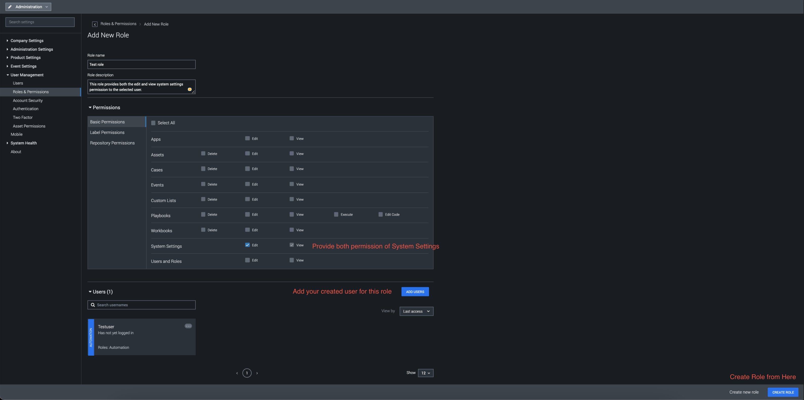

# ServiceNow

Publisher: Splunk \
Connector Version: 2.6.5 \
Product Vendor: ServiceNow \
Product Name: ServiceNow \
Minimum Product Version: 6.3.0

This app integrates with ServiceNow to perform investigative and generic actions

**Notes**

- **Asset Configuration Parameter**

  - on_poll_table: Table to ingest issues from.

  - on_poll_filter: Filter to use with On Poll separated by '^' (e.g. description=This is a
    test^assigned_to=test.name).

  - first_run_container: Maximum containers to ingest for the first run of scheduled polling.

  - max_container: Maximum containers to ingest for subsequent runs of scheduled polling.

  - severity: Custom severity of the ingested artifact.

    - **Using Custom Severities on Ingested Data**
      - If you decide to use custom severities to apply to Containers and Artifacts ingested
        via On Poll, then you must make sure that the automation user you use has the
        correct permissions.

      - By default, the automation user is selected to run the ServiceNow ingestion action.
        (See **Asset Configuration** > **Asset Settings** > **Advanced** ) The automation
        user does **NOT** have access to view or edit **System Settings** , which includes
        the permission to view the custom severities on your instance. This will cause your
        On Poll action to fail since your user cannot pull the custom severities on your
        instance.

      - In order to solve this problem, you must create a user of type **Automation** and
        assign this user a Role that has permissions to view or edit **System Settings** (
        **Administration** > **User Management** > **Users** **> + User** button on the
        top right corner). Then, choose this user in your ServiceNow **Asset Settings**
        under **Advanced** and you will be able to successfully apply custom severities to
        your ingested data.

        **Administration** > **User Management** > **Users** **> + User**
        

        **Administration** > **User Management** > **Roles & Permissions** **> + Role**
        

        **Asset Settings** > **Advanced**
        

      - In order to use the custom severity it is necessary to create a severity over (
        **Administration** > **Event Settings** > **Severity** ). If custom severity has
        not been provided in the asset configuration, then the default severity from "
        **Administration** > **Event Settings** > **Severity** " will be considered.

- **The functioning of On Poll**

  - On Poll ingests the details of the tickets/records of a table provided by the user. An
    ingested container's name will be set to the 'short_description' of the ticket/record. If
    the ticket/record does not have any short_description then a default name will be given to
    the container.

  - **Two ways of polling**

    - Manual polling

      - The application will fetch the number of tickets/records controlled by the
        container_count parameter set in the Poll Now window.
      - Tickets/records can be restricted by providing a filter in the configuration
        parameter.

    - Scheduled Polling

      - The application will fetch the number of tickets/records, controlled by the
        'first_run_container' configuration parameter for the first run of Scheduled Polling
        and by the 'max_container' configuration parameter for the other runs of Scheduled
        Polling. Each poll will ingest tickets/records which have been created or updated
        since the previous run of Scheduled Polling.

- **Specific functionality of ServiceNow On Poll**

  - When the app is installed with Python version 3 and if the data is ingested using On Poll
    with query A and label B, it will list down the containers accordingly. If the ticket that
    is already ingested is updated, and then if the On Poll is executed again with the same
    label i.e. label B and with the same query A, it will not update the container properties
    but will add the updated ticket as an artifact in the already created container.

- **The functioning of Test Connectivity**

  - **Case 1: If Client ID & Client Secret are provided:**

    - Step1: While running the test connectivity, the system will check if the refresh token
      is present or not in the state file.
    - Step2(a): If a refresh token is present then the system will make the API call to fetch
      a new token. Using new token the test connectivity will get passed.
    - Step2(b): If the refresh token is not present then the system will check for the
      Username and Password. Using Username & Password system will make an API call to fetch a
      new token and test connectivity will get passed.
    - Step3: If the refresh token is not present and Username and Password are not provided
      then the system will return an error and the action will fail.

  - **Case 2: If Client ID & Client Secret are not provided:**

    - Step1: While running the test connectivity, System will check if the Username and
      Password are provided or not.
    - Step2: If Username & Password are provided then the system will get authenticated and
      test connectivity will get passed.
    - Step3: If the Username & Password are not provided then the system will return an error
      and the action will fail.

- In order to use the app actions, a user must have these roles itil, sn_request_write, and
  catalog. In some actions, the user can also provide the table name as input in that case the
  user must have the role/permission to access that table.

## Port Information

The app uses HTTP/ HTTPS protocol for communicating with the ServiceNow server. Below are the
default ports used by Splunk SOAR.

|         SERVICE NAME | TRANSPORT PROTOCOL | PORT |
|----------------------|--------------------|------|
|         http | tcp | 80 |
|         https | tcp | 443 |

### Configuration variables

This table lists the configuration variables required to operate ServiceNow. These variables are specified when configuring a ServiceNow asset in Splunk SOAR.

VARIABLE | REQUIRED | TYPE | DESCRIPTION
-------- | -------- | ---- | -----------
**username** | optional | string | Username |
**timezone** | optional | timezone | Timezone configured on ServiceNow |
**url** | required | string | Device URL including the port, e.g. https://myservicenow.enterprise.com:8080 |
**on_poll_table** | optional | string | Table to ingest issues from |
**on_poll_filter** | optional | string | Filter to use with On Poll separated by '^' (e.g. description=This is a test^assigned_to=test.name) |
**client_id** | optional | string | Client ID. OAuth will be preferred if provided |
**client_secret** | optional | password | Client Secret. Required with Client ID |
**password** | optional | password | Password |
**first_run_container** | optional | numeric | Max container (For first run of schedule polling) |
**max_container** | optional | numeric | Max container (For other runs of schedule polling) |
**severity** | optional | string | Severity to apply to Containers and Artifacts ingested via On Poll (Automation user must have System Settings permissions) |

### Supported Actions

[test connectivity](#action-test-connectivity) - Run a query on the device to test connection and credentials \
[add work note](#action-add-work-note) - Add a work note to a record \
[add comment](#action-add-comment) - Add a comment to a record \
[describe service catalog](#action-describe-service-catalog) - Fetches the details of a catalog \
[request catalog item](#action-request-catalog-item) - Requests a catalog item \
[describe catalog item](#action-describe-catalog-item) - Fetches the details of a catalog item \
[list services](#action-list-services) - Get a list of items \
[list categories](#action-list-categories) - Get a list of categories \
[list service catalogs](#action-list-service-catalogs) - Get a list of catalogs \
[list tickets](#action-list-tickets) - Get a list of tickets/records \
[create ticket](#action-create-ticket) - Create a new ticket/record \
[get ticket](#action-get-ticket) - Get ticket/record information \
[update ticket](#action-update-ticket) - Update ticket/record information \
[get variables](#action-get-variables) - Get variables for a ticket/record \
[run query](#action-run-query) - Gets object data according to the specified query \
[query users](#action-query-users) - Gets user data according to the specified query, username, or system ID \
[search sources](#action-search-sources) - Search for records across multiple tables \
[on poll](#action-on-poll) - Ingest tickets from SNOW

## action: 'test connectivity'

Run a query on the device to test connection and credentials

Type: **test** \
Read only: **True**

#### Action Parameters

No parameters are required for this action

#### Action Output

No Output

## action: 'add work note'

Add a work note to a record

Type: **generic** \
Read only: **False**

Users can provide a valid ticket number in the 'sys_id' parameter or check the 'is_sys_id' parameter and provide a valid <b>SYS ID</b> in the 'sys_id' parameter. Users can get the <b>SYS ID</b> value for any ticket from the results of the <b>List Tickets</b> action run. For 'work_note' parameter, users can provide new line(\\n), single quote(\\'), double quote(\\") and backspace(\\b) as escape sequences.

#### Action Parameters

PARAMETER | REQUIRED | DESCRIPTION | TYPE | CONTAINS
--------- | -------- | ----------- | ---- | --------
**table_name** | required | Table to query | string | `servicenow table` |
**id** | required | SYS ID or ticket number of a record | string | `servicenow ticket sysid` `servicenow ticket number` |
**work_note** | required | Work note to add | string | |
**is_sys_id** | optional | Whether the value provided in the ID parameter is SYS ID or ticket number | boolean | |

#### Action Output

DATA PATH | TYPE | CONTAINS | EXAMPLE VALUES
--------- | ---- | -------- | --------------
action_result.status | string | | success failed |
action_result.parameter.id | string | `servicenow ticket sysid` `servicenow ticket number` | 1c832706732023002728660c4cf6a7b9 |
action_result.parameter.is_sys_id | boolean | | True False |
action_result.parameter.table_name | string | `servicenow table` | incident |
action_result.parameter.work_note | string | | check work note |
action_result.data.\*.acquisition_method | string | | |
action_result.data.\*.active | string | | false |
action_result.data.\*.activity_due | string | | UNKNOWN |
action_result.data.\*.additional_assignee_list | string | | |
action_result.data.\*.approval | string | | Not Yet Requested |
action_result.data.\*.approval_history | string | | |
action_result.data.\*.approval_set | string | | |
action_result.data.\*.asset_tag | string | | SW000077 |
action_result.data.\*.assigned | string | | 2020-02-02 23:00:00 |
action_result.data.\*.assigned_condition | string | | |
action_result.data.\*.assigned_to | string | | |
action_result.data.\*.assignment_group | string | | |
action_result.data.\*.beneficiary | string | | |
action_result.data.\*.business_duration | string | | 0 Seconds |
action_result.data.\*.business_service | string | | |
action_result.data.\*.business_stc | string | | 0 |
action_result.data.\*.calendar_duration | string | | 1 Minute |
action_result.data.\*.calendar_stc | string | | 114 |
action_result.data.\*.caller_id | string | | |
action_result.data.\*.caller_id.display_value | string | | Test Name |
action_result.data.\*.caller_id.link | string | `url` | https://devtest.service-now.com/api/now/table/sys_user/77ad8176731313005754660c4cf6a7de |
action_result.data.\*.category | string | | Hardware |
action_result.data.\*.caused_by | string | | |
action_result.data.\*.checked_in | string | | |
action_result.data.\*.checked_out | string | | |
action_result.data.\*.child_incidents | string | | |
action_result.data.\*.ci | string | | |
action_result.data.\*.close_code | string | | Solved (Permanently) |
action_result.data.\*.close_notes | string | | This is not an issue with the USB port. Replaced the headset to resolve the issue. |
action_result.data.\*.closed_at | string | | 2018-12-09 19:29:08 |
action_result.data.\*.closed_by | string | | |
action_result.data.\*.closed_by.display_value | string | | System Administrator |
action_result.data.\*.closed_by.link | string | `url` | https://devtest.service-now.com/api/now/table/sys_user/6816f79cc0a8016401c5a33be04be441 |
action_result.data.\*.cmdb_ci | string | | |
action_result.data.\*.comments | string | | 2019-10-15 03:31:23 - System Administrator (Additional comments) test12345 comment  2019-10-15 02:25:50 - System Administrator (Additional comments) This is a test123 comment  2019-10-10 06:00:48 - System Administrator (Additional comments) This is a test comment  2019-10-10 05:45:58 - System Administrator (Additional comments) This is a test comment   |
action_result.data.\*.comments_and_work_notes | string | | 2019-10-15 03:56:58 - System Administrator (Work notes) check work note  2019-10-15 03:31:23 - System Administrator (Additional comments) test12345 comment  2019-10-15 02:27:07 - System Administrator (Work notes) This is a test123 work note  2019-10-15 02:25:50 - System Administrator (Additional comments) This is a test123 comment  2019-10-10 06:00:48 - System Administrator (Additional comments) This is a test comment  2019-10-10 05:54:52 - System Administrator (Work notes) This is a test work note  2019-10-10 05:45:58 - System Administrator (Additional comments) This is a test comment   |
action_result.data.\*.company | string | | |
action_result.data.\*.company.display_value | string | | ACME Corporation |
action_result.data.\*.company.link | string | | https://dev78070.service-now.com/api/now/table/core_company/e7c1f3d53790200044e0bfc8bcbe5deb |
action_result.data.\*.contact_type | string | | |
action_result.data.\*.contract | string | | |
action_result.data.\*.correlation_display | string | | |
action_result.data.\*.correlation_id | string | | |
action_result.data.\*.cost | string | | $590.00 |
action_result.data.\*.cost_center | string | | |
action_result.data.\*.delivery_date | string | | |
action_result.data.\*.delivery_plan | string | | |
action_result.data.\*.delivery_task | string | | |
action_result.data.\*.department | string | | |
action_result.data.\*.depreciated_amount | string | | $0.00 |
action_result.data.\*.depreciation | string | | |
action_result.data.\*.depreciation_date | string | | |
action_result.data.\*.description | string | | My computer is not detecting the headphone device. It could be an issue with the USB port. |
action_result.data.\*.display_name | string | | SW000077 Test |
action_result.data.\*.disposal_reason | string | | |
action_result.data.\*.due | string | | |
action_result.data.\*.due_date | string | | |
action_result.data.\*.due_in | string | | |
action_result.data.\*.entitlement_condition | string | | |
action_result.data.\*.escalation | string | | Normal |
action_result.data.\*.expected_start | string | | |
action_result.data.\*.expenditure_type | string | | |
action_result.data.\*.follow_up | string | | |
action_result.data.\*.gl_account | string | | |
action_result.data.\*.group_list | string | | |
action_result.data.\*.hold_reason | string | | |
action_result.data.\*.impact | string | | 2 - Medium |
action_result.data.\*.incident_state | string | | Closed |
action_result.data.\*.install_date | string | | 2019-08-19 01:00:00 |
action_result.data.\*.install_status | string | | In use |
action_result.data.\*.invoice_number | string | | |
action_result.data.\*.is_merged_license | string | | false |
action_result.data.\*.justification | string | | |
action_result.data.\*.knowledge | string | | false |
action_result.data.\*.lease_id | string | | |
action_result.data.\*.license_key | string | | |
action_result.data.\*.location | string | | |
action_result.data.\*.made_sla | string | | true |
action_result.data.\*.managed_by | string | | |
action_result.data.\*.merged_into | string | | |
action_result.data.\*.model.display_value | string | | ASP.NET 2011 |
action_result.data.\*.model.link | string | | https://dev78070.service-now.com/api/now/table/cmdb_model/81bfae3f37601000deeabfc8bcbe5d2d |
action_result.data.\*.model_category.display_value | string | | Software License |
action_result.data.\*.model_category.link | string | | https://dev78070.service-now.com/api/now/table/cmdb_model_category/35bf2d4137101000deeabfc8bcbe5dbd |
action_result.data.\*.notify | string | | Do Not Notify |
action_result.data.\*.number | string | `servicenow ticket number` | INC0000001 |
action_result.data.\*.old_status | string | | |
action_result.data.\*.old_substatus | string | | |
action_result.data.\*.opened_at | string | | 2018-09-16 05:49:23 |
action_result.data.\*.opened_by.display_value | string | | System Administrator |
action_result.data.\*.opened_by.link | string | `url` | https://devtest.service-now.com/api/now/table/sys_user/6816f79cc0a8016401c5a33be04be441 |
action_result.data.\*.order | string | | |
action_result.data.\*.order_date | string | | |
action_result.data.\*.owned_by | string | | |
action_result.data.\*.parent | string | | |
action_result.data.\*.parent_incident | string | | |
action_result.data.\*.po_number | string | | |
action_result.data.\*.pre_allocated | string | | false |
action_result.data.\*.priority | string | | 3 - Moderate |
action_result.data.\*.problem_id | string | | |
action_result.data.\*.purchase_date | string | | |
action_result.data.\*.quantity | string | | 1 |
action_result.data.\*.reassignment_count | string | | 0 |
action_result.data.\*.reopen_count | string | | 0 |
action_result.data.\*.reopened_by | string | | |
action_result.data.\*.reopened_time | string | | |
action_result.data.\*.request_line | string | | |
action_result.data.\*.resale_price | string | | $0.00 |
action_result.data.\*.reserved_for | string | | |
action_result.data.\*.residual | string | | $0.00 |
action_result.data.\*.residual_date | string | | |
action_result.data.\*.resolved_at | string | | 2018-09-16 05:51:17 |
action_result.data.\*.resolved_by | string | | |
action_result.data.\*.resolved_by.display_value | string | | System Administrator |
action_result.data.\*.resolved_by.link | string | `url` | https://devtest.service-now.com/api/now/table/sys_user/6816f79cc0a8016401c5a33be04be441 |
action_result.data.\*.retired | string | | |
action_result.data.\*.retirement_date | string | | |
action_result.data.\*.rfc | string | | |
action_result.data.\*.rights | string | | 10 |
action_result.data.\*.route_reason | string | | |
action_result.data.\*.salvage_value | string | | $0.00 |
action_result.data.\*.serial_number | string | | |
action_result.data.\*.service_offering | string | | |
action_result.data.\*.severity | string | | 3 - Low |
action_result.data.\*.short_description | string | | My computer is not detecting the headphone device |
action_result.data.\*.skip_sync | string | | false |
action_result.data.\*.sla_due | string | | UNKNOWN |
action_result.data.\*.state | string | | Closed |
action_result.data.\*.stockroom | string | | |
action_result.data.\*.subcategory | string | | |
action_result.data.\*.substatus | string | | |
action_result.data.\*.support_group | string | | |
action_result.data.\*.supported_by | string | | |
action_result.data.\*.sys_class_name | string | | Incident |
action_result.data.\*.sys_created_by | string | | admin |
action_result.data.\*.sys_created_on | string | | 2018-09-16 05:50:05 |
action_result.data.\*.sys_domain.display_value | string | | global |
action_result.data.\*.sys_domain.link | string | `url` | https://devtest.service-now.com/api/now/table/sys_user_group/global |
action_result.data.\*.sys_domain_path | string | `domain` | / |
action_result.data.\*.sys_id | string | `servicenow ticket sysid` `md5` | 1c832706732023002728660c4cf6a7b9 |
action_result.data.\*.sys_mod_count | string | | 17 |
action_result.data.\*.sys_tags | string | | |
action_result.data.\*.sys_updated_by | string | | admin |
action_result.data.\*.sys_updated_on | string | | 2019-10-15 03:56:58 |
action_result.data.\*.task_effective_number | string | | INC0010111 |
action_result.data.\*.time_worked | string | | |
action_result.data.\*.u_short_description | string | | |
action_result.data.\*.universal_request | string | | |
action_result.data.\*.upon_approval | string | | Proceed to Next Task |
action_result.data.\*.upon_reject | string | | Cancel all future Tasks |
action_result.data.\*.urgency | string | | 2 - Medium |
action_result.data.\*.user_input | string | | |
action_result.data.\*.vendor.display_value | string | | PRB000050 Test |
action_result.data.\*.vendor.link | string | `url` | https://dev78070.service-now.com/api/now/table/core_company/0e8b8e650a0a0b3b004f285ffbb1a4fc |
action_result.data.\*.warranty_expiration | string | | |
action_result.data.\*.watch_list | string | | |
action_result.data.\*.work_end | string | | |
action_result.data.\*.work_notes | string | | 2019-10-15 03:56:58 - System Administrator (Work notes) check work note  2019-10-15 02:27:07 - System Administrator (Work notes) This is a test123 work note  2019-10-10 05:54:52 - System Administrator (Work notes) This is a test work note   |
action_result.data.\*.work_notes_list | string | | |
action_result.data.\*.work_start | string | | |
action_result.summary | string | | |
action_result.message | string | | Added the work note successfully |
summary.total_objects | numeric | | 1 |
summary.total_objects_successful | numeric | | 1 |

## action: 'add comment'

Add a comment to a record

Type: **generic** \
Read only: **False**

Users can provide a valid ticket number in the 'sys_id' parameter or check the 'is_sys_id' parameter and provide a valid <b>SYS ID</b> in the 'sys_id' parameter. Users can get the <b>SYS ID</b> value for any ticket from the results of the <b>List Tickets</b> action run. For 'comment' parameter, users can provide new line(\\n), single quote(\\'), double quote(\\") and backspace(\\b) as escape sequences.

#### Action Parameters

PARAMETER | REQUIRED | DESCRIPTION | TYPE | CONTAINS
--------- | -------- | ----------- | ---- | --------
**table_name** | required | Table to query | string | `servicenow table` |
**id** | required | SYS ID or ticket number of a record | string | `servicenow ticket sysid` `servicenow ticket number` |
**comment** | required | Comment to add | string | |
**is_sys_id** | optional | Whether the value provided in the ID parameter is SYS ID or ticket number | boolean | |

#### Action Output

DATA PATH | TYPE | CONTAINS | EXAMPLE VALUES
--------- | ---- | -------- | --------------
action_result.status | string | | success failed |
action_result.parameter.comment | string | | test12345 comment |
action_result.parameter.id | string | `servicenow ticket sysid` `servicenow ticket number` | 1c832706732023002728660c4cf6a7b9 INC0000001 |
action_result.parameter.is_sys_id | boolean | | True False |
action_result.parameter.table_name | string | `servicenow table` | incident |
action_result.data.\*.acquisition_method | string | | |
action_result.data.\*.active | string | | false |
action_result.data.\*.activity_due | string | | UNKNOWN |
action_result.data.\*.additional_assignee_list | string | | |
action_result.data.\*.approval | string | | Not Yet Requested |
action_result.data.\*.approval_history | string | | |
action_result.data.\*.approval_set | string | | |
action_result.data.\*.asset_tag | string | | P1000479 |
action_result.data.\*.asset_tracking_strategy | string | | Leave to category |
action_result.data.\*.assigned | string | | 2018-07-29 00:00:00 |
action_result.data.\*.assigned_condition | string | | |
action_result.data.\*.assigned_to | string | | |
action_result.data.\*.assigned_to.display_value | string | | Miranda Hammitt |
action_result.data.\*.assigned_to.link | string | | https://dev78070.service-now.com/api/now/table/sys_user/9a826bf03710200044e0bfc8bcbe5dad |
action_result.data.\*.assignment_group | string | | |
action_result.data.\*.barcode | string | | G73SW-XN2 |
action_result.data.\*.beneficiary | string | | |
action_result.data.\*.bundle | string | | false |
action_result.data.\*.business_duration | string | | 0 Seconds |
action_result.data.\*.business_service | string | | |
action_result.data.\*.business_stc | string | | 0 |
action_result.data.\*.calendar_duration | string | | 1 Minute |
action_result.data.\*.calendar_stc | string | | 114 |
action_result.data.\*.caller_id | string | | |
action_result.data.\*.caller_id.display_value | string | | Test Name |
action_result.data.\*.caller_id.link | string | `url` | https://devtest.service-now.com/api/now/table/sys_user/77ad8176731313005754660c4cf6a7de |
action_result.data.\*.category | string | | Hardware |
action_result.data.\*.caused_by | string | | |
action_result.data.\*.certified | string | | false |
action_result.data.\*.checked_in | string | | |
action_result.data.\*.checked_out | string | | |
action_result.data.\*.child_incidents | string | | 1 |
action_result.data.\*.ci | string | | |
action_result.data.\*.ci.display_value | string | | MacBook Pro 15" |
action_result.data.\*.ci.link | string | | https://dev78070.service-now.com/api/now/table/cmdb_ci/0ca96c0d3790200044e0bfc8bcbe5dc3 |
action_result.data.\*.close_code | string | | Solved (Permanently) |
action_result.data.\*.close_notes | string | | This is not an issue with the USB port. Replaced the headset to resolve the issue. |
action_result.data.\*.closed_at | string | | 2018-12-09 19:29:08 |
action_result.data.\*.closed_by | string | | |
action_result.data.\*.closed_by.display_value | string | | System Administrator |
action_result.data.\*.closed_by.link | string | `url` | https://devtest.service-now.com/api/now/table/sys_user/6816f79cc0a8016401c5a33be04be441 |
action_result.data.\*.cmdb_ci | string | | |
action_result.data.\*.cmdb_ci_class | string | | |
action_result.data.\*.cmdb_model_category | string | | Computer |
action_result.data.\*.comments | string | | 2019-10-15 03:31:23 - System Administrator (Additional comments) test12345 comment  2019-10-15 02:25:50 - System Administrator (Additional comments) This is a test123 comment  2019-10-10 06:00:48 - System Administrator (Additional comments) This is a test comment  2019-10-10 05:45:58 - System Administrator (Additional comments) This is a test comment   |
action_result.data.\*.comments_and_work_notes | string | | 2019-10-15 03:31:23 - System Administrator (Additional comments) test12345 comment  2019-10-15 02:27:07 - System Administrator (Work notes) This is a test123 work note  2019-10-15 02:25:50 - System Administrator (Additional comments) This is a test123 comment  2019-10-10 06:00:48 - System Administrator (Additional comments) This is a test comment  2019-10-10 05:54:52 - System Administrator (Work notes) This is a test work note  2019-10-10 05:45:58 - System Administrator (Additional comments) This is a test comment   |
action_result.data.\*.company | string | | |
action_result.data.\*.company.display_value | string | | ACME China |
action_result.data.\*.company.link | string | | https://dev78070.service-now.com/api/now/table/core_company/81fdf9ebac1d55eb4cb89f136a082555 |
action_result.data.\*.contact_type | string | | |
action_result.data.\*.correlation_display | string | | |
action_result.data.\*.correlation_id | string | | |
action_result.data.\*.cost | string | | $1,799.99 |
action_result.data.\*.cost_center | string | | |
action_result.data.\*.cost_center.display_value | string | | IT |
action_result.data.\*.cost_center.link | string | | https://dev78070.service-now.com/api/now/table/cmn_cost_center/d9d0a971c0a80a641c20b13d99a48576 |
action_result.data.\*.delivery_date | string | | 2018-01-15 23:00:00 |
action_result.data.\*.delivery_plan | string | | |
action_result.data.\*.delivery_task | string | | |
action_result.data.\*.department | string | | |
action_result.data.\*.department.display_value | string | | IT |
action_result.data.\*.department.link | string | | https://dev78070.service-now.com/api/now/table/cmn_department/221f79b7c6112284005d646b76ab978c |
action_result.data.\*.depreciated_amount | string | | $968.47 |
action_result.data.\*.depreciation | string | | |
action_result.data.\*.depreciation.display_value | string | | SL 5 Years |
action_result.data.\*.depreciation.link | string | | https://dev78070.service-now.com/api/now/table/cmdb_depreciation/0f21351437b03000158bbfc8bcbe5da8 |
action_result.data.\*.depreciation_date | string | | 2018-02-28 23:00:00 |
action_result.data.\*.description | string | | My computer is not detecting the headphone device. It could be an issue with the USB port. |
action_result.data.\*.display_name | string | | P1000479 - Apple MacBook Pro 15" |
action_result.data.\*.disposal_reason | string | | |
action_result.data.\*.due | string | | |
action_result.data.\*.due_date | string | | |
action_result.data.\*.due_in | string | | |
action_result.data.\*.entitlement_condition | string | | |
action_result.data.\*.escalation | string | | Normal |
action_result.data.\*.expected_start | string | | |
action_result.data.\*.expenditure_type | string | | |
action_result.data.\*.flow_rate | string | | |
action_result.data.\*.follow_up | string | | |
action_result.data.\*.full_name | string | | |
action_result.data.\*.gl_account | string | | |
action_result.data.\*.group_list | string | | |
action_result.data.\*.hold_reason | string | | |
action_result.data.\*.impact | string | | 2 - Medium |
action_result.data.\*.incident_state | string | | Closed |
action_result.data.\*.install_date | string | | 2018-02-27 23:00:00 |
action_result.data.\*.install_status | string | | In use |
action_result.data.\*.invoice_number | string | | |
action_result.data.\*.is_merged_license | string | | false |
action_result.data.\*.justification | string | | |
action_result.data.\*.knowledge | string | | false |
action_result.data.\*.lease_id | string | | |
action_result.data.\*.license_key | string | | |
action_result.data.\*.location | string | | |
action_result.data.\*.location.display_value | string | | 2500 West Daming Road, Shanghai |
action_result.data.\*.location.link | string | | https://dev78070.service-now.com/api/now/table/cmn_location/8201c34fac1d55eb36e59da730b7d035 |
action_result.data.\*.made_sla | string | | true |
action_result.data.\*.main_component | string | | |
action_result.data.\*.managed_by | string | | |
action_result.data.\*.manufacturer.display_value | string | | Asus |
action_result.data.\*.manufacturer.link | string | | https://dev78070.service-now.com/api/now/table/core_company/a4bfed3737e3100044e0bfc8bcbe5dbe |
action_result.data.\*.merged_into | string | | |
action_result.data.\*.model.display_value | string | | Apple MacBook Pro 15" |
action_result.data.\*.model.link | string | | https://dev78070.service-now.com/api/now/table/cmdb_model/d501454f1b1310002502fbcd2c071334 |
action_result.data.\*.model_category.display_value | string | | Computer |
action_result.data.\*.model_category.link | string | | https://dev78070.service-now.com/api/now/table/cmdb_model_category/81feb9c137101000deeabfc8bcbe5dc4 |
action_result.data.\*.model_number | string | | G73SW-XN2 |
action_result.data.\*.name | string | | G Series |
action_result.data.\*.notify | string | | Do Not Notify |
action_result.data.\*.number | string | `servicenow ticket number` | INC0000001 |
action_result.data.\*.old_status | string | | |
action_result.data.\*.old_substatus | string | | |
action_result.data.\*.opened_at | string | | 2018-09-16 05:49:23 |
action_result.data.\*.opened_by.display_value | string | | System Administrator |
action_result.data.\*.opened_by.link | string | `url` | https://devtest.service-now.com/api/now/table/sys_user/6816f79cc0a8016401c5a33be04be441 |
action_result.data.\*.order | string | | |
action_result.data.\*.order_date | string | | 2017-12-22 23:00:00 |
action_result.data.\*.owned_by | string | | |
action_result.data.\*.owner | string | | |
action_result.data.\*.parent | string | | |
action_result.data.\*.parent_incident | string | | |
action_result.data.\*.picture | string | | |
action_result.data.\*.po_number | string | | PO100004 |
action_result.data.\*.power_consumption | string | | |
action_result.data.\*.pre_allocated | string | | false |
action_result.data.\*.priority | string | | 3 - Moderate |
action_result.data.\*.problem_id | string | | |
action_result.data.\*.product_catalog_item.display_value | string | | Asus G Series |
action_result.data.\*.product_catalog_item.link | string | | https://dev78070.service-now.com/api/now/table/sc_cat_item/7e87837237153000158bbfc8bcbe5df6 |
action_result.data.\*.purchase_date | string | | 2018-01-05 |
action_result.data.\*.quantity | string | | 1 |
action_result.data.\*.rack_units | string | | 1 |
action_result.data.\*.reassignment_count | string | | 0 |
action_result.data.\*.reopen_count | string | | 0 |
action_result.data.\*.reopened_by | string | | |
action_result.data.\*.reopened_time | string | | |
action_result.data.\*.request_line | string | | |
action_result.data.\*.resale_price | string | | $0.00 |
action_result.data.\*.reserved_for | string | | |
action_result.data.\*.residual | string | | $831.52 |
action_result.data.\*.residual_date | string | | 2020-11-08 |
action_result.data.\*.resolved_at | string | | 2018-09-16 05:51:17 |
action_result.data.\*.resolved_by | string | | |
action_result.data.\*.resolved_by.display_value | string | | System Administrator |
action_result.data.\*.resolved_by.link | string | `url` | https://devtest.service-now.com/api/now/table/sys_user/6816f79cc0a8016401c5a33be04be441 |
action_result.data.\*.retired | string | | |
action_result.data.\*.retirement_date | string | | |
action_result.data.\*.rfc | string | | |
action_result.data.\*.rights | string | | 600 |
action_result.data.\*.salvage_value | string | | $0.00 |
action_result.data.\*.serial_number | string | | BQP-854-D33246-GH |
action_result.data.\*.service_offering | string | | |
action_result.data.\*.severity | string | | 3 - Low |
action_result.data.\*.short_description | string | | My computer is not detecting the headphone device |
action_result.data.\*.skip_sync | string | | false |
action_result.data.\*.sla | string | | |
action_result.data.\*.sla_due | string | | UNKNOWN |
action_result.data.\*.sound_power | string | | |
action_result.data.\*.state | string | | Closed |
action_result.data.\*.status | string | | In Production |
action_result.data.\*.stockroom | string | | |
action_result.data.\*.stockroom.display_value | string | | San Diego North - Pickup/Dropoff |
action_result.data.\*.stockroom.link | string | | https://dev78070.service-now.com/api/now/table/alm_stockroom/eaaa2b3f3763100044e0bfc8bcbe5de3 |
action_result.data.\*.subcategory | string | | |
action_result.data.\*.substatus | string | | |
action_result.data.\*.support_group | string | | |
action_result.data.\*.supported_by | string | | |
action_result.data.\*.sys_class_name | string | | Incident |
action_result.data.\*.sys_created_by | string | | admin |
action_result.data.\*.sys_created_on | string | | 2018-09-16 05:50:05 |
action_result.data.\*.sys_domain.display_value | string | | global |
action_result.data.\*.sys_domain.link | string | `url` | https://devtest.service-now.com/api/now/table/sys_user_group/global |
action_result.data.\*.sys_domain_path | string | `domain` | / |
action_result.data.\*.sys_id | string | `servicenow ticket sysid` `md5` | 1c832706732023002728660c4cf6a7b9 |
action_result.data.\*.sys_mod_count | string | | 16 |
action_result.data.\*.sys_tags | string | | |
action_result.data.\*.sys_updated_by | string | | admin |
action_result.data.\*.sys_updated_on | string | | 2019-10-15 03:31:23 |
action_result.data.\*.time_worked | string | | |
action_result.data.\*.type | string | | Generic |
action_result.data.\*.u_short_description | string | | |
action_result.data.\*.upon_approval | string | | Proceed to Next Task |
action_result.data.\*.upon_reject | string | | Cancel all future Tasks |
action_result.data.\*.urgency | string | | 2 - Medium |
action_result.data.\*.user_input | string | | |
action_result.data.\*.vendor.display_value | string | | Apple |
action_result.data.\*.vendor.link | string | | https://dev78070.service-now.com/api/now/table/core_company/b7e9e843c0a80169009a5a485bb2a2b5 |
action_result.data.\*.warranty_expiration | string | | 2021-02-27 |
action_result.data.\*.watch_list | string | | |
action_result.data.\*.weight | string | | |
action_result.data.\*.work_end | string | | |
action_result.data.\*.work_notes | string | | 2019-10-15 02:27:07 - System Administrator (Work notes) This is a test123 work note  2019-10-10 05:54:52 - System Administrator (Work notes) This is a test work note   |
action_result.data.\*.work_notes_list | string | | |
action_result.data.\*.work_start | string | | |
action_result.summary | string | | |
action_result.message | string | | Added the comment successfully |
summary.total_objects | numeric | | 1 |
summary.total_objects_successful | numeric | | 1 |

## action: 'describe service catalog'

Fetches the details of a catalog

Type: **investigate** \
Read only: **True**

#### Action Parameters

PARAMETER | REQUIRED | DESCRIPTION | TYPE | CONTAINS
--------- | -------- | ----------- | ---- | --------
**sys_id** | required | SYS ID of a catalog | string | `servicenow catalog sys id` `md5` |
**max_results** | optional | Max number of service catalog items to return | numeric | |

#### Action Output

DATA PATH | TYPE | CONTAINS | EXAMPLE VALUES
--------- | ---- | -------- | --------------
action_result.status | string | | success failed |
action_result.parameter.max_results | numeric | | 100 |
action_result.parameter.sys_id | string | `servicenow catalog sys id` `md5` | aeed229047801200e0ef563dbb9a71c2 |
action_result.data.\*.active | string | | true |
action_result.data.\*.background_color | string | | #FFFFFF |
action_result.data.\*.categories.\*.active | string | | true |
action_result.data.\*.categories.\*.description | string | | Propose a new Standard Change Template. Modify or Retire an existing Standard Change Template. |
action_result.data.\*.categories.\*.entitlement_script | string | | |
action_result.data.\*.categories.\*.header_icon | string | | |
action_result.data.\*.categories.\*.homepage_image | string | | |
action_result.data.\*.categories.\*.homepage_renderer | string | | |
action_result.data.\*.categories.\*.homepage_renderer.link | string | `url` | https://devtest.service-now.com/api/now/table/sc_homepage_renderer/Default |
action_result.data.\*.categories.\*.homepage_renderer.value | string | `md5` | Default |
action_result.data.\*.categories.\*.icon | string | | |
action_result.data.\*.categories.\*.image | string | | |
action_result.data.\*.categories.\*.location | string | | |
action_result.data.\*.categories.\*.mobile_hide_description | string | | false |
action_result.data.\*.categories.\*.mobile_picture | string | | |
action_result.data.\*.categories.\*.mobile_subcategory_render_type | string | | list |
action_result.data.\*.categories.\*.module | string | | |
action_result.data.\*.categories.\*.order | string | | 0 |
action_result.data.\*.categories.\*.parent | string | | |
action_result.data.\*.categories.\*.parent.link | string | `url` | https://devtest.service-now.com/api/now/table/sc_category/b0fdfb01932002009ca87a75e57ffbe9 |
action_result.data.\*.categories.\*.parent.value | string | `md5` | b0fdfb01932002009ca87a75e57ffbe9 |
action_result.data.\*.categories.\*.roles | string | | |
action_result.data.\*.categories.\*.sc_catalog.link | string | `url` | https://devtest.service-now.com/api/now/table/sc_catalog/e0d08b13c3330100c8b837659bba8fb4 |
action_result.data.\*.categories.\*.sc_catalog.value | string | `md5` | e0d08b13c3330100c8b837659bba8fb4 |
action_result.data.\*.categories.\*.show_in_cms | string | | false |
action_result.data.\*.categories.\*.sys_class_name | string | | sc_category |
action_result.data.\*.categories.\*.sys_created_by | string | | admin |
action_result.data.\*.categories.\*.sys_created_on | string | | 2015-06-24 04:53:17 |
action_result.data.\*.categories.\*.sys_id | string | `servicenow category sys id` `md5` | 00728916937002002dcef157b67ffb6d |
action_result.data.\*.categories.\*.sys_mod_count | string | | 1 |
action_result.data.\*.categories.\*.sys_name | string | | Template Management |
action_result.data.\*.categories.\*.sys_package.link | string | `url` | https://devtest.service-now.com/api/now/table/sys_package/fe3f01141b1400106cc640c6cc4bcbc1 |
action_result.data.\*.categories.\*.sys_package.value | string | `md5` | fe3f01141b1400106cc640c6cc4bcbc1 |
action_result.data.\*.categories.\*.sys_policy | string | | |
action_result.data.\*.categories.\*.sys_scope.link | string | `url` | https://devtest.service-now.com/api/now/table/sys_scope/global |
action_result.data.\*.categories.\*.sys_scope.value | string | `md5` | global |
action_result.data.\*.categories.\*.sys_tags | string | | |
action_result.data.\*.categories.\*.sys_update_name | string | | sc_category_00728916937002002dcef157b67ffb6d |
action_result.data.\*.categories.\*.sys_updated_by | string | | admin |
action_result.data.\*.categories.\*.sys_updated_on | string | | 2015-06-24 04:54:20 |
action_result.data.\*.categories.\*.title | string | | Template Management |
action_result.data.\*.description | string | | Service Catalog - IT Now |
action_result.data.\*.desktop_continue_shopping | string | | |
action_result.data.\*.desktop_home_page | string | | |
action_result.data.\*.desktop_image | string | | |
action_result.data.\*.editors | string | | |
action_result.data.\*.enable_wish_list | string | | false |
action_result.data.\*.items.\*.active | string | | true |
action_result.data.\*.items.\*.availability | string | | on_desktop |
action_result.data.\*.items.\*.billable | string | | false |
action_result.data.\*.items.\*.catalogs.\*.active | boolean | | True False |
action_result.data.\*.items.\*.catalogs.\*.sys_id | string | `servicenow catalog sys id` `md5` | e0d08b13c3330100c8b837659bba8fb4 |
action_result.data.\*.items.\*.catalogs.\*.title | string | | Service Catalog |
action_result.data.\*.items.\*.category | string | | |
action_result.data.\*.items.\*.category.link | string | | https://dev78070.service-now.com/api/now/table/sc_category/00728916937002002dcef157b67ffb6d |
action_result.data.\*.items.\*.category.sys_id | string | `servicenow category sys id` `md5` | 00728916937002002dcef157b67ffb6d |
action_result.data.\*.items.\*.category.title | string | | Template Management |
action_result.data.\*.items.\*.category.value | string | | 00728916937002002dcef157b67ffb6d |
action_result.data.\*.items.\*.content_type | string | | |
action_result.data.\*.items.\*.cost | string | | 0 |
action_result.data.\*.items.\*.custom_cart | string | | |
action_result.data.\*.items.\*.delivery_plan | string | | |
action_result.data.\*.items.\*.delivery_plan.link | string | | https://dev78070.service-now.com/api/now/table/sc_cat_item_delivery_plan/523da512c611228900811a37c97c2014 |
action_result.data.\*.items.\*.delivery_plan.value | string | | 523da512c611228900811a37c97c2014 |
action_result.data.\*.items.\*.delivery_plan_script | string | | |
action_result.data.\*.items.\*.delivery_time | string | | 1970-01-03 00:00:00 |
action_result.data.\*.items.\*.description | string | | 
Request an existing Standard Change Template is made unavailable when it is no longer required or no longer acceptable as a Standard Change. This will be confirmed by your Change Management team.
 |
action_result.data.\*.items.\*.display_price_property | string | | non_zero |
action_result.data.\*.items.\*.entitlement_script | string | | |
action_result.data.\*.items.\*.group | string | | |
action_result.data.\*.items.\*.hide_sp | string | | true |
action_result.data.\*.items.\*.icon | string | | images/icons/catalog_item.gifx |
action_result.data.\*.items.\*.ignore_price | string | | true |
action_result.data.\*.items.\*.image | string | | |
action_result.data.\*.items.\*.kb_article | string | | |
action_result.data.\*.items.\*.list_price | string | | 0 |
action_result.data.\*.items.\*.local_currency | string | | USD |
action_result.data.\*.items.\*.localized_price | string | | $139.99 |
action_result.data.\*.items.\*.localized_recurring_price | string | | $0.00 |
action_result.data.\*.items.\*.location | string | | |
action_result.data.\*.items.\*.mandatory_attachment | string | | true |
action_result.data.\*.items.\*.meta | string | | |
action_result.data.\*.items.\*.mobile_hide_price | string | | false |
action_result.data.\*.items.\*.mobile_picture | string | | |
action_result.data.\*.items.\*.mobile_picture_type | string | | use_desktop_picture |
action_result.data.\*.items.\*.model | string | | |
action_result.data.\*.items.\*.model.link | string | | https://dev78070.service-now.com/api/now/table/cmdb_model/15e8f8d537a01000deeabfc8bcbe5d46 |
action_result.data.\*.items.\*.model.value | string | | 15e8f8d537a01000deeabfc8bcbe5d46 |
action_result.data.\*.items.\*.name | string | | Retire a Standard Change Template |
action_result.data.\*.items.\*.no_attachment_v2 | string | | false |
action_result.data.\*.items.\*.no_cart | string | | false |
action_result.data.\*.items.\*.no_cart_v2 | string | | false |
action_result.data.\*.items.\*.no_delivery_time_v2 | string | | false |
action_result.data.\*.items.\*.no_order | string | | false |
action_result.data.\*.items.\*.no_order_now | string | | false |
action_result.data.\*.items.\*.no_proceed_checkout | string | | false |
action_result.data.\*.items.\*.no_quantity | string | | false |
action_result.data.\*.items.\*.no_quantity_v2 | string | | false |
action_result.data.\*.items.\*.no_search | string | | false |
action_result.data.\*.items.\*.no_wishlist_v2 | string | | false |
action_result.data.\*.items.\*.omit_price | string | | false |
action_result.data.\*.items.\*.order | string | | 30 |
action_result.data.\*.items.\*.ordered_item_link | string | | |
action_result.data.\*.items.\*.picture | string | | |
action_result.data.\*.items.\*.preview | string | | JavaScript: popupOpenStandard("com.glideapp.servicecatalog_cat_item_view.do?v=1&sysparm_id=011f117a9f3002002920bde8132e7020&sysparm_preview=true", "summary"); |
action_result.data.\*.items.\*.price | string | | $139.99 |
action_result.data.\*.items.\*.price_currency | string | | USD |
action_result.data.\*.items.\*.recurring_frequency | string | | |
action_result.data.\*.items.\*.recurring_price | string | | $0.00 |
action_result.data.\*.items.\*.recurring_price_currency | string | | USD |
action_result.data.\*.items.\*.request_method | string | | |
action_result.data.\*.items.\*.roles | string | | |
action_result.data.\*.items.\*.sc_catalogs | string | | e0d08b13c3330100c8b837659bba8fb4 |
action_result.data.\*.items.\*.sc_ic_item_staging | string | | |
action_result.data.\*.items.\*.sc_ic_version | string | | |
action_result.data.\*.items.\*.short_description | string | | |
action_result.data.\*.items.\*.show_delivery_time | boolean | | True False |
action_result.data.\*.items.\*.show_price | boolean | | True False |
action_result.data.\*.items.\*.show_quantity | boolean | | True False |
action_result.data.\*.items.\*.show_variable_help_on_load | string | | false |
action_result.data.\*.items.\*.show_wishlist | boolean | | True False |
action_result.data.\*.items.\*.start_closed | string | | false |
action_result.data.\*.items.\*.sys_class_name | string | | sc_cat_item_producer |
action_result.data.\*.items.\*.sys_created_by | string | | admin |
action_result.data.\*.items.\*.sys_created_on | string | | 2015-06-25 20:19:46 |
action_result.data.\*.items.\*.sys_id | string | `servicenow item sys id` `md5` | 011f117a9f3002002920bde8132e7020 |
action_result.data.\*.items.\*.sys_mod_count | string | | 21 |
action_result.data.\*.items.\*.sys_name | string | | Retire a Standard Change Template |
action_result.data.\*.items.\*.sys_package.link | string | | https://dev78070.service-now.com/api/now/table/sys_package/67117ed02f07101045f851172799b656 |
action_result.data.\*.items.\*.sys_package.value | string | | 67117ed02f07101045f851172799b656 |
action_result.data.\*.items.\*.sys_policy | string | | |
action_result.data.\*.items.\*.sys_scope.link | string | | https://dev78070.service-now.com/api/now/table/sys_scope/global |
action_result.data.\*.items.\*.sys_scope.value | string | | global |
action_result.data.\*.items.\*.sys_tags | string | | |
action_result.data.\*.items.\*.sys_update_name | string | | sc_cat_item_producer_011f117a9f3002002920bde8132e7020 |
action_result.data.\*.items.\*.sys_updated_by | string | | admin |
action_result.data.\*.items.\*.sys_updated_on | string | | 2017-11-02 22:38:21 |
action_result.data.\*.items.\*.template | string | | |
action_result.data.\*.items.\*.template.link | string | | https://dev78070.service-now.com/api/now/table/sys_template/56e62ccbc611227500adb083f968a484 |
action_result.data.\*.items.\*.template.value | string | | 56e62ccbc611227500adb083f968a484 |
action_result.data.\*.items.\*.type | string | | record_producer |
action_result.data.\*.items.\*.url | string | | |
action_result.data.\*.items.\*.use_sc_layout | string | | true |
action_result.data.\*.items.\*.vendor | string | | |
action_result.data.\*.items.\*.vendor.link | string | | https://dev78070.service-now.com/api/now/table/core_company/0e8b8e650a0a0b3b004f285ffbb1a4fc |
action_result.data.\*.items.\*.vendor.value | string | | 0e8b8e650a0a0b3b004f285ffbb1a4fc |
action_result.data.\*.items.\*.visible_bundle | string | | true |
action_result.data.\*.items.\*.visible_guide | string | | true |
action_result.data.\*.items.\*.visible_standalone | string | | true |
action_result.data.\*.items.\*.workflow | string | | |
action_result.data.\*.items.\*.workflow.link | string | | https://dev78070.service-now.com/api/now/table/wf_workflow/c2c3f55037023000158bbfc8bcbe5d6d |
action_result.data.\*.items.\*.workflow.value | string | | c2c3f55037023000158bbfc8bcbe5d6d |
action_result.data.\*.manager | string | | |
action_result.data.\*.sys_class_name | string | | sc_catalog |
action_result.data.\*.sys_created_by | string | | admin |
action_result.data.\*.sys_created_on | string | | 2013-09-19 11:03:11 |
action_result.data.\*.sys_id | string | `servicenow catalog sys id` `md5` | e0d08b13c3330100c8b837659bba8fb4 |
action_result.data.\*.sys_mod_count | string | | 48 |
action_result.data.\*.sys_name | string | | Service Catalog |
action_result.data.\*.sys_package.link | string | `url` | https://devtest.service-now.com/api/now/table/sys_package/15dd41d41bd000106cc640c6cc4bcb17 |
action_result.data.\*.sys_package.value | string | `md5` | 15dd41d41bd000106cc640c6cc4bcb17 |
action_result.data.\*.sys_policy | string | | |
action_result.data.\*.sys_scope.link | string | `url` | https://devtest.service-now.com/api/now/table/sys_scope/global |
action_result.data.\*.sys_scope.value | string | | global |
action_result.data.\*.sys_tags | string | | |
action_result.data.\*.sys_update_name | string | | sc_catalog_e0d08b13c3330100c8b837659bba8fb4 |
action_result.data.\*.sys_updated_by | string | | admin |
action_result.data.\*.sys_updated_on | string | | 2016-06-16 05:19:58 |
action_result.data.\*.title | string | | Service Catalog |
action_result.summary | string | | |
action_result.message | string | | Details fetched successfully |
summary.total_objects | numeric | | 1 |
summary.total_objects_successful | numeric | | 1 |

## action: 'request catalog item'

Requests a catalog item

Type: **generic** \
Read only: **False**

#### Action Parameters

PARAMETER | REQUIRED | DESCRIPTION | TYPE | CONTAINS
--------- | -------- | ----------- | ---- | --------
**sys_id** | required | SYS ID of an item | string | `servicenow item sys id` `md5` |
**variables** | optional | JSON containing variables values | string | |
**quantity** | required | Number of items to request | numeric | |

#### Action Output

DATA PATH | TYPE | CONTAINS | EXAMPLE VALUES
--------- | ---- | -------- | --------------
action_result.status | string | | success failed |
action_result.parameter.quantity | numeric | | 3 |
action_result.parameter.sys_id | string | `servicenow item sys id` `md5` | 01205b180a0a0b3000b6efd641d24b75 |
action_result.parameter.variables | string | | {"role_delegator_group":"test"} |
action_result.data.\*.active | string | | true |
action_result.data.\*.activity_due | string | | |
action_result.data.\*.additional_assignee_list | string | | |
action_result.data.\*.approval | string | | approved |
action_result.data.\*.approval_history | string | | |
action_result.data.\*.approval_set | string | | |
action_result.data.\*.assigned_to | string | | |
action_result.data.\*.assignment_group | string | | |
action_result.data.\*.business_duration | string | | |
action_result.data.\*.business_service | string | | |
action_result.data.\*.calendar_duration | string | | |
action_result.data.\*.calendar_stc | string | | |
action_result.data.\*.close_notes | string | | |
action_result.data.\*.closed_at | string | | |
action_result.data.\*.closed_by | string | | |
action_result.data.\*.cmdb_ci | string | | |
action_result.data.\*.comments | string | | |
action_result.data.\*.comments_and_work_notes | string | | |
action_result.data.\*.company | string | | |
action_result.data.\*.contact_type | string | | |
action_result.data.\*.correlation_display | string | | |
action_result.data.\*.correlation_id | string | | |
action_result.data.\*.delivery_address | string | | |
action_result.data.\*.delivery_plan | string | | |
action_result.data.\*.delivery_task | string | | |
action_result.data.\*.description | string | | |
action_result.data.\*.due_date | string | | 2019-10-18 13:49:24 |
action_result.data.\*.escalation | string | | 0 |
action_result.data.\*.expected_start | string | | |
action_result.data.\*.follow_up | string | | |
action_result.data.\*.group_list | string | | |
action_result.data.\*.impact | string | | 3 |
action_result.data.\*.knowledge | string | | false |
action_result.data.\*.location | string | | |
action_result.data.\*.made_sla | string | | true |
action_result.data.\*.number | string | `servicenow ticket number` | REQ0010008 |
action_result.data.\*.opened_at | string | | 2019-10-18 13:49:24 |
action_result.data.\*.opened_by.link | string | `url` | https://devtest.service-now.com/api/now/table/sys_user/6816f79cc0a8016401c5a33be04be441 |
action_result.data.\*.opened_by.value | string | `md5` | 6816f79cc0a8016401c5a33be04be441 |
action_result.data.\*.order | string | | |
action_result.data.\*.parent | string | | |
action_result.data.\*.parent_interaction | string | | |
action_result.data.\*.price | string | | 0 |
action_result.data.\*.priority | string | | 4 |
action_result.data.\*.reassignment_count | string | | 0 |
action_result.data.\*.request_state | string | | in_process |
action_result.data.\*.requested_date | string | | |
action_result.data.\*.requested_for.link | string | `url` | https://devtest.service-now.com/api/now/table/sys_user/6816f79cc0a8016401c5a33be04be441 |
action_result.data.\*.requested_for.value | string | `md5` | 6816f79cc0a8016401c5a33be04be441 |
action_result.data.\*.service_offering | string | | |
action_result.data.\*.short_description | string | | |
action_result.data.\*.sla_due | string | | |
action_result.data.\*.special_instructions | string | | |
action_result.data.\*.stage | string | | requested |
action_result.data.\*.state | string | | 1 |
action_result.data.\*.sys_class_name | string | | sc_request |
action_result.data.\*.sys_created_by | string | | admin |
action_result.data.\*.sys_created_on | string | | 2019-10-18 13:49:24 |
action_result.data.\*.sys_domain.link | string | `url` | https://devtest.service-now.com/api/now/table/sys_user_group/global |
action_result.data.\*.sys_domain.value | string | | global |
action_result.data.\*.sys_domain_path | string | `domain` | / |
action_result.data.\*.sys_id | string | `md5` | 9660d88a1b6000106cc640c6cc4bcbb0 |
action_result.data.\*.sys_mod_count | string | | 0 |
action_result.data.\*.sys_tags | string | | |
action_result.data.\*.sys_updated_by | string | | admin |
action_result.data.\*.sys_updated_on | string | | 2019-10-18 13:49:24 |
action_result.data.\*.time_worked | string | | |
action_result.data.\*.upon_approval | string | | proceed |
action_result.data.\*.upon_reject | string | | cancel |
action_result.data.\*.urgency | string | | 3 |
action_result.data.\*.user_input | string | | |
action_result.data.\*.watch_list | string | | |
action_result.data.\*.work_end | string | | |
action_result.data.\*.work_notes | string | | |
action_result.data.\*.work_notes_list | string | | |
action_result.data.\*.work_start | string | | |
action_result.summary | string | | |
action_result.message | string | | The item has been requested |
summary.total_objects | numeric | | 1 |
summary.total_objects_successful | numeric | | 1 |

## action: 'describe catalog item'

Fetches the details of a catalog item

Type: **investigate** \
Read only: **True**

#### Action Parameters

PARAMETER | REQUIRED | DESCRIPTION | TYPE | CONTAINS
--------- | -------- | ----------- | ---- | --------
**sys_id** | required | SYS ID of an item | string | `servicenow item sys id` `md5` |

#### Action Output

DATA PATH | TYPE | CONTAINS | EXAMPLE VALUES
--------- | ---- | -------- | --------------
action_result.status | string | | success failed |
action_result.parameter.sys_id | string | `servicenow item sys id` `md5` | 81c887819f203100d8f8700c267fcfb5 |
action_result.data.\*.catalogs.\*.active | boolean | | True False |
action_result.data.\*.catalogs.\*.sys_id | string | `servicenow catalog sys id` `md5` | e0d08b13c3330100c8b837659bba8fb4 |
action_result.data.\*.catalogs.\*.title | string | | Service Catalog |
action_result.data.\*.categories.\*.active | boolean | | True False |
action_result.data.\*.categories.\*.category.active | boolean | | True False |
action_result.data.\*.categories.\*.category.sys_id | string | | b06546f23731300054b6a3549dbe5dd8 |
action_result.data.\*.categories.\*.category.title | string | | Tablets |
action_result.data.\*.categories.\*.sys_id | string | `servicenow category sys id` `md5` | e15706fc0a0a0aa7007fc21e1ab70c2f |
action_result.data.\*.categories.\*.title | string | | Can We Help You? |
action_result.data.\*.category.sys_id | string | `servicenow category sys id` `md5` | e15706fc0a0a0aa7007fc21e1ab70c2f |
action_result.data.\*.category.title | string | | Can We Help You? |
action_result.data.\*.client_script.onLoad.\*.appliesTo | string | | item |
action_result.data.\*.client_script.onLoad.\*.condition | string | | |
action_result.data.\*.client_script.onLoad.\*.fieldName | string | | |
action_result.data.\*.client_script.onLoad.\*.script | string | | function onLoad() {  var stdChangeProducerSysId = getParmVal('std_change_producer');  if (stdChangeProducerSysId) {  g_form.setValue('variables.std_change_producer', stdChangeProducerSysId);  } } function getParmVal(name) { name = name.replace(/\[\\[]/, "\\\\\\\[").replace(/[\\]\]/, "\\\\\\\]");  var regexS = "[\\\\?&]" + name + "=([^&#]\*)";  var regex = new RegExp(regexS);  var results = regex.exec(window.location.href);  if (results) {  return unescape(results[1]);  } else {  return '';  } }  |
action_result.data.\*.client_script.onLoad.\*.sys_id | string | | 9b30f0529f8102002920bde8132e7013 |
action_result.data.\*.client_script.onLoad.\*.type | string | | onLoad |
action_result.data.\*.client_script.onLoad.\*.ui_type | string | | Desktop |
action_result.data.\*.client_script.onLoad.\*.variable_set | string | | |
action_result.data.\*.content_type | string | | |
action_result.data.\*.description | string | | 
Here you can request a new Knowledge Base to be used. A Knowledge Base can be used to store Knowledge in an organization and anyone can request for a new one to be created.
 |
action_result.data.\*.icon | string | | images/icons/catalog_item.gifx |
action_result.data.\*.kb_article | string | | |
action_result.data.\*.local_currency | string | | USD |
action_result.data.\*.localized_price | string | | $600.00 |
action_result.data.\*.localized_recurring_price | string | | $0.00 |
action_result.data.\*.mandatory_attachment | boolean | | True False |
action_result.data.\*.name | string | | Request Knowledge Base |
action_result.data.\*.order | numeric | | 0 |
action_result.data.\*.picture | string | | |
action_result.data.\*.price | string | | $600.00 |
action_result.data.\*.price_currency | string | | USD |
action_result.data.\*.recurring_frequency | string | | |
action_result.data.\*.recurring_price | string | | $0.00 |
action_result.data.\*.recurring_price_currency | string | | USD |
action_result.data.\*.request_method | string | | |
action_result.data.\*.short_description | string | | Request for a Knowledge Base |
action_result.data.\*.show_delivery_time | boolean | | True False |
action_result.data.\*.show_price | boolean | | True False |
action_result.data.\*.show_quantity | boolean | | True False |
action_result.data.\*.show_wishlist | boolean | | True False |
action_result.data.\*.sys_class_name | string | | sc_cat_item_producer |
action_result.data.\*.sys_id | string | `servicenow item sys id` `md5` | 81c887819f203100d8f8700c267fcfb5 |
action_result.data.\*.type | string | | record_producer |
action_result.data.\*.url | string | | |
action_result.data.\*.variables.\*.attributes | string | | edge_encryption_enabled=true |
action_result.data.\*.variables.\*.children.\*.attributes | string | | edge_encryption_enabled=true |
action_result.data.\*.variables.\*.children.\*.display_type | string | | CheckBox |
action_result.data.\*.variables.\*.children.\*.displayvalue | string | | false |
action_result.data.\*.variables.\*.children.\*.friendly_type | string | | check_box |
action_result.data.\*.variables.\*.children.\*.help_text | string | | |
action_result.data.\*.variables.\*.children.\*.id | string | | 90b72d4b4f7b4200086eeed18110c701 |
action_result.data.\*.variables.\*.children.\*.label | string | | Adobe Acrobat |
action_result.data.\*.variables.\*.children.\*.mandatory | boolean | | True False |
action_result.data.\*.variables.\*.children.\*.max_length | numeric | | 0 |
action_result.data.\*.variables.\*.children.\*.name | string | | acrobat |
action_result.data.\*.variables.\*.children.\*.pricing_implications | boolean | | True False |
action_result.data.\*.variables.\*.children.\*.read_only | boolean | | True False |
action_result.data.\*.variables.\*.children.\*.render_label | boolean | | True False |
action_result.data.\*.variables.\*.children.\*.type | numeric | | 7 |
action_result.data.\*.variables.\*.children.\*.value | boolean | | True False |
action_result.data.\*.variables.\*.display_type | string | | Multi Line Text |
action_result.data.\*.variables.\*.displayvalue | string | | |
action_result.data.\*.variables.\*.friendly_type | string | | multi_line_text |
action_result.data.\*.variables.\*.help_text | string | | |
action_result.data.\*.variables.\*.id | string | `md5` | 4e92cf349f203100d8f8700c267fcfe4 |
action_result.data.\*.variables.\*.label | string | | What is the reason for this Knowledge Base to be created? |
action_result.data.\*.variables.\*.macro | string | | std_chg_retire_rp_buttons |
action_result.data.\*.variables.\*.mandatory | boolean | | True False |
action_result.data.\*.variables.\*.max_length | numeric | | 0 |
action_result.data.\*.variables.\*.name | string | | request_reason |
action_result.data.\*.variables.\*.read_only | boolean | | True False |
action_result.data.\*.variables.\*.ref_qualifier | string | | retired=false^EQ |
action_result.data.\*.variables.\*.reference | string | | std_change_record_producer |
action_result.data.\*.variables.\*.render_label | boolean | | True False |
action_result.data.\*.variables.\*.type | numeric | | 2 |
action_result.data.\*.variables.\*.value | string | | |
action_result.data.\*.visible_standalone | boolean | | True False |
action_result.summary | string | | |
action_result.message | string | | Details fetched successfully |
summary.total_objects | numeric | | 1 |
summary.total_objects_successful | numeric | | 1 |

## action: 'list services'

Get a list of items

Type: **investigate** \
Read only: **True**

The 'search text' parameter will search the text in the 'Name', 'Display Name', 'Short Description', and 'Description' fields of an item.

#### Action Parameters

PARAMETER | REQUIRED | DESCRIPTION | TYPE | CONTAINS
--------- | -------- | ----------- | ---- | --------
**catalog_sys_id** | optional | SYS ID of a catalog | string | `servicenow catalog sys id` `md5` |
**category_sys_id** | optional | SYS ID of a catergory | string | `servicenow category sys id` `md5` |
**search_text** | optional | Text pattern to search over | string | |
**max_results** | optional | Max number of items to return | numeric | |

#### Action Output

DATA PATH | TYPE | CONTAINS | EXAMPLE VALUES
--------- | ---- | -------- | --------------
action_result.status | string | | success failed |
action_result.parameter.catalog_sys_id | string | `servicenow catalog sys id` `md5` | e0d08b13c3330100c8b837659bba8fb4 |
action_result.parameter.category_sys_id | string | `servicenow category sys id` `md5` | 00728916937002002dcef157b67ffb6d |
action_result.parameter.max_results | numeric | | 100 |
action_result.parameter.search_text | string | | change |
action_result.data.\*.active | string | | true |
action_result.data.\*.availability | string | | on_desktop |
action_result.data.\*.billable | string | | false |
action_result.data.\*.catalogs | string | `md5` | e0d08b13c3330100c8b837659bba8fb4 |
action_result.data.\*.category | string | | |
action_result.data.\*.category.link | string | `url` | https://devtest.service-now.com/api/now/table/sc_category/00728916937002002dcef157b67ffb6d |
action_result.data.\*.category.value | string | `md5` | 00728916937002002dcef157b67ffb6d |
action_result.data.\*.cost | string | | 0 |
action_result.data.\*.custom_cart | string | | |
action_result.data.\*.delivery_plan | string | | |
action_result.data.\*.delivery_plan.link | string | `url` | https://devtest.service-now.com/api/now/table/sc_cat_item_delivery_plan/523da512c611228900811a37c97c2014 |
action_result.data.\*.delivery_plan.value | string | `md5` | 523da512c611228900811a37c97c2014 |
action_result.data.\*.delivery_plan_script | string | | |
action_result.data.\*.delivery_time | string | | 1970-01-03 00:00:00 |
action_result.data.\*.description | string | | 
Request an existing Standard Change Template is made unavailable when it is no longer required or no longer acceptable as a Standard Change. This will be confirmed by your Change Management team.
 |
action_result.data.\*.display_price_property | string | | non_zero |
action_result.data.\*.entitlement_script | string | | |
action_result.data.\*.group | string | | |
action_result.data.\*.hide_sp | string | | true |
action_result.data.\*.icon | string | | |
action_result.data.\*.ignore_price | string | | true |
action_result.data.\*.image | string | | |
action_result.data.\*.list_price | string | | 0 |
action_result.data.\*.location | string | | |
action_result.data.\*.mandatory_attachment | string | | false |
action_result.data.\*.meta | string | | |
action_result.data.\*.mobile_hide_price | string | | false |
action_result.data.\*.mobile_picture | string | | |
action_result.data.\*.mobile_picture_type | string | | use_desktop_picture |
action_result.data.\*.model | string | | |
action_result.data.\*.model.link | string | | https://dev78070.service-now.com/api/now/table/cmdb_model/15e8f8d537a01000deeabfc8bcbe5d46 |
action_result.data.\*.model.value | string | | 15e8f8d537a01000deeabfc8bcbe5d46 |
action_result.data.\*.name | string | | Retire a Standard Change Template |
action_result.data.\*.no_attachment_v2 | string | | false |
action_result.data.\*.no_cart | string | | false |
action_result.data.\*.no_cart_v2 | string | | false |
action_result.data.\*.no_delivery_time_v2 | string | | false |
action_result.data.\*.no_order | string | | false |
action_result.data.\*.no_order_now | string | | false |
action_result.data.\*.no_proceed_checkout | string | | false |
action_result.data.\*.no_quantity | string | | false |
action_result.data.\*.no_quantity_v2 | string | | false |
action_result.data.\*.no_search | string | | false |
action_result.data.\*.no_wishlist_v2 | string | | false |
action_result.data.\*.omit_price | string | | false |
action_result.data.\*.order | string | | 30 |
action_result.data.\*.ordered_item_link | string | | |
action_result.data.\*.picture | string | | |
action_result.data.\*.preview | string | | JavaScript: popupOpenStandard("com.glideapp.servicecatalog_cat_item_view.do?v=1&sysparm_id=011f117a9f3002002920bde8132e7020&sysparm_preview=true", "summary"); |
action_result.data.\*.price | string | | 0 |
action_result.data.\*.recurring_frequency | string | | |
action_result.data.\*.recurring_price | string | | 0 |
action_result.data.\*.request_method | string | | |
action_result.data.\*.roles | string | | |
action_result.data.\*.sc_catalogs | string | `md5` | e0d08b13c3330100c8b837659bba8fb4 |
action_result.data.\*.sc_ic_item_staging | string | | |
action_result.data.\*.sc_ic_version | string | | |
action_result.data.\*.short_description | string | | |
action_result.data.\*.show_variable_help_on_load | string | | false |
action_result.data.\*.start_closed | string | | false |
action_result.data.\*.sys_class_name | string | | sc_cat_item_producer |
action_result.data.\*.sys_created_by | string | | admin |
action_result.data.\*.sys_created_on | string | | 2015-06-25 20:19:46 |
action_result.data.\*.sys_id | string | `md5` | 011f117a9f3002002920bde8132e7020 |
action_result.data.\*.sys_mod_count | string | | 21 |
action_result.data.\*.sys_name | string | | Retire a Standard Change Template |
action_result.data.\*.sys_package.link | string | `url` | https://devtest.service-now.com/api/now/table/sys_package/fe3f01141b1400106cc640c6cc4bcbc1 |
action_result.data.\*.sys_package.value | string | `md5` | fe3f01141b1400106cc640c6cc4bcbc1 |
action_result.data.\*.sys_policy | string | | |
action_result.data.\*.sys_scope.link | string | `url` | https://devtest.service-now.com/api/now/table/sys_scope/global |
action_result.data.\*.sys_scope.value | string | | global |
action_result.data.\*.sys_tags | string | | |
action_result.data.\*.sys_update_name | string | | sc_cat_item_producer_011f117a9f3002002920bde8132e7020 |
action_result.data.\*.sys_updated_by | string | | admin |
action_result.data.\*.sys_updated_on | string | | 2017-11-02 22:38:21 |
action_result.data.\*.template | string | | |
action_result.data.\*.template.link | string | | https://dev78070.service-now.com/api/now/table/sys_template/56e62ccbc611227500adb083f968a484 |
action_result.data.\*.template.value | string | | 56e62ccbc611227500adb083f968a484 |
action_result.data.\*.type | string | | item |
action_result.data.\*.use_sc_layout | string | | true |
action_result.data.\*.vendor | string | | |
action_result.data.\*.vendor.link | string | | https://dev78070.service-now.com/api/now/table/core_company/0e8b8e650a0a0b3b004f285ffbb1a4fc |
action_result.data.\*.vendor.value | string | | 0e8b8e650a0a0b3b004f285ffbb1a4fc |
action_result.data.\*.visible_bundle | string | | true |
action_result.data.\*.visible_guide | string | | true |
action_result.data.\*.visible_standalone | string | | true |
action_result.data.\*.workflow | string | | |
action_result.data.\*.workflow.link | string | | https://dev78070.service-now.com/api/now/table/wf_workflow/c2c3f55037023000158bbfc8bcbe5d6d |
action_result.data.\*.workflow.value | string | | c2c3f55037023000158bbfc8bcbe5d6d |
action_result.summary.services_returned | numeric | | 3 |
action_result.message | string | | Services returned: 3 |
summary.total_objects | numeric | | 1 |
summary.total_objects_successful | numeric | | 1 |

## action: 'list categories'

Get a list of categories

Type: **investigate** \
Read only: **True**

#### Action Parameters

PARAMETER | REQUIRED | DESCRIPTION | TYPE | CONTAINS
--------- | -------- | ----------- | ---- | --------
**max_results** | optional | Max number of categories to return | numeric | |

#### Action Output

DATA PATH | TYPE | CONTAINS | EXAMPLE VALUES
--------- | ---- | -------- | --------------
action_result.status | string | | success failed |
action_result.parameter.max_results | numeric | | 10 |
action_result.data.\*.active | string | | true |
action_result.data.\*.description | string | | Propose a new Standard Change Template. Modify or Retire an existing Standard Change Template. |
action_result.data.\*.entitlement_script | string | | |
action_result.data.\*.header_icon | string | | |
action_result.data.\*.homepage_image | string | | |
action_result.data.\*.homepage_renderer | string | | |
action_result.data.\*.homepage_renderer.link | string | `url` | https://devtest.service-now.com/api/now/table/sc_homepage_renderer/Default |
action_result.data.\*.homepage_renderer.value | string | `md5` | Default |
action_result.data.\*.icon | string | | |
action_result.data.\*.image | string | | |
action_result.data.\*.location | string | | |
action_result.data.\*.mobile_hide_description | string | | false |
action_result.data.\*.mobile_picture | string | | |
action_result.data.\*.mobile_subcategory_render_type | string | | list |
action_result.data.\*.module | string | | |
action_result.data.\*.module.link | string | | https://dev78070.service-now.com/api/now/table/sys_app_module/ffa901b09f10120066dabde8132e70cf |
action_result.data.\*.module.value | string | | ffa901b09f10120066dabde8132e70cf |
action_result.data.\*.order | string | | 0 |
action_result.data.\*.parent | string | | |
action_result.data.\*.parent.link | string | `url` | https://devtest.service-now.com/api/now/table/sc_category/b0fdfb01932002009ca87a75e57ffbe9 |
action_result.data.\*.parent.value | string | `md5` | b0fdfb01932002009ca87a75e57ffbe9 |
action_result.data.\*.roles | string | | |
action_result.data.\*.sc_catalog | string | | |
action_result.data.\*.sc_catalog.link | string | `url` | https://devtest.service-now.com/api/now/table/sc_catalog/e0d08b13c3330100c8b837659bba8fb4 |
action_result.data.\*.sc_catalog.value | string | `servicenow catalog sys id` `md5` | e0d08b13c3330100c8b837659bba8fb4 |
action_result.data.\*.show_in_cms | string | | false |
action_result.data.\*.sys_class_name | string | | sc_category |
action_result.data.\*.sys_created_by | string | | admin |
action_result.data.\*.sys_created_on | string | | 2015-06-24 04:53:17 |
action_result.data.\*.sys_id | string | `servicenow category sys id` `md5` | 00728916937002002dcef157b67ffb6d |
action_result.data.\*.sys_mod_count | string | | 1 |
action_result.data.\*.sys_name | string | | Template Management |
action_result.data.\*.sys_package.link | string | `url` | https://devtest.service-now.com/api/now/table/sys_package/fe3f01141b1400106cc640c6cc4bcbc1 |
action_result.data.\*.sys_package.value | string | `md5` | fe3f01141b1400106cc640c6cc4bcbc1 |
action_result.data.\*.sys_policy | string | | |
action_result.data.\*.sys_scope.link | string | `url` | https://devtest.service-now.com/api/now/table/sys_scope/global |
action_result.data.\*.sys_scope.value | string | | global |
action_result.data.\*.sys_tags | string | | |
action_result.data.\*.sys_update_name | string | | sc_category_00728916937002002dcef157b67ffb6d |
action_result.data.\*.sys_updated_by | string | | admin |
action_result.data.\*.sys_updated_on | string | | 2015-06-24 04:54:20 |
action_result.data.\*.title | string | | Template Management |
action_result.summary.categories_returned | numeric | | 10 |
action_result.message | string | | Categories returned: 10 |
summary.total_objects | numeric | | 1 |
summary.total_objects_successful | numeric | | 1 |

## action: 'list service catalogs'

Get a list of catalogs

Type: **investigate** \
Read only: **True**

#### Action Parameters

PARAMETER | REQUIRED | DESCRIPTION | TYPE | CONTAINS
--------- | -------- | ----------- | ---- | --------
**max_results** | optional | Max number of service catalogs to return | numeric | |

#### Action Output

DATA PATH | TYPE | CONTAINS | EXAMPLE VALUES
--------- | ---- | -------- | --------------
action_result.status | string | | success failed |
action_result.parameter.max_results | numeric | | 2 |
action_result.data.\*.active | string | | true |
action_result.data.\*.background_color | string | | white |
action_result.data.\*.description | string | | |
action_result.data.\*.desktop_continue_shopping | string | | |
action_result.data.\*.desktop_home_page | string | | |
action_result.data.\*.desktop_image | string | | |
action_result.data.\*.editors | string | | |
action_result.data.\*.enable_wish_list | string | | false |
action_result.data.\*.manager | string | | |
action_result.data.\*.sys_class_name | string | | sc_catalog |
action_result.data.\*.sys_created_by | string | | admin |
action_result.data.\*.sys_created_on | string | | 2019-10-11 06:12:27 |
action_result.data.\*.sys_id | string | `servicenow catalog sys id` `md5` | 6ca4222f1b1c00106cc640c6cc4bcbd1 |
action_result.data.\*.sys_mod_count | string | | 0 |
action_result.data.\*.sys_name | string | | test_catalog |
action_result.data.\*.sys_package.link | string | `url` | https://devtest.service-now.com/api/now/table/sys_package/global |
action_result.data.\*.sys_package.value | string | `md5` | global |
action_result.data.\*.sys_policy | string | | |
action_result.data.\*.sys_scope.link | string | `url` | https://devtest.service-now.com/api/now/table/sys_scope/global |
action_result.data.\*.sys_scope.value | string | | global |
action_result.data.\*.sys_tags | string | | |
action_result.data.\*.sys_update_name | string | | sc_catalog_6ca4222f1b1c00106cc640c6cc4bcbd1 |
action_result.data.\*.sys_updated_by | string | | admin |
action_result.data.\*.sys_updated_on | string | | 2019-10-11 06:12:27 |
action_result.data.\*.title | string | | test_catalog |
action_result.summary.service_catalogs_returned | numeric | | 2 |
action_result.message | string | | Service catalogs returned: 2 |
summary.total_objects | numeric | | 1 |
summary.total_objects_successful | numeric | | 1 |

## action: 'list tickets'

Get a list of tickets/records

Type: **investigate** \
Read only: **True**

Steps for getting the required filter query are as follows: In the ServiceNow instance, navigate to the required table's page. Create the query in the ServiceNow UI. On the top-left corner of the page, right-click on the query string and select the 'Copy query' option to copy the required query string. This query string can be further used or modified as per the user's need to provide in the filter parameter of the action. If the <b>table</b> value is not specified, the action defaults to the <b>incident</b>. If the <b>max_results</b> value is not specified, the action defaults to <b>100</b>. For specifying and getting the filter to work correctly, below is the criteria for the date-time fields: <ul><li>If the user provides date-time filter based on local timezone as selected on the ServiceNow settings, follow the syntax i.e. sys_created_on>javascript:gs.dateGenerate('YYYY-MM-DD','HH:mm:SS'). </li> <li>If the user provides a date-time filter based on GMT/UTC timezone, follow the syntax i.e. sys_created_on>YYYY-MM-DD HH:mm:SS.</li></ul>

#### Action Parameters

PARAMETER | REQUIRED | DESCRIPTION | TYPE | CONTAINS
--------- | -------- | ----------- | ---- | --------
**filter** | optional | Filter to use with action separated by '^' (e.g. description=This is a test^assigned_to=john.smith) | string | |
**table** | optional | Table to query | string | `servicenow table` |
**max_results** | optional | Max number of records to return | numeric | |

#### Action Output

DATA PATH | TYPE | CONTAINS | EXAMPLE VALUES
--------- | ---- | -------- | --------------
action_result.status | string | | success failed |
action_result.parameter.filter | string | | short_descriptionLIKEunder^priority=1 |
action_result.parameter.max_results | numeric | | 100 |
action_result.parameter.table | string | `servicenow table` | incident |
action_result.data.\*.active | string | | false |
action_result.data.\*.activity_due | string | | |
action_result.data.\*.additional_assignee_list | string | | |
action_result.data.\*.approval | string | | |
action_result.data.\*.approval_history | string | | |
action_result.data.\*.approval_set | string | | |
action_result.data.\*.assigned_to | string | | |
action_result.data.\*.assigned_to.link | string | `url` | https://devtest.service-now.com/api/now/table/sys_user/46b87022a9fe198101a78787e40d7547 |
action_result.data.\*.assigned_to.value | string | `md5` | 46b87022a9fe198101a78787e40d7547 |
action_result.data.\*.assignment_group | string | | |
action_result.data.\*.assignment_group.link | string | `url` | https://devtest.service-now.com/api/now/table/sys_user_group/d625dccec0a8016700a222a0f7900d06 |
action_result.data.\*.assignment_group.value | string | `md5` | d625dccec0a8016700a222a0f7900d06 |
action_result.data.\*.business_duration | string | | 1970-01-22 21:46:21 |
action_result.data.\*.business_service | string | | |
action_result.data.\*.business_service.link | string | `url` | https://devtest.service-now.com/api/now/table/cmdb_ci_service/27d32778c0a8000b00db970eeaa60f16 |
action_result.data.\*.business_service.value | string | `md5` | 27d32778c0a8000b00db970eeaa60f16 |
action_result.data.\*.business_stc | string | | 1892781 |
action_result.data.\*.calendar_duration | string | | 1970-04-02 20:46:21 |
action_result.data.\*.calendar_stc | string | | 7937181 |
action_result.data.\*.caller_id | string | | |
action_result.data.\*.caller_id.link | string | `url` | https://devtest.service-now.com/api/now/table/sys_user/5137153cc611227c000bbd1bd8cd2005 |
action_result.data.\*.caller_id.value | string | `md5` | 5137153cc611227c000bbd1bd8cd2005 |
action_result.data.\*.category | string | | network |
action_result.data.\*.caused_by | string | | |
action_result.data.\*.child_incidents | string | | |
action_result.data.\*.close_code | string | | Closed/Resolved by Caller |
action_result.data.\*.close_notes | string | | Closed before close notes were made mandatory  |
action_result.data.\*.closed_at | string | | 2018-02-08 23:10:06 |
action_result.data.\*.closed_by | string | | |
action_result.data.\*.closed_by.link | string | `url` | https://devtest.service-now.com/api/now/table/sys_user/9ee1b13dc6112271007f9d0efdb69cd0 |
action_result.data.\*.closed_by.value | string | `md5` | 9ee1b13dc6112271007f9d0efdb69cd0 |
action_result.data.\*.cmdb_ci | string | | |
action_result.data.\*.cmdb_ci.link | string | `url` | https://devtest.service-now.com/api/now/table/cmdb_ci/b0c4030ac0a800090152e7a4564ca36c |
action_result.data.\*.cmdb_ci.value | string | `md5` | b0c4030ac0a800090152e7a4564ca36c |
action_result.data.\*.comments | string | | |
action_result.data.\*.comments_and_work_notes | string | | |
action_result.data.\*.company | string | | |
action_result.data.\*.company.link | string | `url` | https://devtest.service-now.com/api/now/table/core_company/31bea3d53790200044e0bfc8bcbe5dec |
action_result.data.\*.company.value | string | `md5` | 31bea3d53790200044e0bfc8bcbe5dec |
action_result.data.\*.contact_type | string | | |
action_result.data.\*.correlation_display | string | | |
action_result.data.\*.correlation_id | string | | |
action_result.data.\*.delivery_plan | string | | |
action_result.data.\*.delivery_task | string | | |
action_result.data.\*.description | string | | User can't access email on mail.company.com.  |
action_result.data.\*.due_date | string | | |
action_result.data.\*.escalation | string | | 0 |
action_result.data.\*.expected_start | string | | |
action_result.data.\*.follow_up | string | | |
action_result.data.\*.group_list | string | | |
action_result.data.\*.hold_reason | string | | |
action_result.data.\*.impact | string | | 1 |
action_result.data.\*.incident_state | string | | 7 |
action_result.data.\*.knowledge | string | | false |
action_result.data.\*.location | string | | |
action_result.data.\*.location.link | string | `url` | https://devtest.service-now.com/api/now/table/cmn_location/1083361cc611227501b682158cabf646 |
action_result.data.\*.location.value | string | `md5` | 1083361cc611227501b682158cabf646 |
action_result.data.\*.made_sla | string | | false |
action_result.data.\*.notify | string | | 1 |
action_result.data.\*.number | string | `servicenow ticket number` | INC0000001 |
action_result.data.\*.opened_at | string | | 2018-02-07 23:09:51 |
action_result.data.\*.opened_by.link | string | `url` | https://devtest.service-now.com/api/now/table/sys_user/681ccaf9c0a8016400b98a06818d57c7 |
action_result.data.\*.opened_by.value | string | `md5` | 681ccaf9c0a8016400b98a06818d57c7 |
action_result.data.\*.order | string | | |
action_result.data.\*.parent | string | | |
action_result.data.\*.parent_incident | string | | |
action_result.data.\*.parent_incident.link | string | | https://devtest.service-now.com/api/now/table/incident/f12ca184735123002728660c4cf6a7ef |
action_result.data.\*.parent_incident.value | string | | f12ca184735123002728660c4cf6a7ef |
action_result.data.\*.priority | string | | 1 |
action_result.data.\*.problem_id | string | | |
action_result.data.\*.problem_id.link | string | `url` | https://devtest.service-now.com/api/now/table/problem/9d3a266ac6112287004e37fb2ceb0133 |
action_result.data.\*.problem_id.value | string | `md5` | 9d3a266ac6112287004e37fb2ceb0133 |
action_result.data.\*.reassignment_count | string | | 1 |
action_result.data.\*.reopen_count | string | | |
action_result.data.\*.reopened_by | string | | |
action_result.data.\*.reopened_time | string | | |
action_result.data.\*.request_item.link | string | | https://devtest2704.service-now.com/api/now/table/sc_req_item/aeed229047801200e0ef563dbb9a71c2 |
action_result.data.\*.request_item.value | string | | aeed229047801200e0ef563dbb9a71c2 |
action_result.data.\*.resolved_at | string | | 2018-05-10 19:56:12 |
action_result.data.\*.resolved_by | string | | |
action_result.data.\*.resolved_by.link | string | `url` | https://devtest.service-now.com/api/now/table/sys_user/6816f79cc0a8016401c5a33be04be441 |
action_result.data.\*.resolved_by.value | string | `md5` | 6816f79cc0a8016401c5a33be04be441 |
action_result.data.\*.rfc | string | | |
action_result.data.\*.rfc.link | string | `url` | https://devtest.service-now.com/api/now/table/change_request/15e9cf93db792300134cd100cf96192d |
action_result.data.\*.rfc.value | string | `md5` | 15e9cf93db792300134cd100cf96192d |
action_result.data.\*.sc_item_option | string | | |
action_result.data.\*.service_offering | string | | |
action_result.data.\*.severity | string | | 1 |
action_result.data.\*.short_description | string | | phapp_servicenow_update, Run file reputation actions only |
action_result.data.\*.sla_due | string | | |
action_result.data.\*.state | string | | 7 |
action_result.data.\*.subcategory | string | | |
action_result.data.\*.sys_class_name | string | | incident |
action_result.data.\*.sys_created_by | string | | pat |
action_result.data.\*.sys_created_on | string | | 2016-09-08 18:24:13 |
action_result.data.\*.sys_domain.link | string | `url` | https://devtest.service-now.com/api/now/table/sys_user_group/global |
action_result.data.\*.sys_domain.value | string | | global |
action_result.data.\*.sys_domain_path | string | `domain` | / |
action_result.data.\*.sys_id | string | `servicenow ticket sysid` `md5` | 9c573169c611228700193229fff72400 |
action_result.data.\*.sys_mod_count | string | | 22 |
action_result.data.\*.sys_tags | string | | |
action_result.data.\*.sys_updated_by | string | | admin |
action_result.data.\*.sys_updated_on | string | | 2018-11-21 05:51:32 |
action_result.data.\*.time_worked | string | | |
action_result.data.\*.u_short_description | string | | |
action_result.data.\*.upon_approval | string | | |
action_result.data.\*.upon_reject | string | | |
action_result.data.\*.urgency | string | | 1 |
action_result.data.\*.user_input | string | | |
action_result.data.\*.watch_list | string | | |
action_result.data.\*.work_end | string | | |
action_result.data.\*.work_notes | string | | |
action_result.data.\*.work_notes_list | string | | |
action_result.data.\*.work_start | string | | |
action_result.summary.total_tickets | numeric | | 68 |
action_result.message | string | | Total tickets: 68 |
summary.total_objects | numeric | | 1 |
summary.total_objects_successful | numeric | | 1 |

## action: 'create ticket'

Create a new ticket/record

Type: **generic** \
Read only: **False**

Create a new ticket with the given <b>short_description</b> and <b>description</b> (the values provided in the <b>short_description</b> and <b>description</b> action parameters will override the values provided for these keys in the <b>fields</b> action parameter). Additional values can be specified in the <b>fields</b> parameter. By default, the action appends the 'Added by Phantom for container id: \<container_id_of_action_run>' footnote after the value of description provided either in the <b>description</b> or <b>fields</b> action parameters. If the value for <b>description</b> is not provided in any of the above-mentioned two action parameters, then, the default footnote will be added in the description of the created ticket. Study the results of the <b>get ticket</b> action to get more information about all the properties that can be added. The JSON that is specified in the <b>fields</b> parameter should have the keys and values specified in double-quotes string format, except in the case of boolean values, which should be either <i>True</i> or <i>False</i> (without any single quotes); for example: {"short_description": "Zeus, multiple actions need to be taken", "made_sla": False}.  If this action is performed from the playbook the easiest thing to do is create a dictionary (e.g: <i>my_fields_value_dict</i>) and then pass the return value of <i>json.dumps(my_fields_value_dict)</i> as the value of <b>fields</b>. Please see the servicenow_app playbook for an example.  One can specify a <b>table</b> other than the <i>incident</i> to create the ticket in. Do note that the fields for user-generated tables, usually are named with <i>u\_</i> prefix. In such cases, it is better to use the <b>fields</b> parameter to set values.  To set a parent-child relationship between two tickets, specify the parent ticket's ID in a <b>parent_incident</b> field in the <b>fields</b> parameter while creating the child ticket.  ServiceNow restricts the upload time and the file size of attached files, which may cause file uploads to fail. These values can be configured by an admin on the ServiceNow device. As of this writing, please go to <a href="https://support.servicenow.com/kb?id=kb_article_view&sysparm_article=KB0718101" target="_blank">this link</a> on the ServiceNow Website for more information.  For updating the timeout for attaching the file please go to <b>System Definition</b>-><b>Transaction Quota Rules</b>. Update the <b>maximum duration</b> field as per your requirement in <b>REST Attachment API request timeout</b> or/and <b>REST and JSON Catch ALL</b> rule. The <b>REST Attachment API request timeout</b> rule applies to all incoming attachment requests. Any request exceeding the maximum duration set here will be cancelled and the <b>REST and JSON Catch All</b> rule will be used for all REST transactions.  If the <b>table</b> value is not specified, the action defaults to the <b>incident</b>.  ServiceNow does not return an error if an invalid field is updated or if a valid field is updated in an invalid manner (e.g: updating the <i>caller_id</i> dictionary with your dictionary). For the best results, please check the results of the action in the JSON view to verify the changes.  For the <b>short_description</b> action parameter, users can provide new line(\\n), tab(\\t), single quote(\\'), double quote(\\"), alarm or beep(\\a) and backspace(\\b) as escape sequences and for the <b>description</b> action parameter, new line(\\n, \\r), tab(\\t), single quote(\\'), double quote(\\"), alarm or beep(\\a) and backspace(\\b) can be provided as escape sequences.

#### Action Parameters

PARAMETER | REQUIRED | DESCRIPTION | TYPE | CONTAINS
--------- | -------- | ----------- | ---- | --------
**short_description** | optional | Ticket short description | string | |
**table** | optional | Table to add to | string | `servicenow table` |
**vault_id** | optional | To attach a file to a ticket, the file must first be in the vault. When the Vault ID of a file is provided, it is uploaded and attached to the ticket (Comma-delimited) | string | `vault id` |
**description** | optional | Ticket description | string | |
**fields** | optional | JSON containing field values | string | |

#### Action Output

DATA PATH | TYPE | CONTAINS | EXAMPLE VALUES
--------- | ---- | -------- | --------------
action_result.status | string | | success failed |
action_result.parameter.description | string | | Switch occasionally drops connections |
action_result.parameter.fields | string | | {"made_sla":true,"severity":3,"description":"This is testing description"} |
action_result.parameter.short_description | string | | phapp_servicenow, Multiple action need to be taken |
action_result.parameter.table | string | `servicenow table` | incident |
action_result.parameter.vault_id | string | `vault id` | 8d0b13046973703f5783977c41a76ac31b4bf8ad |
action_result.data.\*.acquisition_method | string | | |
action_result.data.\*.active | string | | true |
action_result.data.\*.activity_due | string | | |
action_result.data.\*.additional_assignee_list | string | | |
action_result.data.\*.approval | string | | not requested |
action_result.data.\*.approval_history | string | | |
action_result.data.\*.approval_set | string | | |
action_result.data.\*.asset_tag | string | | |
action_result.data.\*.assigned | string | | |
action_result.data.\*.assigned_condition | string | | |
action_result.data.\*.assigned_to | string | | |
action_result.data.\*.assigned_to.link | string | | https://devtest2704.service-now.com/api/now/table/sys_user/d8f57f140b20220050192f15d6673a98 |
action_result.data.\*.assigned_to.value | string | | d8f57f140b20220050192f15d6673a98 |
action_result.data.\*.assignment_group | string | | |
action_result.data.\*.attachment_details.\*.average_image_color | string | | |
action_result.data.\*.attachment_details.\*.chunk_size_bytes | string | | 734003 |
action_result.data.\*.attachment_details.\*.compressed | string | | |
action_result.data.\*.attachment_details.\*.content_type | string | | |
action_result.data.\*.attachment_details.\*.download_link | string | `url` | |
action_result.data.\*.attachment_details.\*.file_name | string | `file name` | |
action_result.data.\*.attachment_details.\*.hash | string | | 254395830ef2e6c1ef61063b2cc734a008c645dc8455c498633eecef85324158 |
action_result.data.\*.attachment_details.\*.image_height | string | | |
action_result.data.\*.attachment_details.\*.image_width | string | | |
action_result.data.\*.attachment_details.\*.size_bytes | string | | |
action_result.data.\*.attachment_details.\*.size_compressed | string | | |
action_result.data.\*.attachment_details.\*.state | string | | available |
action_result.data.\*.attachment_details.\*.sys_created_by | string | | |
action_result.data.\*.attachment_details.\*.sys_created_on | string | | |
action_result.data.\*.attachment_details.\*.sys_id | string | | |
action_result.data.\*.attachment_details.\*.sys_mod_count | string | | |
action_result.data.\*.attachment_details.\*.sys_tags | string | | |
action_result.data.\*.attachment_details.\*.sys_updated_by | string | | |
action_result.data.\*.attachment_details.\*.sys_updated_on | string | | |
action_result.data.\*.attachment_details.\*.table_name | string | | |
action_result.data.\*.attachment_details.\*.table_sys_id | string | | |
action_result.data.\*.beneficiary | string | | |
action_result.data.\*.business_duration | string | | |
action_result.data.\*.business_service | string | | |
action_result.data.\*.business_stc | string | | |
action_result.data.\*.calendar_duration | string | | |
action_result.data.\*.calendar_stc | string | | |
action_result.data.\*.caller_id | string | | |
action_result.data.\*.category | string | | inquiry |
action_result.data.\*.caused_by | string | | |
action_result.data.\*.checked_in | string | | |
action_result.data.\*.checked_out | string | | |
action_result.data.\*.child_incidents | string | | 0 |
action_result.data.\*.ci | string | | |
action_result.data.\*.close_code | string | | |
action_result.data.\*.close_notes | string | | |
action_result.data.\*.closed_at | string | | |
action_result.data.\*.closed_by | string | | |
action_result.data.\*.cmdb_ci | string | | |
action_result.data.\*.comments | string | | |
action_result.data.\*.comments_and_work_notes | string | | |
action_result.data.\*.company | string | | |
action_result.data.\*.contact_type | string | | |
action_result.data.\*.correlation_display | string | | |
action_result.data.\*.correlation_id | string | | |
action_result.data.\*.cost | string | | 0 |
action_result.data.\*.cost_center | string | | |
action_result.data.\*.delivery_date | string | | |
action_result.data.\*.delivery_plan | string | | |
action_result.data.\*.delivery_task | string | | |
action_result.data.\*.department | string | | |
action_result.data.\*.depreciated_amount | string | | 0 |
action_result.data.\*.depreciation | string | | |
action_result.data.\*.depreciation_date | string | | |
action_result.data.\*.description | string | | Investigative actions to check for the presence of phapp_servicenow  Added by Splunk for container id: 000 |
action_result.data.\*.display_name | string | | |
action_result.data.\*.disposal_reason | string | | |
action_result.data.\*.due | string | | |
action_result.data.\*.due_date | string | | |
action_result.data.\*.due_in | string | | |
action_result.data.\*.entitlement_condition | string | | |
action_result.data.\*.escalation | string | | 0 |
action_result.data.\*.expected_start | string | | |
action_result.data.\*.expenditure_type | string | | |
action_result.data.\*.follow_up | string | | |
action_result.data.\*.gl_account | string | | |
action_result.data.\*.group_list | string | | |
action_result.data.\*.hold_reason | string | | |
action_result.data.\*.impact | string | | 3 |
action_result.data.\*.incident_state | string | | 1 |
action_result.data.\*.install_date | string | | |
action_result.data.\*.install_status | string | | 1 |
action_result.data.\*.invoice_number | string | | |
action_result.data.\*.is_merged_license | string | | false |
action_result.data.\*.justification | string | | |
action_result.data.\*.knowledge | string | | false |
action_result.data.\*.lease_id | string | | |
action_result.data.\*.license_key | string | | |
action_result.data.\*.location | string | | |
action_result.data.\*.location.link | string | | https://dev78070.service-now.com/api/now/table/cmn_location/25b3d04b0a0a0bb300176b546c22db27 |
action_result.data.\*.location.value | string | | 25b3d04b0a0a0bb300176b546c22db27 |
action_result.data.\*.made_sla | string | | true |
action_result.data.\*.managed_by | string | | |
action_result.data.\*.merged_into | string | | |
action_result.data.\*.model | string | | |
action_result.data.\*.model.link | string | | https://dev78070.service-now.com/api/now/table/cmdb_model/test_user |
action_result.data.\*.model.value | string | | test_user |
action_result.data.\*.model_category | string | | |
action_result.data.\*.model_category.link | string | | https://dev78070.service-now.com/api/now/table/cmdb_model_category/35bf2d4137101000deeabfc8bcbe5dbd |
action_result.data.\*.model_category.value | string | | 35bf2d4137101000deeabfc8bcbe5dbd |
action_result.data.\*.notify | string | | 1 |
action_result.data.\*.number | string | `servicenow ticket number` | INC0000001 |
action_result.data.\*.old_status | string | | |
action_result.data.\*.old_substatus | string | | |
action_result.data.\*.opened_at | string | | 2018-11-22 09:57:05 |
action_result.data.\*.opened_by.link | string | `url` | https://devtest.service-now.com/api/now/table/sys_user/6816f79cc0a8016401c5a33be04be441 |
action_result.data.\*.opened_by.value | string | `md5` | 6816f79cc0a8016401c5a33be04be441 |
action_result.data.\*.order | string | | |
action_result.data.\*.order_date | string | | |
action_result.data.\*.owned_by | string | | |
action_result.data.\*.parent | string | | |
action_result.data.\*.parent_incident | string | | |
action_result.data.\*.po_number | string | | |
action_result.data.\*.pre_allocated | string | | false |
action_result.data.\*.priority | string | | 5 |
action_result.data.\*.problem_id | string | | |
action_result.data.\*.purchase_date | string | | |
action_result.data.\*.quantity | string | | 1 |
action_result.data.\*.reassignment_count | string | | 0 |
action_result.data.\*.reopen_count | string | | 0 |
action_result.data.\*.reopened_by | string | | |
action_result.data.\*.reopened_time | string | | |
action_result.data.\*.request_line | string | | |
action_result.data.\*.resale_price | string | | 0 |
action_result.data.\*.reserved_for | string | | |
action_result.data.\*.residual | string | | 0 |
action_result.data.\*.residual_date | string | | |
action_result.data.\*.resolved_at | string | | |
action_result.data.\*.resolved_by | string | | |
action_result.data.\*.retired | string | | |
action_result.data.\*.retirement_date | string | | |
action_result.data.\*.rfc | string | | |
action_result.data.\*.rights | string | | |
action_result.data.\*.salvage_value | string | | 0 |
action_result.data.\*.serial_number | string | | |
action_result.data.\*.service_offering | string | | |
action_result.data.\*.severity | string | | 3 |
action_result.data.\*.short_description | string | | phapp_servicenow, Multiple action need to be taken |
action_result.data.\*.skip_sync | string | | false |
action_result.data.\*.sla_due | string | | |
action_result.data.\*.state | string | | 1 |
action_result.data.\*.stockroom | string | | |
action_result.data.\*.subcategory | string | | |
action_result.data.\*.substatus | string | | |
action_result.data.\*.support_group | string | | |
action_result.data.\*.supported_by | string | | |
action_result.data.\*.sys_class_name | string | | incident |
action_result.data.\*.sys_created_by | string | | admin |
action_result.data.\*.sys_created_on | string | | 2018-11-22 09:57:05 |
action_result.data.\*.sys_domain.link | string | `url` | https://devtest.service-now.com/api/now/table/sys_user_group/global |
action_result.data.\*.sys_domain.value | string | | global |
action_result.data.\*.sys_domain_path | string | `domain` | / |
action_result.data.\*.sys_id | string | `servicenow ticket sysid` `md5` | e19eff67db716300134cd100cf961915 |
action_result.data.\*.sys_mod_count | string | | 0 |
action_result.data.\*.sys_tags | string | | |
action_result.data.\*.sys_updated_by | string | | admin |
action_result.data.\*.sys_updated_on | string | | 2018-11-22 09:57:05 |
action_result.data.\*.time_worked | string | | |
action_result.data.\*.u_short_description | string | | |
action_result.data.\*.upon_approval | string | | proceed |
action_result.data.\*.upon_reject | string | | cancel |
action_result.data.\*.urgency | string | | 3 |
action_result.data.\*.user_input | string | | |
action_result.data.\*.vendor | string | | |
action_result.data.\*.warranty_expiration | string | | |
action_result.data.\*.watch_list | string | | |
action_result.data.\*.work_end | string | | |
action_result.data.\*.work_notes | string | | |
action_result.data.\*.work_notes_list | string | | |
action_result.data.\*.work_start | string | | |
action_result.summary.created_ticket_id | string | `servicenow ticket sysid` `md5` | e19eff67db716300134cd100cf961915 |
action_result.summary.successfully_added_attachments_count | numeric | | 2 |
action_result.summary.vault_failure_details | string | | {'Vault file could not be found with supplied Vault ID': \['<id>'\]} |
action_result.message | string | | Created ticket id: e19eff67db716300134cd100cf961915 |
summary.total_objects | numeric | | 1 |
summary.total_objects_successful | numeric | | 1 |

## action: 'get ticket'

Get ticket/record information

Type: **investigate** \
Read only: **True**

If the <b>table</b> value is not specified, the action defaults to the <b>incident</b>. Users can provide a valid ticket number in the 'id' parameter or check the 'is_sys_id' parameter and provide a valid <b>SYS ID</b> in the 'id' parameter. Users can get the <b>SYS ID</b> value for any ticket from the results of the <b>List Tickets</b> action run.

#### Action Parameters

PARAMETER | REQUIRED | DESCRIPTION | TYPE | CONTAINS
--------- | -------- | ----------- | ---- | --------
**table** | optional | Table to query | string | `servicenow table` |
**id** | required | SYS ID or ticket number of a record | string | `servicenow ticket sysid` `servicenow ticket number` |
**is_sys_id** | optional | Whether the value provided in the ID parameter is SYS ID or ticket number | boolean | |

#### Action Output

DATA PATH | TYPE | CONTAINS | EXAMPLE VALUES
--------- | ---- | -------- | --------------
action_result.status | string | | success failed |
action_result.parameter.id | string | `servicenow ticket sysid` `servicenow ticket number` | 9c573169c611228700193229fff72400 INC0000001 |
action_result.parameter.is_sys_id | boolean | | True False |
action_result.parameter.table | string | `servicenow table` | incident |
action_result.data.\*.acquisition_method | string | | |
action_result.data.\*.active | string | | false |
action_result.data.\*.activity_due | string | | |
action_result.data.\*.additional_assignee_list | string | | |
action_result.data.\*.approval | string | | |
action_result.data.\*.approval_history | string | | |
action_result.data.\*.approval_set | string | | |
action_result.data.\*.asset_tag | string | | |
action_result.data.\*.asset_tracking_strategy | string | | leave_to_category |
action_result.data.\*.assigned | string | | |
action_result.data.\*.assigned_condition | string | | |
action_result.data.\*.assigned_to | string | | |
action_result.data.\*.assigned_to.link | string | `url` | https://devtest.service-now.com/api/now/table/sys_user/46b87022a9fe198101a78787e40d7547 |
action_result.data.\*.assigned_to.value | string | `md5` | 46b87022a9fe198101a78787e40d7547 |
action_result.data.\*.assignment_group | string | | |
action_result.data.\*.assignment_group.link | string | `url` | https://devtest.service-now.com/api/now/table/sys_user_group/d625dccec0a8016700a222a0f7900d06 |
action_result.data.\*.assignment_group.value | string | `md5` | d625dccec0a8016700a222a0f7900d06 |
action_result.data.\*.attachment_details.\*.average_image_color | string | | |
action_result.data.\*.attachment_details.\*.chunk_size_bytes | string | | 734003 |
action_result.data.\*.attachment_details.\*.compressed | string | | |
action_result.data.\*.attachment_details.\*.content_type | string | | |
action_result.data.\*.attachment_details.\*.download_link | string | | |
action_result.data.\*.attachment_details.\*.file_name | string | | |
action_result.data.\*.attachment_details.\*.hash | string | | 254395830ef2e6c1ef61063b2cc734a008c645dc8455c498633eecef85324158 |
action_result.data.\*.attachment_details.\*.image_height | string | | |
action_result.data.\*.attachment_details.\*.image_width | string | | |
action_result.data.\*.attachment_details.\*.size_bytes | string | | |
action_result.data.\*.attachment_details.\*.size_compressed | string | | |
action_result.data.\*.attachment_details.\*.state | string | | available |
action_result.data.\*.attachment_details.\*.sys_created_by | string | | |
action_result.data.\*.attachment_details.\*.sys_created_on | string | | |
action_result.data.\*.attachment_details.\*.sys_id | string | | |
action_result.data.\*.attachment_details.\*.sys_mod_count | string | | |
action_result.data.\*.attachment_details.\*.sys_tags | string | | |
action_result.data.\*.attachment_details.\*.sys_updated_by | string | | |
action_result.data.\*.attachment_details.\*.sys_updated_on | string | | |
action_result.data.\*.attachment_details.\*.table_name | string | | |
action_result.data.\*.attachment_details.\*.table_sys_id | string | | |
action_result.data.\*.barcode | string | | G73SW-XN2 |
action_result.data.\*.beneficiary | string | | |
action_result.data.\*.bundle | string | | false |
action_result.data.\*.business_duration | string | | 1970-01-22 21:46:21 |
action_result.data.\*.business_service | string | | |
action_result.data.\*.business_service.link | string | | https://devtest.service-now.com/api/now/table/cmdb_ci_service/27d32778c0a8000b00db970eeaa60f16 |
action_result.data.\*.business_service.value | string | | 27d32778c0a8000b00db970eeaa60f16 |
action_result.data.\*.business_stc | string | | 1892781 |
action_result.data.\*.calendar_duration | string | | 1970-04-02 20:46:21 |
action_result.data.\*.calendar_stc | string | | 7937181 |
action_result.data.\*.caller_id | string | | |
action_result.data.\*.caller_id.link | string | `url` | https://devtest.service-now.com/api/now/table/sys_user/5137153cc611227c000bbd1bd8cd2005 |
action_result.data.\*.caller_id.value | string | `md5` | 5137153cc611227c000bbd1bd8cd2005 |
action_result.data.\*.category | string | | network |
action_result.data.\*.caused_by | string | | |
action_result.data.\*.certified | string | | false |
action_result.data.\*.checked_in | string | | |
action_result.data.\*.checked_out | string | | |
action_result.data.\*.child_incidents | string | | |
action_result.data.\*.ci | string | | |
action_result.data.\*.close_code | string | | Closed/Resolved by Caller |
action_result.data.\*.close_notes | string | | Closed before close notes were made mandatory  |
action_result.data.\*.closed_at | string | | 2018-02-08 23:10:06 |
action_result.data.\*.closed_by | string | | |
action_result.data.\*.closed_by.link | string | `url` | https://devtest.service-now.com/api/now/table/sys_user/9ee1b13dc6112271007f9d0efdb69cd0 |
action_result.data.\*.closed_by.value | string | `md5` | 9ee1b13dc6112271007f9d0efdb69cd0 |
action_result.data.\*.cmdb_ci | string | | |
action_result.data.\*.cmdb_ci.link | string | `url` | https://devtest.service-now.com/api/now/table/cmdb_ci/b0c4030ac0a800090152e7a4564ca36c |
action_result.data.\*.cmdb_ci.value | string | `md5` | b0c4030ac0a800090152e7a4564ca36c |
action_result.data.\*.cmdb_ci_class | string | | |
action_result.data.\*.cmdb_model_category | string | | 81feb9c137101000deeabfc8bcbe5dc4 |
action_result.data.\*.comments | string | | |
action_result.data.\*.comments_and_work_notes | string | | |
action_result.data.\*.company | string | | |
action_result.data.\*.company.link | string | `url` | https://devtest.service-now.com/api/now/table/core_company/31bea3d53790200044e0bfc8bcbe5dec |
action_result.data.\*.company.value | string | `md5` | 31bea3d53790200044e0bfc8bcbe5dec |
action_result.data.\*.contact_type | string | | |
action_result.data.\*.correlation_display | string | | |
action_result.data.\*.correlation_id | string | | |
action_result.data.\*.cost | string | | 0 |
action_result.data.\*.cost_center | string | | |
action_result.data.\*.delivery_date | string | | |
action_result.data.\*.delivery_plan | string | | |
action_result.data.\*.delivery_task | string | | |
action_result.data.\*.department | string | | |
action_result.data.\*.depreciated_amount | string | | 0 |
action_result.data.\*.depreciation | string | | |
action_result.data.\*.depreciation_date | string | | |
action_result.data.\*.description | string | | User can't access email on mail.company.com.  |
action_result.data.\*.display_name | string | | |
action_result.data.\*.disposal_reason | string | | |
action_result.data.\*.due | string | | |
action_result.data.\*.due_date | string | | |
action_result.data.\*.due_in | string | | |
action_result.data.\*.entitlement_condition | string | | |
action_result.data.\*.escalation | string | | 0 |
action_result.data.\*.expected_start | string | | |
action_result.data.\*.expenditure_type | string | | |
action_result.data.\*.flow_rate | string | | |
action_result.data.\*.follow_up | string | | |
action_result.data.\*.full_name | string | | |
action_result.data.\*.gl_account | string | | |
action_result.data.\*.group_list | string | | |
action_result.data.\*.hold_reason | string | | |
action_result.data.\*.impact | string | | 1 |
action_result.data.\*.incident_state | string | | 7 |
action_result.data.\*.install_date | string | | |
action_result.data.\*.install_status | string | | 1 |
action_result.data.\*.invoice_number | string | | |
action_result.data.\*.is_merged_license | string | | false |
action_result.data.\*.justification | string | | |
action_result.data.\*.knowledge | string | | false |
action_result.data.\*.lease_id | string | | |
action_result.data.\*.license_key | string | | |
action_result.data.\*.location | string | | |
action_result.data.\*.location.link | string | `url` | https://devtest.service-now.com/api/now/table/cmn_location/1083361cc611227501b682158cabf646 |
action_result.data.\*.location.value | string | `md5` | 1083361cc611227501b682158cabf646 |
action_result.data.\*.made_sla | string | | false |
action_result.data.\*.main_component | string | | |
action_result.data.\*.managed_by | string | | |
action_result.data.\*.manufacturer.link | string | | https://dev78070.service-now.com/api/now/table/core_company/a4bfed3737e3100044e0bfc8bcbe5dbe |
action_result.data.\*.manufacturer.value | string | | a4bfed3737e3100044e0bfc8bcbe5dbe |
action_result.data.\*.merged_into | string | | |
action_result.data.\*.model | string | | |
action_result.data.\*.model.link | string | | https://dev78070.service-now.com/api/now/table/cmdb_model/f8fa15df0a0a0b9100a14bd778fb212a |
action_result.data.\*.model.value | string | | f8fa15df0a0a0b9100a14bd778fb212a |
action_result.data.\*.model_category | string | | |
action_result.data.\*.model_category.link | string | | https://dev78070.service-now.com/api/now/table/cmdb_model_category/35bf2d4137101000deeabfc8bcbe5dbd |
action_result.data.\*.model_category.value | string | | 35bf2d4137101000deeabfc8bcbe5dbd |
action_result.data.\*.model_number | string | | G73SW-XN2 |
action_result.data.\*.name | string | | G Series |
action_result.data.\*.notify | string | | 1 |
action_result.data.\*.number | string | `servicenow ticket number` | INC0000001 |
action_result.data.\*.old_status | string | | |
action_result.data.\*.old_substatus | string | | |
action_result.data.\*.opened_at | string | | 2018-02-07 23:09:51 |
action_result.data.\*.opened_by.link | string | `url` | https://devtest.service-now.com/api/now/table/sys_user/681ccaf9c0a8016400b98a06818d57c7 |
action_result.data.\*.opened_by.value | string | `md5` | 681ccaf9c0a8016400b98a06818d57c7 |
action_result.data.\*.order | string | | |
action_result.data.\*.order_date | string | | |
action_result.data.\*.owned_by | string | | |
action_result.data.\*.owner | string | | |
action_result.data.\*.parent | string | | |
action_result.data.\*.parent_incident | string | | |
action_result.data.\*.picture | string | | |
action_result.data.\*.po_number | string | | |
action_result.data.\*.power_consumption | string | | |
action_result.data.\*.pre_allocated | string | | false |
action_result.data.\*.priority | string | | 1 |
action_result.data.\*.problem_id | string | | |
action_result.data.\*.problem_id.link | string | `url` | https://devtest.service-now.com/api/now/table/problem/9d3a266ac6112287004e37fb2ceb0133 |
action_result.data.\*.problem_id.value | string | `md5` | 9d3a266ac6112287004e37fb2ceb0133 |
action_result.data.\*.product_catalog_item.link | string | | https://dev78070.service-now.com/api/now/table/sc_cat_item/7e87837237153000158bbfc8bcbe5df6 |
action_result.data.\*.product_catalog_item.value | string | | 7e87837237153000158bbfc8bcbe5df6 |
action_result.data.\*.purchase_date | string | | |
action_result.data.\*.quantity | string | | 1 |
action_result.data.\*.rack_units | string | | 1 |
action_result.data.\*.reassignment_count | string | | 1 |
action_result.data.\*.reopen_count | string | | |
action_result.data.\*.reopened_by | string | | |
action_result.data.\*.reopened_time | string | | |
action_result.data.\*.request_line | string | | |
action_result.data.\*.resale_price | string | | 0 |
action_result.data.\*.reserved_for | string | | |
action_result.data.\*.residual | string | | 0 |
action_result.data.\*.residual_date | string | | |
action_result.data.\*.resolved_at | string | | 2018-05-10 19:56:12 |
action_result.data.\*.resolved_by | string | | |
action_result.data.\*.resolved_by.link | string | `url` | https://devtest.service-now.com/api/now/table/sys_user/6816f79cc0a8016401c5a33be04be441 |
action_result.data.\*.resolved_by.value | string | `md5` | 6816f79cc0a8016401c5a33be04be441 |
action_result.data.\*.retired | string | | |
action_result.data.\*.retirement_date | string | | |
action_result.data.\*.rfc | string | | |
action_result.data.\*.rights | string | | 600 |
action_result.data.\*.salvage_value | string | | 0 |
action_result.data.\*.serial_number | string | | |
action_result.data.\*.service_offering | string | | |
action_result.data.\*.severity | string | | 1 |
action_result.data.\*.short_description | string | | phapp_servicenow_update, Run file reputation actions only |
action_result.data.\*.skip_sync | string | | false |
action_result.data.\*.sla | string | | |
action_result.data.\*.sla_due | string | | |
action_result.data.\*.sound_power | string | | |
action_result.data.\*.state | string | | 7 |
action_result.data.\*.status | string | | In Production |
action_result.data.\*.stockroom | string | | |
action_result.data.\*.stockroom.link | string | | https://dev78070.service-now.com/api/now/table/alm_stockroom/eaaa2b3f3763100044e0bfc8bcbe5de3 |
action_result.data.\*.stockroom.value | string | | eaaa2b3f3763100044e0bfc8bcbe5de3 |
action_result.data.\*.subcategory | string | | |
action_result.data.\*.substatus | string | | |
action_result.data.\*.support_group | string | | |
action_result.data.\*.supported_by | string | | |
action_result.data.\*.sys_class_name | string | | incident |
action_result.data.\*.sys_created_by | string | | pat |
action_result.data.\*.sys_created_on | string | | 2016-09-08 18:24:13 |
action_result.data.\*.sys_domain.link | string | `url` | https://devtest.service-now.com/api/now/table/sys_user_group/global |
action_result.data.\*.sys_domain.value | string | | global |
action_result.data.\*.sys_domain_path | string | `domain` | / |
action_result.data.\*.sys_id | string | `servicenow ticket sysid` `md5` | 9c573169c611228700193229fff72400 |
action_result.data.\*.sys_mod_count | string | | 22 |
action_result.data.\*.sys_tags | string | | |
action_result.data.\*.sys_updated_by | string | | admin |
action_result.data.\*.sys_updated_on | string | | 2018-11-21 05:51:32 |
action_result.data.\*.time_worked | string | | |
action_result.data.\*.type | string | | Generic |
action_result.data.\*.u_short_description | string | | |
action_result.data.\*.upon_approval | string | | |
action_result.data.\*.upon_reject | string | | |
action_result.data.\*.urgency | string | | 1 |
action_result.data.\*.user_input | string | | |
action_result.data.\*.vendor | string | | |
action_result.data.\*.vendor.link | string | | https://dev78070.service-now.com/api/now/table/core_company/0e8b8e650a0a0b3b004f285ffbb1a4fc |
action_result.data.\*.vendor.value | string | | 0e8b8e650a0a0b3b004f285ffbb1a4fc |
action_result.data.\*.warranty_expiration | string | | |
action_result.data.\*.watch_list | string | | |
action_result.data.\*.weight | string | | |
action_result.data.\*.work_end | string | | |
action_result.data.\*.work_notes | string | | |
action_result.data.\*.work_notes_list | string | | |
action_result.data.\*.work_start | string | | |
action_result.summary.queried_ticket_id | string | `md5` | 9c573169c611228700193229fff72400 |
action_result.summary.total_tickets | numeric | | |
action_result.message | string | | Queried ticket id: 9c573169c611228700193229fff72400 |
summary.total_objects | numeric | | 1 |
summary.total_objects_successful | numeric | | 1 |

## action: 'update ticket'

Update ticket/record information

Type: **generic** \
Read only: **False**

Update an already existing ticket with the values that are specified in the <b>fields</b> parameter. The user has to know the key names to set in this parameter. Study the results of the <b>get ticket</b> action to get more info about all the properties that can be updated. The JSON that is specified in the 'fields' parameter should have the keys and values specified in double-quotes string format, except in case of boolean values, which should be either <i>True</i> or <i>False</i> (without any single quotes); for example: {"short_description": "Zeus, multiple actions need to be taken", "made_sla": False}  The action first attempts to update the ticket with the values in <b>fields</b>. If this call is successful, it continues to attach the file specified in <b>vault_id</b>. These are two separate calls made to ServiceNow.  ServiceNow restricts the upload time and the file size of attached files, which may cause file uploads (of attachments) to fail. These values can be configured by an admin on the ServiceNow device. As of this writing, please go to <a href="https://support.servicenow.com/kb?id=kb_article_view&sysparm_article=KB0718101" target="_blank">this link</a> on the ServiceNow Website for more information.  For updating the timeout for attaching the file please go to <b>System Definition</b>-><b>Transaction Quota Rules</b>. Update the <b>maximum duration</b> field as per your requirement in <b>REST Attachment API request timeout</b> or/and <b>REST and JSON Catch ALL</b> rule. The <b>REST Attachment API request timeout</b> rule applies to all incoming attachment requests. Any request exceeding the maximum duration set here will be cancelled and the <b>REST and JSON Catch All</b> rule will be used for all REST transactions.  If the <b>table</b> value is not specified, the action defaults to the <b>incident</b>.  ServiceNow does not return an error if an invalid field is updated, or if a valid field is updated in an invalid manner (e.g: updating the <i>caller_id</i> dictionary with your dictionary). For the best results, please check the results of the action in the JSON view to verify the changes. Users can provide a valid ticket number in the 'id' parameter or check the 'is_sys_id' parameter and provide a valid <b>SYS ID</b> in the 'id' parameter. Users can get the <b>SYS ID</b> value for any ticket from the results of the <b>List Tickets</b> action run.  If the <b>short_description</b> action parameter is added as a key in the <b>fields</b> parameter then users can provide new line(\\n), tab(\\t), single quote(\\'), double quote(\\"), alarm or beep(\\a) and backspace(\\b) as escape sequences in the value. Similarly if the <b>description</b> action parameter is added as a key in <b>fields</b> parameter, then new line(\\n, \\r), tab(\\t), single quote(\\'), double quote(\\"), alarm or beep(\\a) and backspace(\\b) can be provided as escape sequences.

#### Action Parameters

PARAMETER | REQUIRED | DESCRIPTION | TYPE | CONTAINS
--------- | -------- | ----------- | ---- | --------
**table** | optional | Ticket table | string | `servicenow table` |
**vault_id** | optional | To attach a file to a ticket, the file must first be in the vault. When the vault ID of a file is provided, it is uploaded and attached to the ticket (Comma-delimited) | string | `vault id` |
**id** | required | SYS ID or ticket number of a record | string | `servicenow ticket sysid` `servicenow ticket number` |
**fields** | optional | JSON containing field values | string | |
**is_sys_id** | optional | Whether the value provided in the ID parameter is SYS ID or ticket number | boolean | |

#### Action Output

DATA PATH | TYPE | CONTAINS | EXAMPLE VALUES
--------- | ---- | -------- | --------------
action_result.status | string | | success failed |
action_result.parameter.fields | string | | {"short_description": "phapp_servicenow_update, Run file reputation actions only", "made_sla": false} |
action_result.parameter.id | string | `servicenow ticket sysid` `servicenow ticket number` | 9c573169c611228700193229fff72400 INC0000001 |
action_result.parameter.is_sys_id | boolean | | True False |
action_result.parameter.table | string | `servicenow table` | incident |
action_result.parameter.vault_id | string | `vault id` | 8d0b13046973703f5783977c41a76ac31b4bf8ad |
action_result.data.\*.acquisition_method | string | | |
action_result.data.\*.active | string | | false |
action_result.data.\*.activity_due | string | | |
action_result.data.\*.additional_assignee_list | string | | |
action_result.data.\*.approval | string | | |
action_result.data.\*.approval_history | string | | |
action_result.data.\*.approval_set | string | | |
action_result.data.\*.asset_tag | string | | |
action_result.data.\*.assigned | string | | |
action_result.data.\*.assigned_to | string | | |
action_result.data.\*.assigned_to.link | string | `url` | https://devtest.service-now.com/api/now/table/sys_user/46b87022a9fe198101a78787e40d7547 |
action_result.data.\*.assigned_to.value | string | `md5` | 46b87022a9fe198101a78787e40d7547 |
action_result.data.\*.assignment_group | string | | |
action_result.data.\*.assignment_group.link | string | `url` | https://devtest.service-now.com/api/now/table/sys_user_group/d625dccec0a8016700a222a0f7900d06 |
action_result.data.\*.assignment_group.value | string | `md5` | d625dccec0a8016700a222a0f7900d06 |
action_result.data.\*.attachment_details.\*.average_image_color | string | | |
action_result.data.\*.attachment_details.\*.chunk_size_bytes | string | | 734003 |
action_result.data.\*.attachment_details.\*.compressed | string | | |
action_result.data.\*.attachment_details.\*.content_type | string | | |
action_result.data.\*.attachment_details.\*.download_link | string | | |
action_result.data.\*.attachment_details.\*.file_name | string | | |
action_result.data.\*.attachment_details.\*.hash | string | | 254395830ef2e6c1ef61063b2cc734a008c645dc8455c498633eecef85324158 |
action_result.data.\*.attachment_details.\*.image_height | string | | |
action_result.data.\*.attachment_details.\*.image_width | string | | |
action_result.data.\*.attachment_details.\*.size_bytes | string | | |
action_result.data.\*.attachment_details.\*.size_compressed | string | | |
action_result.data.\*.attachment_details.\*.state | string | | available |
action_result.data.\*.attachment_details.\*.sys_created_by | string | | |
action_result.data.\*.attachment_details.\*.sys_created_on | string | | |
action_result.data.\*.attachment_details.\*.sys_id | string | | |
action_result.data.\*.attachment_details.\*.sys_mod_count | string | | |
action_result.data.\*.attachment_details.\*.sys_tags | string | | |
action_result.data.\*.attachment_details.\*.sys_updated_by | string | | |
action_result.data.\*.attachment_details.\*.sys_updated_on | string | | |
action_result.data.\*.attachment_details.\*.table_name | string | | |
action_result.data.\*.attachment_details.\*.table_sys_id | string | | |
action_result.data.\*.beneficiary | string | | |
action_result.data.\*.business_duration | string | | 1970-01-22 21:46:21 |
action_result.data.\*.business_service | string | | |
action_result.data.\*.business_service.link | string | | https://devtest.service-now.com/api/now/table/cmdb_ci_service/27d32778c0a8000b00db970eeaa60f16 |
action_result.data.\*.business_service.value | string | | 27d32778c0a8000b00db970eeaa60f16 |
action_result.data.\*.business_stc | string | | 1892781 |
action_result.data.\*.calendar_duration | string | | 1970-04-02 20:46:21 |
action_result.data.\*.calendar_stc | string | | 7937181 |
action_result.data.\*.caller_id | string | | |
action_result.data.\*.caller_id.link | string | `url` | https://devtest.service-now.com/api/now/table/sys_user/5137153cc611227c000bbd1bd8cd2005 |
action_result.data.\*.caller_id.value | string | `md5` | 5137153cc611227c000bbd1bd8cd2005 |
action_result.data.\*.category | string | | network |
action_result.data.\*.caused_by | string | | |
action_result.data.\*.checked_in | string | | |
action_result.data.\*.checked_out | string | | |
action_result.data.\*.child_incidents | string | | |
action_result.data.\*.ci | string | | |
action_result.data.\*.ci.link | string | | https://dev78070.service-now.com/api/now/table/cmdb_ci/0ca96c0d3790200044e0bfc8bcbe5dc3 |
action_result.data.\*.ci.value | string | | 0ca96c0d3790200044e0bfc8bcbe5dc3 |
action_result.data.\*.close_code | string | | Closed/Resolved by Caller |
action_result.data.\*.close_notes | string | | Closed before close notes were made mandatory  |
action_result.data.\*.closed_at | string | | 2018-02-08 23:10:06 |
action_result.data.\*.closed_by | string | | |
action_result.data.\*.closed_by.link | string | `url` | https://devtest.service-now.com/api/now/table/sys_user/9ee1b13dc6112271007f9d0efdb69cd0 |
action_result.data.\*.closed_by.value | string | `md5` | 9ee1b13dc6112271007f9d0efdb69cd0 |
action_result.data.\*.cmdb_ci | string | | |
action_result.data.\*.cmdb_ci.link | string | `url` | https://devtest.service-now.com/api/now/table/cmdb_ci/b0c4030ac0a800090152e7a4564ca36c |
action_result.data.\*.cmdb_ci.value | string | `md5` | b0c4030ac0a800090152e7a4564ca36c |
action_result.data.\*.comments | string | | |
action_result.data.\*.comments_and_work_notes | string | | |
action_result.data.\*.company | string | | |
action_result.data.\*.company.link | string | `url` | https://devtest.service-now.com/api/now/table/core_company/31bea3d53790200044e0bfc8bcbe5dec |
action_result.data.\*.company.value | string | `md5` | 31bea3d53790200044e0bfc8bcbe5dec |
action_result.data.\*.contact_type | string | | |
action_result.data.\*.correlation_display | string | | |
action_result.data.\*.correlation_id | string | | |
action_result.data.\*.cost | string | | 0 |
action_result.data.\*.cost_center | string | | |
action_result.data.\*.cost_center.link | string | | https://dev78070.service-now.com/api/now/table/cmn_cost_center/d9d0a971c0a80a641c20b13d99a48576 |
action_result.data.\*.cost_center.value | string | | d9d0a971c0a80a641c20b13d99a48576 |
action_result.data.\*.delivery_date | string | | |
action_result.data.\*.delivery_plan | string | | |
action_result.data.\*.delivery_task | string | | |
action_result.data.\*.department | string | | |
action_result.data.\*.department.link | string | | https://dev78070.service-now.com/api/now/table/cmn_department/221f79b7c6112284005d646b76ab978c |
action_result.data.\*.department.value | string | | 221f79b7c6112284005d646b76ab978c |
action_result.data.\*.depreciated_amount | string | | 0 |
action_result.data.\*.depreciation | string | | |
action_result.data.\*.depreciation.link | string | | https://dev78070.service-now.com/api/now/table/cmdb_depreciation/0f21351437b03000158bbfc8bcbe5da8 |
action_result.data.\*.depreciation.value | string | | 0f21351437b03000158bbfc8bcbe5da8 |
action_result.data.\*.depreciation_date | string | | |
action_result.data.\*.description | string | | User can't access email on mail.company.com.  |
action_result.data.\*.display_name | string | | |
action_result.data.\*.disposal_reason | string | | |
action_result.data.\*.due | string | | |
action_result.data.\*.due_date | string | | |
action_result.data.\*.due_in | string | | |
action_result.data.\*.escalation | string | | 0 |
action_result.data.\*.expected_start | string | | |
action_result.data.\*.expenditure_type | string | | |
action_result.data.\*.follow_up | string | | |
action_result.data.\*.gl_account | string | | |
action_result.data.\*.group_list | string | | |
action_result.data.\*.hold_reason | string | | |
action_result.data.\*.impact | string | | 1 |
action_result.data.\*.incident_state | string | | 7 |
action_result.data.\*.install_date | string | | |
action_result.data.\*.install_status | string | | 1 |
action_result.data.\*.invoice_number | string | | |
action_result.data.\*.justification | string | | |
action_result.data.\*.knowledge | string | | false |
action_result.data.\*.lease_id | string | | |
action_result.data.\*.location | string | | |
action_result.data.\*.location.link | string | `url` | https://devtest.service-now.com/api/now/table/cmn_location/1083361cc611227501b682158cabf646 |
action_result.data.\*.location.value | string | `md5` | 1083361cc611227501b682158cabf646 |
action_result.data.\*.made_sla | string | | false |
action_result.data.\*.managed_by | string | | |
action_result.data.\*.model | string | | |
action_result.data.\*.model.link | string | | https://dev78070.service-now.com/api/now/table/cmdb_model/d501454f1b1310002502fbcd2c071334 |
action_result.data.\*.model.value | string | | d501454f1b1310002502fbcd2c071334 |
action_result.data.\*.model_category | string | | |
action_result.data.\*.model_category.link | string | | https://dev78070.service-now.com/api/now/table/cmdb_model_category/81feb9c137101000deeabfc8bcbe5dc4 |
action_result.data.\*.model_category.value | string | | 81feb9c137101000deeabfc8bcbe5dc4 |
action_result.data.\*.notify | string | | 1 |
action_result.data.\*.number | string | `servicenow ticket number` | INC0000001 |
action_result.data.\*.old_status | string | | |
action_result.data.\*.old_substatus | string | | |
action_result.data.\*.opened_at | string | | 2018-02-07 23:09:51 |
action_result.data.\*.opened_by.link | string | `url` | https://devtest.service-now.com/api/now/table/sys_user/681ccaf9c0a8016400b98a06818d57c7 |
action_result.data.\*.opened_by.value | string | `md5` | 681ccaf9c0a8016400b98a06818d57c7 |
action_result.data.\*.order | string | | |
action_result.data.\*.order_date | string | | |
action_result.data.\*.owned_by | string | | |
action_result.data.\*.owned_by.link | string | | https://dev78070.service-now.com/api/now/table/sys_user/be82abf03710200044e0bfc8bcbe5d1c |
action_result.data.\*.owned_by.value | string | | be82abf03710200044e0bfc8bcbe5d1c |
action_result.data.\*.parent | string | | |
action_result.data.\*.parent_incident | string | | |
action_result.data.\*.po_number | string | | |
action_result.data.\*.pre_allocated | string | | false |
action_result.data.\*.priority | string | | 1 |
action_result.data.\*.problem_id | string | | |
action_result.data.\*.problem_id.link | string | `url` | https://devtest.service-now.com/api/now/table/problem/9d3a266ac6112287004e37fb2ceb0133 |
action_result.data.\*.problem_id.value | string | `md5` | 9d3a266ac6112287004e37fb2ceb0133 |
action_result.data.\*.purchase_date | string | | |
action_result.data.\*.quantity | string | | 1 |
action_result.data.\*.reassignment_count | string | | 1 |
action_result.data.\*.reopen_count | string | | |
action_result.data.\*.reopened_by | string | | |
action_result.data.\*.reopened_time | string | | |
action_result.data.\*.request_line | string | | |
action_result.data.\*.resale_price | string | | 0 |
action_result.data.\*.reserved_for | string | | |
action_result.data.\*.residual | string | | 0 |
action_result.data.\*.residual_date | string | | |
action_result.data.\*.resolved_at | string | | 2018-05-10 19:56:12 |
action_result.data.\*.resolved_by | string | | |
action_result.data.\*.resolved_by.link | string | `url` | https://devtest.service-now.com/api/now/table/sys_user/6816f79cc0a8016401c5a33be04be441 |
action_result.data.\*.resolved_by.value | string | `md5` | 6816f79cc0a8016401c5a33be04be441 |
action_result.data.\*.retired | string | | |
action_result.data.\*.retirement_date | string | | |
action_result.data.\*.rfc | string | | |
action_result.data.\*.salvage_value | string | | 0 |
action_result.data.\*.serial_number | string | | |
action_result.data.\*.service_offering | string | | |
action_result.data.\*.severity | string | | 1 |
action_result.data.\*.short_description | string | | phapp_servicenow_update, Run file reputation actions only |
action_result.data.\*.skip_sync | string | | false |
action_result.data.\*.sla_due | string | | |
action_result.data.\*.state | string | | 7 |
action_result.data.\*.stockroom | string | | |
action_result.data.\*.subcategory | string | | |
action_result.data.\*.substatus | string | | |
action_result.data.\*.support_group | string | | |
action_result.data.\*.supported_by | string | | |
action_result.data.\*.sys_class_name | string | | incident |
action_result.data.\*.sys_created_by | string | | pat |
action_result.data.\*.sys_created_on | string | | 2016-09-08 18:24:13 |
action_result.data.\*.sys_domain.link | string | `url` | https://devtest.service-now.com/api/now/table/sys_user_group/global |
action_result.data.\*.sys_domain.value | string | | global |
action_result.data.\*.sys_domain_path | string | `domain` | / |
action_result.data.\*.sys_id | string | `servicenow ticket sysid` `md5` | 9c573169c611228700193229fff72400 |
action_result.data.\*.sys_mod_count | string | | 22 |
action_result.data.\*.sys_tags | string | | |
action_result.data.\*.sys_updated_by | string | | admin |
action_result.data.\*.sys_updated_on | string | | 2018-11-21 05:51:32 |
action_result.data.\*.time_worked | string | | |
action_result.data.\*.u_short_description | string | | |
action_result.data.\*.upon_approval | string | | |
action_result.data.\*.upon_reject | string | | |
action_result.data.\*.urgency | string | | 1 |
action_result.data.\*.user_input | string | | |
action_result.data.\*.vendor | string | | |
action_result.data.\*.vendor.link | string | | https://dev78070.service-now.com/api/now/table/core_company/b7e9e843c0a80169009a5a485bb2a2b5 |
action_result.data.\*.vendor.value | string | | b7e9e843c0a80169009a5a485bb2a2b5 |
action_result.data.\*.warranty_expiration | string | | |
action_result.data.\*.watch_list | string | | |
action_result.data.\*.work_end | string | | |
action_result.data.\*.work_notes | string | | |
action_result.data.\*.work_notes_list | string | | |
action_result.data.\*.work_start | string | | |
action_result.summary.fields_updated | boolean | | False True |
action_result.summary.successfully_added_attachments_count | numeric | | 2 |
action_result.summary.total_tickets | numeric | | |
action_result.summary.vault_failure_details | string | | {'Vault file could not be found with supplied Vault ID': \['<id>'\]} |
action_result.message | string | | Fields updated: True |
summary.total_objects | numeric | | 1 |
summary.total_objects_successful | numeric | | 1 |

## action: 'get variables'

Get variables for a ticket/record

Type: **investigate** \
Read only: **True**

The System ID for this action can be obtained by the below steps. Navigate to ServiceNow platform and enter sc_item_option_mtom.LIST in the search panel in the left navigation pane. This opens the list of variables in a new tab. Click on the Parent Item and it will open the Requested Item page. Click on the Options menu available in the top-left corner of the page and select the 'Copy sys_id' option to copy the required System ID.

#### Action Parameters

PARAMETER | REQUIRED | DESCRIPTION | TYPE | CONTAINS
--------- | -------- | ----------- | ---- | --------
**sys_id** | required | Request Item System ID | string | `servicenow item sys id` `md5` |

#### Action Output

DATA PATH | TYPE | CONTAINS | EXAMPLE VALUES
--------- | ---- | -------- | --------------
action_result.status | string | | success failed |
action_result.parameter.sys_id | string | `servicenow item sys id` `md5` | aeed229047801200e0ef563dbb9a71c2 |
action_result.data | string | | |
action_result.data.\*. | string | | new dependant item |
action_result.data.\*.Additional software requirements | string | | |
action_result.data.\*.Adobe Acrobat | string | | |
action_result.data.\*.Adobe Photoshop | string | | |
action_result.data.\*.Optional Software | string | | |
action_result.summary | string | | |
action_result.summary.num_variables | numeric | | 1 |
action_result.message | string | | Num variables: 1 |
summary.total_objects | numeric | | 1 |
summary.total_objects_successful | numeric | | 1 |

## action: 'run query'

Gets object data according to the specified query

Type: **investigate** \
Read only: **True**

#### Action Parameters

PARAMETER | REQUIRED | DESCRIPTION | TYPE | CONTAINS
--------- | -------- | ----------- | ---- | --------
**query** | required | The query to search for e.g. sysparm_query=short_descriptionLIKEaudit | string | |
**query_table** | required | Name of the table to be searched task | string | `servicenow table` |
**max_results** | optional | Max number of records to return | numeric | |

#### Action Output

DATA PATH | TYPE | CONTAINS | EXAMPLE VALUES
--------- | ---- | -------- | --------------
action_result.status | string | | success failed |
action_result.parameter.max_results | numeric | | 100 |
action_result.parameter.query | string | | sysparm_query=short_descriptionLIKEunable short_descriptionLIKEphapp_servicenow |
action_result.parameter.query_table | string | `servicenow table` | incident |
action_result.data.\*.active | string | | true |
action_result.data.\*.activity_due | string | | |
action_result.data.\*.additional_assignee_list | string | | |
action_result.data.\*.admin_password | string | | |
action_result.data.\*.admin_user | string | | |
action_result.data.\*.approval | string | | not requested |
action_result.data.\*.approval_history | string | | |
action_result.data.\*.approval_set | string | | |
action_result.data.\*.assigned_to | string | | |
action_result.data.\*.assigned_to.link | string | `url` | https://devtest.service-now.com/api/now/table/sys_user/5137153cc611227c000bbd1bd8cd2007 |
action_result.data.\*.assigned_to.value | string | `md5` | 5137153cc611227c000bbd1bd8cd2007 |
action_result.data.\*.assignment_group | string | | |
action_result.data.\*.assignment_group.link | string | `url` | https://devtest.service-now.com/api/now/table/sys_user_group/287ebd7da9fe198100f92cc8d1d2154e |
action_result.data.\*.assignment_group.value | string | `md5` | 287ebd7da9fe198100f92cc8d1d2154e |
action_result.data.\*.business_duration | string | | 1970-01-22 21:46:21 |
action_result.data.\*.business_service | string | | |
action_result.data.\*.business_service.link | string | `url` | https://devtest.service-now.com/api/now/table/cmdb_ci_service/27d32778c0a8000b00db970eeaa60f16 |
action_result.data.\*.business_service.value | string | `md5` | 27d32778c0a8000b00db970eeaa60f16 |
action_result.data.\*.business_stc | string | | 1892781 |
action_result.data.\*.calendar_duration | string | | 1970-04-02 20:46:21 |
action_result.data.\*.calendar_stc | string | | 7937181 |
action_result.data.\*.caller_id | string | | |
action_result.data.\*.caller_id.link | string | `url` | https://devtest.service-now.com/api/now/table/sys_user/5137153cc611227c000bbd1bd8cd2006 |
action_result.data.\*.caller_id.value | string | `md5` | 5137153cc611227c000bbd1bd8cd2006 |
action_result.data.\*.category | string | | inquiry |
action_result.data.\*.caused_by | string | | |
action_result.data.\*.child_incidents | string | | 0 |
action_result.data.\*.close_code | string | | Closed/Resolved by Caller |
action_result.data.\*.close_notes | string | | Closed before close notes were made mandatory  |
action_result.data.\*.closed_at | string | | 2018-02-08 23:10:06 |
action_result.data.\*.closed_by | string | | |
action_result.data.\*.closed_by.link | string | `url` | https://devtest.service-now.com/api/now/table/sys_user/681ccaf9c0a8016400b98a06818d57c7 |
action_result.data.\*.closed_by.value | string | `md5` | 681ccaf9c0a8016400b98a06818d57c7 |
action_result.data.\*.cluster_node | string | | |
action_result.data.\*.cmdb_ci | string | | |
action_result.data.\*.cmdb_ci.link | string | `url` | https://devtest.service-now.com/api/now/table/cmdb_ci/109562a3c611227500a7b7ff98cc0dc7 |
action_result.data.\*.cmdb_ci.value | string | `md5` | 109562a3c611227500a7b7ff98cc0dc7 |
action_result.data.\*.comments | string | | |
action_result.data.\*.comments_and_work_notes | string | | |
action_result.data.\*.company | string | | |
action_result.data.\*.company.link | string | `url` | https://devtest.service-now.com/api/now/table/core_company/31bea3d53790200044e0bfc8bcbe5dec |
action_result.data.\*.company.value | string | `md5` | 31bea3d53790200044e0bfc8bcbe5dec |
action_result.data.\*.contact_type | string | | self-service |
action_result.data.\*.correlation_display | string | | |
action_result.data.\*.correlation_id | string | | |
action_result.data.\*.database_name | string | | |
action_result.data.\*.database_password | string | | |
action_result.data.\*.database_tablespace | string | | |
action_result.data.\*.database_type | string | | |
action_result.data.\*.database_url | string | | |
action_result.data.\*.database_user | string | | |
action_result.data.\*.delivery_plan | string | | |
action_result.data.\*.delivery_task | string | | |
action_result.data.\*.description | string | | I can access my folder but can't access my team's folder on our file share |
action_result.data.\*.due_date | string | | |
action_result.data.\*.escalation | string | | 0 |
action_result.data.\*.expected_start | string | | |
action_result.data.\*.follow_up | string | | |
action_result.data.\*.group_list | string | | |
action_result.data.\*.hold_reason | string | | |
action_result.data.\*.impact | string | | 2 |
action_result.data.\*.incident_state | string | | 1 |
action_result.data.\*.instance_id | string | | |
action_result.data.\*.instance_name | string | | Source Instance |
action_result.data.\*.instance_url | string | | |
action_result.data.\*.knowledge | string | | false |
action_result.data.\*.location | string | | |
action_result.data.\*.location.link | string | `url` | https://devtest.service-now.com/api/now/table/cmn_location/1083361cc611227501b682158cabf646 |
action_result.data.\*.location.value | string | `md5` | 1083361cc611227501b682158cabf646 |
action_result.data.\*.made_sla | string | | true |
action_result.data.\*.notify | string | | 1 |
action_result.data.\*.number | string | `servicenow ticket number` | INC0000001 |
action_result.data.\*.opened_at | string | | 2016-08-10 16:14:29 |
action_result.data.\*.opened_by.link | string | `url` | https://devtest.service-now.com/api/now/table/sys_user/6816f79cc0a8016401c5a33be04be441 |
action_result.data.\*.opened_by.value | string | `md5` | 6816f79cc0a8016401c5a33be04be441 |
action_result.data.\*.order | string | | |
action_result.data.\*.parent | string | | |
action_result.data.\*.parent_incident | string | | |
action_result.data.\*.parent_incident.link | string | | https://devtest00.service-now.com/api/now/table/incident/f12ca184735123002720060c4cf6a7ef |
action_result.data.\*.parent_incident.value | string | | f12ca184735123002720060c4cf6a7ef |
action_result.data.\*.primary | string | | |
action_result.data.\*.priority | string | | 3 |
action_result.data.\*.problem_id | string | | |
action_result.data.\*.problem_id.link | string | `url` | https://devtest.service-now.com/api/now/table/problem/9d3a266ac6112287004e37fb2ceb0133 |
action_result.data.\*.problem_id.value | string | `md5` | 9d3a266ac6112287004e37fb2ceb0133 |
action_result.data.\*.production | string | | true |
action_result.data.\*.reassignment_count | string | | 0 |
action_result.data.\*.reopen_count | string | | 0 |
action_result.data.\*.reopened_by | string | | |
action_result.data.\*.reopened_time | string | | |
action_result.data.\*.resolved_at | string | | 2018-05-10 19:56:12 |
action_result.data.\*.resolved_by | string | | |
action_result.data.\*.resolved_by.link | string | `url` | https://devtest.service-now.com/api/now/table/sys_user/5137153cc611227c000bbd1bd8cd2007 |
action_result.data.\*.resolved_by.value | string | `md5` | 5137153cc611227c000bbd1bd8cd2007 |
action_result.data.\*.rfc | string | | |
action_result.data.\*.rfc.link | string | `url` | https://devtest.service-now.com/api/now/table/change_request/15e9cf93db792300134cd100cf96192d |
action_result.data.\*.rfc.value | string | `md5` | 15e9cf93db792300134cd100cf96192d |
action_result.data.\*.service_offering | string | | |
action_result.data.\*.severity | string | | 3 |
action_result.data.\*.short_description | string | | Unable to access team file share |
action_result.data.\*.sla_due | string | | |
action_result.data.\*.source | string | | true |
action_result.data.\*.state | string | | 1 |
action_result.data.\*.subcategory | string | | |
action_result.data.\*.sys_class_name | string | | incident |
action_result.data.\*.sys_created_by | string | | admin |
action_result.data.\*.sys_created_on | string | | 2016-08-10 16:14:29 |
action_result.data.\*.sys_domain.link | string | `url` | https://devtest.service-now.com/api/now/table/sys_user_group/global |
action_result.data.\*.sys_domain.value | string | | global |
action_result.data.\*.sys_domain_path | string | `domain` | / |
action_result.data.\*.sys_id | string | `servicenow ticket sysid` `md5` | 85071a1347c12200e0ef563dbb9a71c1 |
action_result.data.\*.sys_mod_count | string | | 0 |
action_result.data.\*.sys_tags | string | | |
action_result.data.\*.sys_updated_by | string | | admin |
action_result.data.\*.sys_updated_on | string | | 2016-08-10 16:14:29 |
action_result.data.\*.time_worked | string | | |
action_result.data.\*.u_short_description | string | | |
action_result.data.\*.upon_approval | string | | proceed |
action_result.data.\*.upon_reject | string | | cancel |
action_result.data.\*.urgency | string | | 2 |
action_result.data.\*.user_input | string | | |
action_result.data.\*.validation_error | string | | |
action_result.data.\*.war_version | string | | |
action_result.data.\*.watch_list | string | | |
action_result.data.\*.work_end | string | | |
action_result.data.\*.work_notes | string | | |
action_result.data.\*.work_notes_list | string | | |
action_result.data.\*.work_start | string | | |
action_result.summary.total_tickets | numeric | | 2 |
action_result.message | string | | Important data: value |
summary.total_objects | numeric | | 1 |
summary.total_objects_successful | numeric | | 1 |

## action: 'query users'

Gets user data according to the specified query, username, or system ID

Type: **investigate** \
Read only: **True**

#### Action Parameters

PARAMETER | REQUIRED | DESCRIPTION | TYPE | CONTAINS
--------- | -------- | ----------- | ---- | --------
**query** | optional | The query to run. e.g. sysparm_query=user_name=admin | string | |
**user_id** | optional | Query by user system ID | string | |
**username** | optional | Query by username | string | |
**max_results** | optional | Max number of records to return | numeric | |

#### Action Output

DATA PATH | TYPE | CONTAINS | EXAMPLE VALUES
--------- | ---- | -------- | --------------
action_result.status | string | | success failed |
action_result.parameter.max_results | numeric | | 100 |
action_result.parameter.query | string | | sysparm_query=user_name=admin |
action_result.parameter.user_id | string | | 6816f79cc0a8016401c5a33be04be441 |
action_result.parameter.username | string | | admin |
action_result.data.\*.active | string | | true |
action_result.data.\*.avatar | string | `md5` | c148e1d13741310042106710ce41f149 |
action_result.data.\*.building | string | | |
action_result.data.\*.calendar_integration | string | | 1 |
action_result.data.\*.city | string | | |
action_result.data.\*.company | string | | |
action_result.data.\*.cost_center | string | | |
action_result.data.\*.country | string | | |
action_result.data.\*.date_format | string | | |
action_result.data.\*.default_perspective | string | | |
action_result.data.\*.department.link | string | `url` | https://dev116432.service-now.com/api/now/table/cmn_department/a581ab703710200044e0bfc8bcbe5de8 |
action_result.data.\*.department.value | string | `md5` | a581ab703710200044e0bfc8bcbe5de8 |
action_result.data.\*.email | string | `email` | abc@pqr.us |
action_result.data.\*.employee_number | string | | |
action_result.data.\*.enable_multifactor_authn | string | | false |
action_result.data.\*.failed_attempts | string | | 0 |
action_result.data.\*.first_name | string | | System |
action_result.data.\*.gender | string | | |
action_result.data.\*.home_phone | string | | |
action_result.data.\*.internal_integration_user | string | | false |
action_result.data.\*.introduction | string | | |
action_result.data.\*.last_login | string | | 2022-06-24 |
action_result.data.\*.last_login_time | string | | 2022-06-24 22:32:15 |
action_result.data.\*.last_name | string | | Administrator |
action_result.data.\*.ldap_server | string | | |
action_result.data.\*.location | string | | |
action_result.data.\*.locked_out | string | | false |
action_result.data.\*.manager | string | | |
action_result.data.\*.middle_name | string | | |
action_result.data.\*.mobile_phone | string | | |
action_result.data.\*.name | string | | System Administrator |
action_result.data.\*.notification | string | | 2 |
action_result.data.\*.password_needs_reset | string | | false |
action_result.data.\*.phone | string | | |
action_result.data.\*.photo | string | | |
action_result.data.\*.preferred_language | string | | |
action_result.data.\*.roles | string | | admin |
action_result.data.\*.schedule | string | | |
action_result.data.\*.source | string | | |
action_result.data.\*.state | string | | |
action_result.data.\*.street | string | | |
action_result.data.\*.sys_class_name | string | | sys_user |
action_result.data.\*.sys_created_by | string | | fred.luddy |
action_result.data.\*.sys_created_on | string | | 2007-07-03 18:48:47 |
action_result.data.\*.sys_domain.link | string | `url` | https://dev116432.service-now.com/api/now/table/sys_user_group/global |
action_result.data.\*.sys_domain.value | string | | global |
action_result.data.\*.sys_domain_path | string | `domain` | |
action_result.data.\*.sys_id | string | `md5` | 6816f79cc0a8016401c5a33be04be441 |
action_result.data.\*.sys_mod_count | string | | 110 |
action_result.data.\*.sys_tags | string | | |
action_result.data.\*.sys_updated_by | string | | system |
action_result.data.\*.sys_updated_on | string | | 2022-06-24 22:32:28 |
action_result.data.\*.time_format | string | | |
action_result.data.\*.time_zone | string | | |
action_result.data.\*.title | string | | System Administrator |
action_result.data.\*.user_name | string | | admin |
action_result.data.\*.vip | string | | false |
action_result.data.\*.web_service_access_only | string | | false |
action_result.data.\*.zip | string | | |
action_result.summary.total_tickets | numeric | | 1 |
action_result.message | string | | Total tickets: 1 |
summary.total_objects | numeric | | 1 |
summary.total_objects_successful | numeric | | 1 |

## action: 'search sources'

Search for records across multiple tables

Type: **investigate** \
Read only: **True**

To find the list of search source IDs for the <b>sysparm_search_sources</b> parameter, follow this path in servicenow UI: All > Workspace Experience > Administration > Search Sources. Once there, click with two fingers/right click on the source name and copy the sys_id.

#### Action Parameters

PARAMETER | REQUIRED | DESCRIPTION | TYPE | CONTAINS
--------- | -------- | ----------- | ---- | --------
**sysparm_term** | required | Search record for the given term | string | |
**sysparm_search_sources** | required | SYS ID of search sources, Comma-separated list allowed | string | `servicenow ticket sysid` |

#### Action Output

DATA PATH | TYPE | CONTAINS | EXAMPLE VALUES
--------- | ---- | -------- | --------------
action_result.status | string | | success failed |
action_result.parameter.sysparm_search_sources | string | `servicenow ticket sysid` | tec681c771testfedf0bcbe2c2606c |
action_result.parameter.sysparm_term | string | | Resolved |
action_result.data.\*.result_count | numeric | | |
action_result.data.\*.search_results.\*.fields.\*.label | string | | Number |
action_result.data.\*.search_results.\*.fields.\*.label_plural | string | | Numbers |
action_result.data.\*.search_results.\*.fields.\*.max_length | numeric | | 40 |
action_result.data.\*.search_results.\*.fields.\*.name | string | | number |
action_result.data.\*.search_results.\*.fields.\*.reference | string | | sys_user_group |
action_result.data.\*.search_results.\*.fields.\*.type | string | | string |
action_result.data.\*.search_results.\*.label | string | | Problem |
action_result.data.\*.search_results.\*.limit | numeric | | 20 |
action_result.data.\*.search_results.\*.page | numeric | | 1 |
action_result.data.\*.search_results.\*.query | string | | 123TEXTQUEtest=Fix Applied |
action_result.data.\*.search_results.\*.record_count | numeric | | |
action_result.data.\*.search_results.\*.records.\*.data.assignment_group.display | string | | |
action_result.data.\*.search_results.\*.records.\*.data.assignment_group.value | string | | |
action_result.data.\*.search_results.\*.records.\*.data.caller_id.display | string | | System Administrator |
action_result.data.\*.search_results.\*.records.\*.data.caller_id.value | string | | 6816f7test016401c5a33be04be441 |
action_result.data.\*.search_results.\*.records.\*.data.category.display | string | | Inquiry / Help |
action_result.data.\*.search_results.\*.records.\*.data.category.value | string | | inquiry |
action_result.data.\*.search_results.\*.records.\*.data.cmdb_ci.display | string | | |
action_result.data.\*.search_results.\*.records.\*.data.cmdb_ci.value | string | | |
action_result.data.\*.search_results.\*.records.\*.data.number.display | string | | INC000001 |
action_result.data.\*.search_results.\*.records.\*.data.number.value | string | | INC000001 |
action_result.data.\*.search_results.\*.records.\*.data.opened_at.display | string | | 2023-04-05 00:59:28 |
action_result.data.\*.search_results.\*.records.\*.data.opened_at.value | string | | 2023-04-05 07:59:28 |
action_result.data.\*.search_results.\*.records.\*.data.priority.display | string | | 5 - Planning |
action_result.data.\*.search_results.\*.records.\*.data.priority.value | string | | 5 |
action_result.data.\*.search_results.\*.records.\*.data.related_incidents.display | string | | 0 |
action_result.data.\*.search_results.\*.records.\*.data.related_incidents.value | string | | 0 |
action_result.data.\*.search_results.\*.records.\*.data.resolution_code.value | string | | |
action_result.data.\*.search_results.\*.records.\*.data.state.display | string | | New |
action_result.data.\*.search_results.\*.records.\*.data.state.value | string | | 1 |
action_result.data.\*.search_results.\*.records.\*.data.sys_id.display | string | | c673edctest1106401f1e3f153af11 |
action_result.data.\*.search_results.\*.records.\*.data.sys_id.value | string | | td673test1106401f1e3f153af11 |
action_result.data.\*.search_results.\*.records.\*.metadata.description | string | | |
action_result.data.\*.search_results.\*.records.\*.metadata.thumbnail_url | string | | |
action_result.data.\*.search_results.\*.records.\*.metadata.title | string | | hello |
action_result.data.\*.search_results.\*.records.\*.record_class_name | string | | incident |
action_result.data.\*.search_results.\*.records.\*.record_url | string | | /incident.do?sys_id=test978221106401f1e99f11&sysparm_view=text_search |
action_result.data.\*.search_results.\*.records.\*.sys_id | string | | c673ettest97822119953af11 |
action_result.data.\*.search_results.\*.records.\*.table | string | | incident |
action_result.data.\*.search_results.\*.sys_id | string | | test897862996401f1e3f1990e |
action_result.data.\*.search_results.\*.term | string | | Resolved |
action_result.data.\*.sources.\*.condition.display | string | | |
action_result.data.\*.sources.\*.condition.value | string | | |
action_result.data.\*.sources.\*.name.display | string | | Tasks-Tickets |
action_result.data.\*.sources.\*.name.value | string | | Tasks-Tickets |
action_result.data.\*.sources.\*.source_table | string | | Problem |
action_result.data.\*.sources.\*.sys_id | string | `servicenow ticket sysid` | test8699964099f153af0e99 |
action_result.data.\*.term | string | | Resolved |
action_result.summary | string | | |
action_result.summary.total_records | numeric | | 1 |
action_result.message | string | | Total records: 0 |
summary.total_objects | numeric | | 1 |
summary.total_objects_successful | numeric | | 1 |

## action: 'on poll'

Ingest tickets from SNOW

Type: **ingest** \
Read only: **True**

For specifying and getting the On Poll filter (available in config parameters) work correctly for the date-time fields, follow the next steps. If the user provides date-time filter based on local timezone as selected on the ServiceNow settings, follow the syntax i.e. sys_created_on>javascript:gs.dateGenerate('YYYY-MM-DD','HH:MM:SS'). If the user provides a date-time filter based on GMT/UTC timezone, follow the syntax i.e. sys_created_on>YYYY-MM-DD HH:MM:SS.

#### Action Parameters

PARAMETER | REQUIRED | DESCRIPTION | TYPE | CONTAINS
--------- | -------- | ----------- | ---- | --------
**container_count** | optional | Maximum numer of tickets ingest during poll now | numeric | |
**start_time** | optional | Parameter ignored in this app | numeric | |
**container_id** | optional | Parameter ignored in this app | string | |
**artifact_count** | optional | Parameter ignored in this app | numeric | |
**end_time** | optional | Parameter ignored in this app | numeric | |
**severity** | optional | Parameter ignored in this app | string | |

#### Action Output

No Output

______________________________________________________________________

Auto-generated Splunk SOAR Connector documentation.

Copyright 2025 Splunk Inc.

Licensed under the Apache License, Version 2.0 (the "License");
you may not use this file except in compliance with the License.
You may obtain a copy of the License at

http://www.apache.org/licenses/LICENSE-2.0

Unless required by applicable law or agreed to in writing,
software distributed under the License is distributed on an "AS IS" BASIS,
WITHOUT WARRANTIES OR CONDITIONS OF ANY KIND, either express or implied.
See the License for the specific language governing permissions and limitations under the License.
