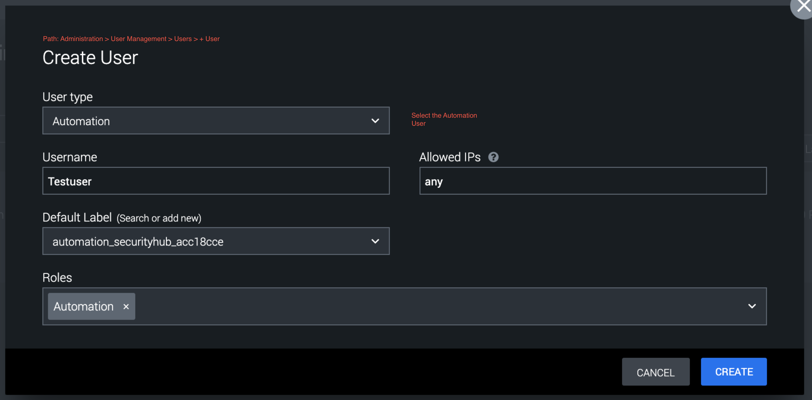
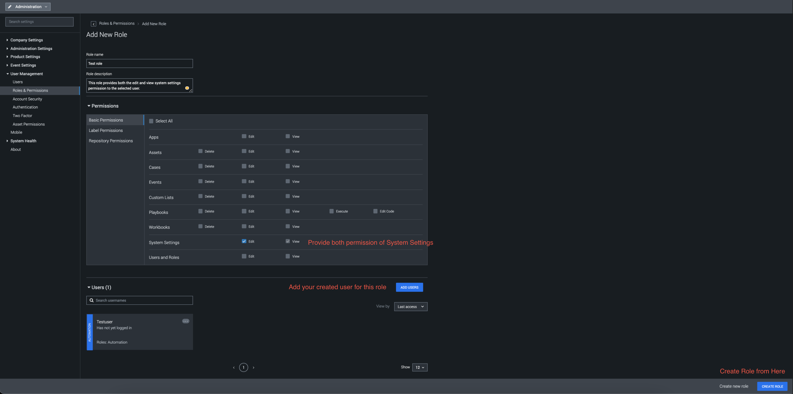
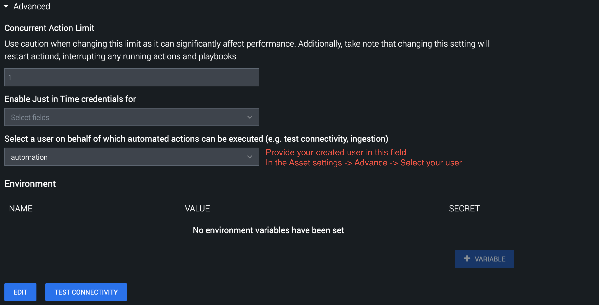

**Notes**

- **Asset Configuration Parameter**

  - on_poll_table: Table to ingest issues from.

  - on_poll_filter: Filter to use with On Poll separated by '^' (e.g. description=This is a
    test^assigned_to=test.name).

  - first_run_container: Maximum containers to ingest for the first run of scheduled polling.

  - max_container: Maximum containers to ingest for subsequent runs of scheduled polling.

  - severity: Custom severity of the ingested artifact.

    - **Using Custom Severities on Ingested Data**
      - If you decide to use custom severities to apply to Containers and Artifacts ingested
        via On Poll, then you must make sure that the automation user you use has the
        correct permissions.

      - By default, the automation user is selected to run the ServiceNow ingestion action.
        (See **Asset Configuration** > **Asset Settings** > **Advanced** ) The automation
        user does **NOT** have access to view or edit **System Settings** , which includes
        the permission to view the custom severities on your instance. This will cause your
        On Poll action to fail since your user cannot pull the custom severities on your
        instance.

      - In order to solve this problem, you must create a user of type **Automation** and
        assign this user a Role that has permissions to view or edit **System Settings** (
        **Administration** > **User Management** > **Users** **> + User** button on the
        top right corner). Then, choose this user in your ServiceNow **Asset Settings**
        under **Advanced** and you will be able to successfully apply custom severities to
        your ingested data.

        **Administration** > **User Management** > **Users** **> + User**
        

        **Administration** > **User Management** > **Roles & Permissions** **> + Role**
        

        **Asset Settings** > **Advanced**
        

      - In order to use the custom severity it is necessary to create a severity over (
        **Administration** > **Event Settings** > **Severity** ). If custom severity has
        not been provided in the asset configuration, then the default severity from "
        **Administration** > **Event Settings** > **Severity** " will be considered.

- **The functioning of On Poll**

  - On Poll ingests the details of the tickets/records of a table provided by the user. An
    ingested container's name will be set to the 'short_description' of the ticket/record. If
    the ticket/record does not have any short_description then a default name will be given to
    the container.

  - **Two ways of polling**

    - Manual polling

      - The application will fetch the number of tickets/records controlled by the
        container_count parameter set in the Poll Now window.
      - Tickets/records can be restricted by providing a filter in the configuration
        parameter.

    - Scheduled Polling

      - The application will fetch the number of tickets/records, controlled by the
        'first_run_container' configuration parameter for the first run of Scheduled Polling
        and by the 'max_container' configuration parameter for the other runs of Scheduled
        Polling. Each poll will ingest tickets/records which have been created or updated
        since the previous run of Scheduled Polling.

- **Specific functionality of ServiceNow On Poll**

  - When the app is installed with Python version 3 and if the data is ingested using On Poll
    with query A and label B, it will list down the containers accordingly. If the ticket that
    is already ingested is updated, and then if the On Poll is executed again with the same
    label i.e. label B and with the same query A, it will not update the container properties
    but will add the updated ticket as an artifact in the already created container.

- **The functioning of Test Connectivity**

  - **Case 1: If Client ID & Client Secret are provided:**

    - Step1: While running the test connectivity, the system will check if the refresh token
      is present or not in the state file.
    - Step2(a): If a refresh token is present then the system will make the API call to fetch
      a new token. Using new token the test connectivity will get passed.
    - Step2(b): If the refresh token is not present then the system will check for the
      Username and Password. Using Username & Password system will make an API call to fetch a
      new token and test connectivity will get passed.
    - Step3: If the refresh token is not present and Username and Password are not provided
      then the system will return an error and the action will fail.

  - **Case 2: If Client ID & Client Secret are not provided:**

    - Step1: While running the test connectivity, System will check if the Username and
      Password are provided or not.
    - Step2: If Username & Password are provided then the system will get authenticated and
      test connectivity will get passed.
    - Step3: If the Username & Password are not provided then the system will return an error
      and the action will fail.

- In order to use the app actions, a user must have these roles itil, sn_request_write, and
  catalog. In some actions, the user can also provide the table name as input in that case the
  user must have the role/permission to access that table.

## Port Information

The app uses HTTP/ HTTPS protocol for communicating with the ServiceNow server. Below are the
default ports used by Splunk SOAR.

|         SERVICE NAME | TRANSPORT PROTOCOL | PORT |
|----------------------|--------------------|------|
|         http | tcp | 80 |
|         https | tcp | 443 |
